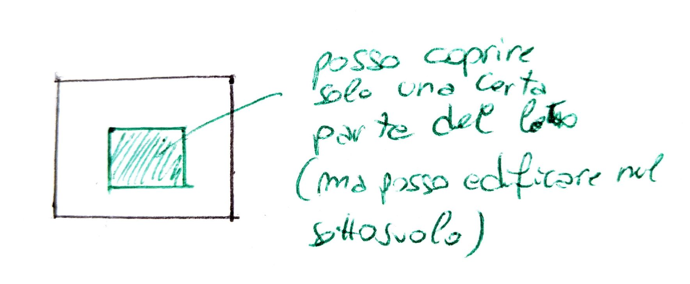
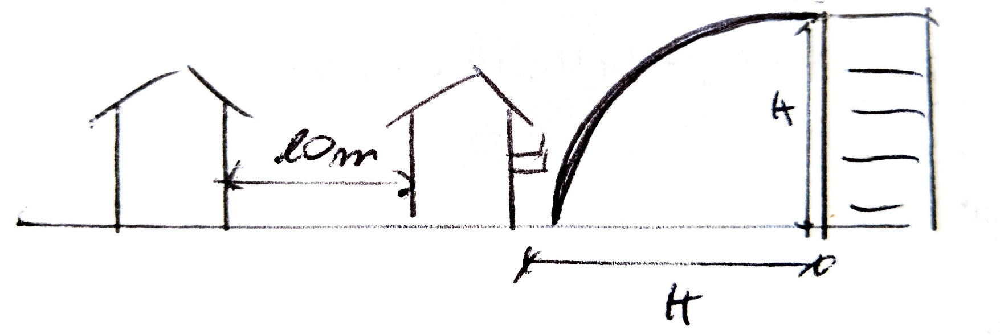
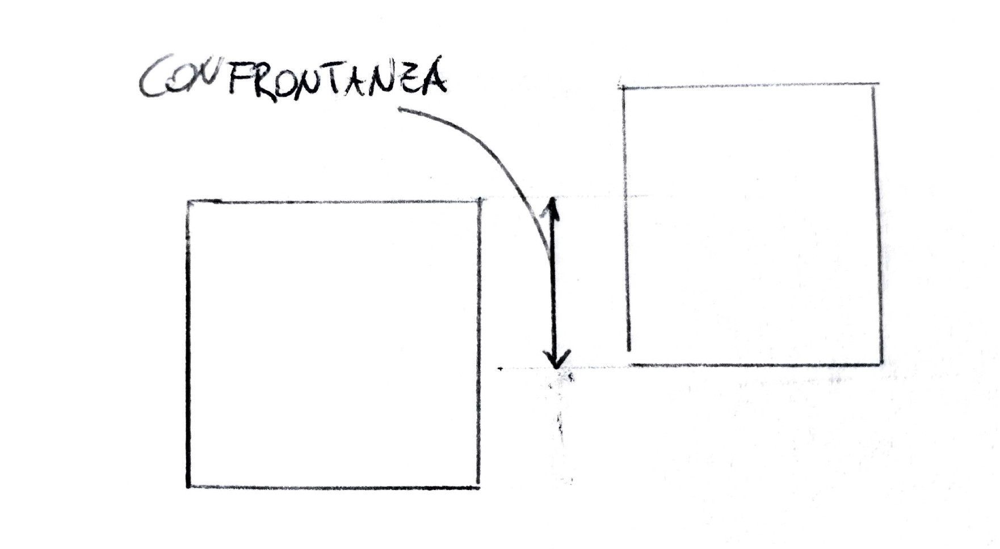

--- 
title: Appunti di Tecnica Urbanistica  
Docenti: *Geneletti* - *Zanon*  
Autore: *Matteo Franzoi - 2019-03-20*  
Università degli Studi di Trento  
---
---

- [INTRODUZIONE AL CORSO](#introduzione-al-corso)
- [TERMINI DELLE DISCIPLINE TERRITORIALI](#termini-delle-discipline-territoriali)
- [SOGGETTI DELLE DISCIPLINE TERRITORIALI](#soggetti-delle-discipline-territoriali)
- [TERRITORIO, LUOGO](#territorio-luogo)
  - [LUOGO](#luogo)
  - [NON - LUOGO](#non---luogo)
- [INSEDIAMENTI, CITTÀ e RETI URBANE](#insediamenti-citt%C3%A0-e-reti-urbane)
  - [CITTÀ](#citt%C3%A0)
  - [CITTÀ INDUSTRIALE](#citt%C3%A0-industriale)
    - [VILLAGGI OPERAI](#villaggi-operai)
    - [URBANISTICA TECNICA](#urbanistica-tecnica)
- [LA CITTÀ DEL MOVIMENTO MODERNO (Le Corbusier)](#la-citt%C3%A0-del-movimento-moderno-le-corbusier)
  - [DALLA CITTÀ INDUSTRIALE ALLA CITTÀ CONTEMPORANEA](#dalla-citt%C3%A0-industriale-alla-citt%C3%A0-contemporanea)
  - [LA CRISI DELLA CITTÀ MODERNA](#la-crisi-della-citt%C3%A0-moderna)
  - [CITTÀ CONTEMPORANEA](#citt%C3%A0-contemporanea)
  - [NUOVE FORME DI TERRITORIO URBANIZZATO](#nuove-forme-di-territorio-urbanizzato)
  - [CRISI DELLA CITTÀ CONTEMPORANEA](#crisi-della-citt%C3%A0-contemporanea)
- [TERRITORIO e CITTÀ IN EUROPA e ITALIA (dall'età industriale a oggi)](#territorio-e-citt%C3%A0-in-europa-e-italia-dallet%C3%A0-industriale-a-oggi)
  - [RIVOLUZIONE INDUSTRIALE, CAPITALISMO, CITTÀ INDUSTRIALE](#rivoluzione-industriale-capitalismo-citt%C3%A0-industriale)
    - [INNOVAZIONE TECNICA](#innovazione-tecnica)
    - [NUOVO SISTEMA ECONOMICO](#nuovo-sistema-economico)
    - [COLLOCAZIONE DELLE ATTIVITÀ SUL TERRITORIO](#collocazione-delle-attivit%C3%A0-sul-territorio)
    - [FERROVIE](#ferrovie)
    - [TRASFORMAZIONI URBANE IN EUROPA](#trasformazioni-urbane-in-europa)
    - [L'ITALIA NEL SECOLO $XIX$](#litalia-nel-secolo-xix)
      - [INFRASTRUTTURE STRADALI](#infrastrutture-stradali)
      - [COME SCEGLIERE LE LINEE FERROVIARIE?](#come-scegliere-le-linee-ferroviarie)
      - [BONIFICHE](#bonifiche)
  - [PIANIFICAZIONE URBANISTICA](#pianificazione-urbanistica)
    - [MILANO](#milano)
    - [BOLOGNA](#bologna)
    - [NAPOLI](#napoli)
  - [IL SECONDO DOPOGUERRA](#il-secondo-dopoguerra)
    - [COME RICOSTRUIRE?](#come-ricostruire)
    - [RICOSTRUZIONE](#ricostruzione)
    - [AVVIO DELLA PIANIFICAZIONE URBANISTICA](#avvio-della-pianificazione-urbanistica)
    - [IL BOOM ECONOMICO DEL 1963](#il-boom-economico-del-1963)
    - [NUOVE INFRASTRUTTURE](#nuove-infrastrutture)
    - [BOOM EDILIZIO](#boom-edilizio)
    - [EVOLUZIONE DELLA NORMATIVA URBANISTICA NEL DOPOGUERRA](#evoluzione-della-normativa-urbanistica-nel-dopoguerra)
    - [VINCOLI DEI PIANI e INDENNITÀ DI ESPROPRIO](#vincoli-dei-piani-e-indennit%C3%A0-di-esproprio)
    - [L'AMBIENTE NEL DOPOGUERRA](#lambiente-nel-dopoguerra)
- [EVOLUZIONE DEL PIANO URBANISTICO](#evoluzione-del-piano-urbanistico)
  - [CITTÀ INDUSTRIALE](#citt%C3%A0-industriale-1)
    - [NEW YORK](#new-york)
  - [PIANO OTTOCENTESCO](#piano-ottocentesco)
  - [I PIANI DEL '900 IN ITALIA](#i-piani-del-900-in-italia)
  - [ATTUAZIONE DEL PIANO](#attuazione-del-piano)
    - [PEREQUAZIONE](#perequazione)
  - [ZONING](#zoning)
  - [AMSTERDAM - PIANO RAZIONALISTA (1934)](#amsterdam---piano-razionalista-1934)
  - [ITALIA](#italia)
    - [TRENTO](#trento)
- [IL PIANO REGOLATORE GENERALE](#il-piano-regolatore-generale)
  - [FINALITÀ DEL PIANO](#finalit%C3%A0-del-piano)
  - [COSTRUZIONE DEL PIANO URBANISTICO](#costruzione-del-piano-urbanistico)
    - [RUOLO E FORMA DEL PIANO](#ruolo-e-forma-del-piano)
    - [DIMENSIONAMENTO](#dimensionamento)
      - [TRENTO](#trento-1)
  - [DOCUMENTI DEL PIANO](#documenti-del-piano)
  - [RAPPORTI CON TEMI E STRUMENTI DI SETTORE](#rapporti-con-temi-e-strumenti-di-settore)
  - [ZONING](#zoning-1)
  - [STANDARD URBANISTICI](#standard-urbanistici)
    - [ZONE TERRITORIALI OMOGENEE](#zone-territoriali-omogenee)
    - [INDICI URBANISTICO - EDILIZI](#indici-urbanistico---edilizi)
  - [DEFINIZIONE DEGLI INTERVENTI EDILIZI](#definizione-degli-interventi-edilizi)
  - [L'ITER DI APPROVAZIONE DEL PIANO](#liter-di-approvazione-del-piano)
    - [INTERVENTO DIRETTO](#intervento-diretto)
    - [PIANI ATTUATIVI](#piani-attuativi)
      - [PROGRAMMA INTEGRATO DI INTERVENTO](#programma-integrato-di-intervento)
    - [PROCEDURE AMMINISTRATIVE](#procedure-amministrative)
      - [REGOLAMENTO EDILIZIO](#regolamento-edilizio)
      - [COMMISSIONE EDILIZIA](#commissione-edilizia)
- [LE ANALISI URBANE E TERRITORIALI](#le-analisi-urbane-e-territoriali)
  - [ANALISI e PIANO](#analisi-e-piano)
  - [SAPERE ESPERTO, SAPERE CONTESTUALE](#sapere-esperto-sapere-contestuale)
  - [SISTEMI INFORMATIVI TERRITORIALI (SIT) e GEOGRAPHICAL INFORMATION SYSTEM (GIS)](#sistemi-informativi-territoriali-sit-e-geographical-information-system-gis)
    - [SIT](#sit)
  - [CARTOGRAFIA](#cartografia)
    - [PRODUZIONE CARTOGRAFICA](#produzione-cartografica)
    - [DATI PER ANALISI URBANE e TERRITORIALI](#dati-per-analisi-urbane-e-territoriali)
      - [DOVE SI TROVANO I DATI?](#dove-si-trovano-i-dati)
  - [ANALISI AMBIENTALI (pag. 37)](#analisi-ambientali-pag-37)
# APPUNTI DI TECNICA URBANISTICA  <!-- omit in toc -->
## INTRODUZIONE AL CORSO
Il corso pone le basi per l'**introduzione all'urbanistica** e si articola in 4 moduli:  
1) introduzione alla tecnica urbanistica (*Zanon*);  
2) strumenti e processi di pianificazione urbana e terrioriale (*Geneletti*);  
3) elementi e progettazione urbana;  
4) tecnica e principi di legislazione urbanistica (*Cassatella*).

L'esame si composto da:  
- parte scritta (moduli **1**, **2**, **4**);  
- elaborato progettuale con discussione orale.

## TERMINI DELLE DISCIPLINE TERRITORIALI
* **urbanistica**: impiegato dall'ingegnere spagnolo *Alfonso Cerdà* (1885) nel 1867 per designare una disciplina autonoma avente per scopo l'organizzazione del territorio.
* **pianificazione**: processo decisionale orientato a risolvere problemi. E` impiegato in campi diversi (ambiente, economia, etc.) ed è un concetto **diverso dal progetto**!  
Richiede di precisare il problema e fare delle previsioni (processo molto rischioso).
* **piano regolatore**: regola l'uso di zone del territorio attraverso regole e indicazioni. Presenta dei contenuti di *disegno urbano* come il **progetto alla scala urbana** (infrastrutture, scuole, etc.).
* **governo del territorio**: è stato introdotto nel 2001 nella *Costituzione* italiana. Amplia il concetto di *urbanistica* a tutte le azioni di **trasformazione del territorio**.
* **territorio**: *spazio organizzato dall'uomo*. Ha dimensione ampia e fa riferimento anche all'ambito di governo: `il comune interviene su un certo territorio, la provincia su un altro e lo Stato su un altro ancora`. Si riferisce a **funzioni** e alle loro **relazioni** da organizzare spazialmente.
* **ambiente**: termine molto ampio, di diversi significati in base ai contenuti. In urbanistica ci si riferisce all'ambiente come allo spazio vitale (**habitat**), non solo dell'uomo ma di tutta la natura (materia vivente), cioè dell'**ecosistema**.  
Dove prima c'era un ambiente omogeneo (di una sola specie) a causa delle prevalenza di alcune specie, dopo la modifica da parte dell'uomo si ha un sistema di *biodiversità* caratterizzato da una mescolazione di specie presenti nell'ambiente.  
Il riconoscimento giuridico dell'ambiente è avvenuto di recente (1967) e riguarda il danneggiamento dello stesso (inquinamento dell'aria o dell'acqua, etc.).  
Anche l'Unione Europea con il progetto **Natura 2000** ha iniziato a salvaguardare l'ambiente ed ostacolare impatti negativi sull'habitat.
* **città**: concetto complesso che si riferisce a realtà morfologiche, funzionali e organizzative diverse. È uno spazio diverso da quello agricolo, infatti, consente attività commerciali, artistiche (ma non agricole) e allo stesso tempo offre servizi, protezione, etc.
È comunque un luogo denso e con forma particolare (strade strette, case attaccate, etc.) e impone delle regole specifiche per costruire.
* **paesaggio**: è quello che si percepisce dello spazio che ci circonda. Rappresenta l'aspetto percettivo (visivo) dell'organizzazione del territorio.  Il concetto vede la sua nascita con la pittura del '700 per poi essere usato in geografia come categoria descrittiva di aspetti fisico - morfologici del territorio legati ad aspetti climatici.
* **metodo**: natura composita della disciplina utilizzando strumenti propri dell'urbanistica, ma anche di tipo storico, analitico, geografico, etc.  Necessita di saper dialogare con altre conoscenze.
* **piani**: strumenti urbanistici che hanno scale territoriali differenti in base al territorio da studiare (comunale, provinciale, regionale, statale).
* **norme**: leggi che regolano comportamenti (scala edilizia).
* **programmi**: riguardano aspetti economici di organizzazione temporale.
* **procedure** definizione di scelte e decisioni come *autorizzazioni*, *valutazioni di impatto ambientale*, etc.  
A volte prevedono la conformità di certe norme, altre vole sono valutative (impatto ambientale, sicurezza, etc.).
* **politiche**: intervento di amministrazioni pubbliche.

## SOGGETTI DELLE DISCIPLINE TERRITORIALI
* **amministrazioni pubbliche**: Stato, regioni, province, comuni hanno competenze diverse ma devono perseguire l'interesse pubblico.
* **cittadini**: utenti di città e servizi, membri della comunità che opera le scelte attraverso i meccanismi di partecipazione.
* **operatori economici**: figure diverse relative ai vari settori dell'economia (commercio, industria, etc.).
* **soggetti collettivi**: partiti, sindacati, etc. Entrano nelle scelte territoriali.
* **progettisti/tecnici**: ingegneri, architetti, etc. che si occupano di settori specifici.

## TERRITORIO, LUOGO
Già i romani organizzarono il territorio in modo ordinato usandolo per scopi specifici come può essere quello agricolo.  
Certe forme impresse al territorio, che servono nel lungo periodo, sono tutt'ora presenti. Si deve, allora, valutare se l'opera sarà duratura e utilizzata nel tempo o se verrà dismessa in fretta (come, ad esempio, per le strade).  
Il territorio **non** è un dato ma il risultato di diversi processi, spontanei o umani.  
Gli abitanti di un territorio scrivono, cancellano e riscrivono il "palinsesto" del territorio.  
Il territorio funziona perché consente relazioni con il sito e/o altri parti dello stesso (relazione tra area agricola e mercato o area industriale e porto, etc.)

Il territorio è costruito mediante fasi, dette *atti territorializzanti*:  
1. **denominazione**: un luogo ha un significato per chi lo frequenta. Serve per identificare una superficie o un luogo.  
2. **perimtrizzazione**: confini che consentono la definizione dei luoghi.  
3. **trasformazione materiale**  
4. **comunicazione**: uscire dai limiti fisici con la creazione di reti, nodi, maglie che consentono la relazione tra parti diverse del territorio.  
5. **strutturazione**
<!-- end of list -->
Il primo livello di organizzazione del territorio è quello agricolo che distingue lo spazio utile (*ager*) dalle zone marginali (*saltus*). 

Il concetto di **proprietà** nasce infatti dall'appropriazione del territorio da parte dell'uomo mediante l'agricoltura. La proprietà ha ancora più significato con l'introduzione delle successioni ereditarie  e dell'edificazione.

* **abitare**: dal latino *continuare ad avere* da un senso di sostenibilità nel lungo periodo.

* il paesaggio agrario riflette:
    - capacità tecniche;
    - economie sociali. 

Ad esempio, in Val Badia, vi sono piccoli insediamenti isolati (di origine latina) dovuti dal fatto che i "padroni" consentivano la libertà agli uomini, abitando e coltivando delle zone altrimenti isolate e inabitabili. 

* Bisogna tener conto della *resilienza* del territorio. Riuscire a mantenere il territorio in sicurezza da agenti atmosferici.  
* **deterritorializzazione**: è un processo  di perdita di senso del territorio o di porzioni di esso.  
* **riterritorializzazione**: processo di riconferimento di senso al territorio.  
<!-- end of list --> 
### LUOGO
È uno spazio con un senso e un'immagine.  
Deve rispettare certe qualità e certe funzioni e deve fungere da *rifugio*.  
Le condizioni del luogo coinvolgono anche il comportamento delle persone (ad esempio ghetti).

È molto importante saper comprendere le potenzialità dei luoghi, in modo da pianificare adeguatamente.

### NON - LUOGO
Il non - luogo è uno spazio che non si può definire:
* identitario;
* relazionale;
* storico.

<!-- end of list --> 

Sono un esempio gli *aeroporti*, i *centri commerciali*, etc.  
Spesso i non - luoghi hanno un valore economico, di mercato, ma non storico. Funzionano in maniera differente dai luoghi (piazze, duomo, etc.).

## INSEDIAMENTI, CITTÀ e RETI URBANE
### CITTÀ
La città è una forma insediativa caratterizzata dall'essere un:
* punto di incontro;  
* luogo di attività non agricole;  
* luogo difeso (da mura) e di difesa;  
* sede di potere, giustizia, etc.

La città può avere luogo dove c'è un surplus agricolo in grado di sostenere uomini che si dedicano ad attività non agricole.

È un agglomerato di popolazione, edifici, attività diverse. È un luogo di incontro culturale di gruppi sociali diversi.  
Ha il compito di dare sicurezza mediante regole ed istituzioni.

In genere, le città sono una diversa dall'altra. Il concetto di città non è legato alle dimensioni, ma alla **funzione**, al **peso**, alla **forma che ricopre**.  
La città deve offrire protezione e servizi al territorio circostante. Deve essere collocata in un luogo appropriato: lungo un percorso, in un incrocio di reti, etc.

### CITTÀ INDUSTRIALE
Tra il '700 e '800, in Inghilterra e Europa centrale, si formano nuove attivita produttive: le **fabbriche**.  
Tra le nuove tecnologie portate dalla rivoluzione industriale c'è la *macchina a vapore* (fine '700).  

L'invenzione di nuovi attrezzi agricoli che sostituiscono l'uomo porta una "migrazione" delle persone dalle campagne alla città, che trovano lavoro nelle industrie presenti nei centri urbani.  

I proprietari si appropriano di terre comuni, recintandole e definendo la loro proprietà. Molti contadini rimangono senza terra e sono costretti a spostarsi in città, dove sono situate le fabbriche.

Inizialmente non c'erano regole che limitavano e normavano la costruzione di nuovi edifici; inizia così un momento di *abusivismo edilizio* dove gli imprenditori costruivano edifici con una densità di abitanti molto elevata che causa un calo drastico delle condizioni igienico - ambientali.

Con l'arrivo delle malattie e delle pestilenze, nascono le prime regole con il fine di limitare i rischi sanitari (in particolare per i ricchi borghesi). Le città non reggono questo cambiamento.

Si diffonde l'interesse di difesa collettiva che porta alla prima comparsa dei __fondamenti dell'urbanistica__:
* larghezza minima delle strade;  
* presenza di scuole e parchi.  

#### VILLAGGI OPERAI
Causa condizioni ambientali sempre peggiori date dall'inquinamento atmosferico, inizia un processo di delocalizzazione delle fabbriche che vengono spostate fuori dalle città. Nascono dei piccoli villaggi attorno alle fabbriche che contenevano gli operai.

#### URBANISTICA TECNICA
La comparsa delle prime norme, quali:
* igienico - sanitarie;  
* edilizie;  
* sulle infrastrutture urbane;  
* sulle attrezzature collettive;  
* sui piani;
  
e del loro rispetto, porta ad una edificazione basata sulla ripetizione di moduli creando una urbanizzazione monotona e ripetitiva.

## LA CITTÀ DEL MOVIMENTO MODERNO (Le Corbusier)
Preso atto del cambiamento industriale che colpisce le città, si fa largo l'idea di una *macchina urbana* che includa l'industria.

### DALLA CITTÀ INDUSTRIALE ALLA CITTÀ CONTEMPORANEA
La città moderna, nata sulla base di quella industriale, è una città "**fordista**" connessa:
* al processo di industrializzazione;  
* alla concentrazione di capitali, attività e persone;  
* alla manifattura e alle tecnologie pesanti;  
* al ruolo primario dell'iniziativa privata e a quello complementare di quella pubblica.

Lo Stato ha il compito importante di *pianificazione* e *programmazione* nonché di dare diritti e doveri ai singoli soggetti.

### LA CRISI DELLA CITTÀ MODERNA
I cambiamenti:  
* economici (da economia industriale a terziario);  
* di organizzazione produttiva (just in time);  
* sociali (migrazione, globalizzazione, etc.);  
* di mobilità;

fanno si che le attività si spostino all'esterno delle città.  
I modelli del movimento moderno, in particolare di *Le Corbusier*, hanno prodotto edifici, organismi urbani, etc. inadatti a ospitare la società. Erano infatti piani utopistici, basati sulle "ipotetiche" esigenze della popolazione, con l'idea di fabbricare alloggi capaci di contenere migliaia o addirittura milioni di persone al loro interno (una città in un unico edificio), che andava però contro alle effettive esigenze delle persone.

### CITTÀ CONTEMPORANEA
Pone le basi sullo spazio espanso della società post - industriale, con le industrie delocalizzate. Questo porta a un ruolo di minor importanza delle industrie, formano la *classe borghese*.

Il ruolo dello Stato diventa sempre più importante dovendo gestire compiti e servizi sempre maggiori (strade, canali, etc.) e non solo la sicurezza come era abituato a fare in precedenza.

Diventa importante la figura dell'*ingegnere civile* che sa come applicare nuove tecnologie e nuove capacità di intervento tramite modelli di città.

La struttura urbana cambia profondamente:
* funzioni ospitative (meno industrie e più servizi);
* relazioni con il territorio;
* nuove gerarchie urbane: città servite da reti ferroviarie e industriali vengono premiate rispetto alle vecchie città di "potere" posizionate in alto e non in valle;
* tempi delle città.

<!-- --> 

Dal punto di vista sociale ed etnico si creano:
* minoranze di migranti;
* problemi di identità locale: gli abitanti non hanno nessun sentimento di appartenenza alla società (si creano ghetti).

<!-- end of list --> 

Alcune città come Milano perdono abitanti e attività industriali, rimanendo però un luogo centrale grazie al passaggio della ferrovia.

### NUOVE FORME DI TERRITORIO URBANIZZATO
La dislocazione delle fabbriche porta la formazione di nuovi luoghi di lavoro (nel campo terziario). Si ritrovano funzioni, prima presenti in città, anche in spazi estesi fuori città.

Si riscontra una difficoltà maggiore a rigenerare gli spazi dismessi piuttosto che espandere la città costruendo su aree nuove.

Nascono nuovi luoghi pubblici (centri commerciali, contenitori di attività ludiche e sportive, etc.) ma anche zone dismesse (vuoti urbani, non-luoghi, etc.) che imitano la città storica (ad esempio con la presenza di portici, etc.).

### CRISI DELLA CITTÀ CONTEMPORANEA
La crisi si crea anche nella città contemporanea a causa di:
* problemi ambientali;
* problemi di sicurezza;
* aree di crisi acuta come periferie e aree dismesse.

<!-- --> 

## TERRITORIO e CITTÀ IN EUROPA e ITALIA (dall'età industriale a oggi)
### RIVOLUZIONE INDUSTRIALE, CAPITALISMO, CITTÀ INDUSTRIALE
La rivoluzione industriale in atto in tutta Europa porta:
* profondi cambiamenti economici;
* nuove esigenze e bisogni;
* nuova organizzazione del territorio;
* nuovo ruolo dello Stato che tramite le *tasse* costruisce edifici per la parte debole della popolazione.

<!-- --> 

Per le *organizzazioni territoriali* si nota:
* trasformazione del territorio agricolo;
* nuove reti di infrastrutture per il commercio (non più per il controllo) e per il collegamento di zone commerciali, agricole e mercenarie.

Dove inizialmente erano i *privati* a finanziare le nuove infrastrutture come *ferrovie* e *autostrade*, che rientravano dell'investimento facendo pagare un pedaggio, successivamente lo Stato inizia a nazionalizzare le ferrovie. 

Si creano nuovi nodi centrali derivanti dagli incroci di reti ferroviarie e strade che in precedenza non erano importanti, mentre le città tagliate fuori dal passaggio delle infrastrutture stradali e ferroviarie perdono il ruolo di città.

#### INNOVAZIONE TECNICA
L'innovazione tecnica partita con la rivoluzione industriale migliora le condizioni industriali: esempio lampante è la **macchina a vapore**.

#### NUOVO SISTEMA ECONOMICO
Nasce il **sistema capitalistico**:
* nuovi prodotti in grandi  quantità e in scambio con altri contintenti;
* rimozione di dazi in modo da agevolare gli scambi internazionali;
* libertà di iniziativa senza particolari autorizzazioni.
  
<!-- end of list --> 

Lo Stato reagisce al nuovo sistema imponendo la dogana, le leggi, il fisco. Prende il ruolo di gestore di servizi e infrastrutture e, come sempre, della difesa.  
Gestisce regolamentando le trasformazioni territoriali con la finalità di **mediare interessi diversi**.

#### COLLOCAZIONE DELLE ATTIVITÀ SUL TERRITORIO
Con l'avvento del vapore le **attività si concentrano** e non rimangono solo vicino a fiumi e corsi d'acqua (necessari per dare "energia").

Il trasporto di merci avveniva su:
* canali: natualmente presenti;
* strade;
* ferrovie.

<!-- end of list --> 
  
In particolare, per le ultime due, sorge il problema di chi e come le costruisce, dati gli scarsi fondi dello Stato.  
I privati, con nuove innovazioni tecniche, costruiscono le infrastrutture al posto dello Stato.

#### FERROVIE
La necessità di collegare le attività industriali ai porti creò una rete nazionale e internazionale di ferrovie.  
Le reti urbane vengono riorganizzate e il territorio viene modificato dove arriva la ferrovia.  
Città servite dal sistema ferroviario (o di intersezione di esso) guadagnano un'importanza notevole di mercato, mentre, le città tagliate fuori dal passaggio della ferrovia perdono sempre più valore.

#### TRASFORMAZIONI URBANE IN EUROPA
Le grandi capitali diventano un modello di riferimento.  
La Parigi di Napoleone e Haussmann sente la necessità di:
* innovare il sistema urbano;
* rendere sicura la città;
* connettere le stazioni ferroviarie tra loro;
* creare viali di connessione tra poli o parti urbane;
* definire le modalità attuative del piano (o delle idee).  

Per connettere parti urbane, in particolare, vengono creati dei viali molto larghi (quello che passa sotto all Tour Eiffel). Per fare questo fu necessario abbattere edifici, mentre, quelli che davano sui viale salirono vertiginosamente di prezzo.

#### L'ITALIA NEL SECOLO $XIX$
Dopo l'unificazione politica del 1861, si scelse un modello napoleonico di amministrazione pubblica basato su province, comuni, ministeri, moneta unica, catasto, etc.  

Nasce la prima legge sulle **espropriazioni per causa di utilità pubblica**: *legge n. 2359 del 25 giugno 1865*.  
Nonostante questo, non esistevano leggi che descrivevano come ampliare l'abitato. Per farlo era necessario adottare i piani regolatori (prima statali e poi passati in mano alle regioni).  

Durante il secolo $XIX$ prevavelano le attività agricole, principalmente poste lungo i corsi d'acqua. 

La scoperta dell'**idroelettrico** all'inizio del '900 porta a un veloce sviluppo delle zone più avantaggiate (dove passavano corsi d'acqua). In seguito la nazionalizzazione del sistema idroelettrico consente un ampliamento della rete anche a zone rurali.

Fotografando l'Italia del secolo $XIX$, si può vedere che:
* l'Italia settentrionale era caratterizzata da piccole città concentrate;
* in Italia centrale c'erano città più grandi contornate da campagne;
* in Italia meridionale prevalevano i latifondi con vaste campagne, paesi molto grandi e densi in cui abitavano i contadini.

##### INFRASTRUTTURE STRADALI
Nel 1861 le infrastrutture stradali erano deboli: le strade carrabili erano poche e difficili da percorrere.  
Si sente il bisogno di creare nuove strade, ottenendo negli anni '20 una rete che converge nei centri urbani.

Con l'avvento della motorizzazione ci si accorge che far convergere le strade nei centri non è l'ideale (per inquinamento e traffico): nascono le *circonvallazioni* e il primo **codice della strada**.  
La rete stradale si articola su un sistema urbano e extraurbano. Negli anni '20 - '30, l'avvio del progetto autostradale (attorno a Milano) amplia ancora la rete di infrastrutture.  
Lo Stato decide e gestisce le tratte autostradali (oltre alle ferrovie) assegnando a privati l'onere di costruire e gestire l'opera per 25 anni (iniziali).

##### COME SCEGLIERE LE LINEE FERROVIARIE?
Scegliendo linee più dirette (stile alta velocità) si corre il rischio di tagliare fuori alcune città, prediligendo città più importanti.  
Si creano così delle linee secondarie per collegare le città tagliate fuori alle linee principali, formando una **rete ferroviaria**.

Nel 1905, a causa della crisi delle aziende gestori delle ferrovie, lo Stato decide di nazionalizzara la rete ferroviaria.

Dopo il 1936, con l'avvento dell'idroelettrico e la carenza di carbone, si avvia un processo di elettrificazione delle linee principali, eliminando qualche linea secondaria.

Nel 2009 le principali reti ferroviarie erano collegate con le linee europee.

##### BONIFICHE
I cambiamenti territoriali possono avvenire anche attraverso **bonifiche** e arginazioni (come ad esempio per il Po). Gli interventi possono essere finanziati sia dal pubblico (in particolare per i corsi d'acqua) che da privati.  
Le dimensioni degli interventi dell'epoca erano molto grandi. Un esempio possono essere il _delta del Po_, la _pianura veronese e ferrerase_.  
I privati che finanziavano le bonifiche erano principalmente grandi imprese capitalistiche che avevano il fine di lavorare il terreno. Importanti lavori sono stati fatti anche costruendo collegamenti e servizi, che formarono poi un **capoluogo**. Un esempio di questo processo è _Latina_.  
Nel primo dopoguerra il compito di bonificare le aree di Latina era stato dato ai reduci della prima guerra mondiale (invece che alle grandi imprese).

Dal 1932, 60'000 contadini veneti, friulani e ferraresi si trasferirono nelle aree bonificate.

Le nuove città vengono progettate con l'idea di _città italiana_ e quindi con una __centralità__ e una __griglia__ abbastanza regolare.

### PIANIFICAZIONE URBANISTICA
#### MILANO
Le città si espandono molto velocemente e in modo diverso dalla città storica per via delle diverse attrezzature e dei diversi servizi.  
Si ha la necessità di individuare luoghi per la residenza adatti alle diverse gerarchie di popolazione. Non basta però individuare e inventare lo spazio, ma serve creare dei _modelli di pianificazione_.  

La città diventa sempre più estesa e necessità di un trasporto pubblico massiccio. Essendo le strade non adatte al transito di un elevato flusso di veicoli, si creano delle sezioni stradali più larghe affiancate a marciapiedi molto ampi protetti da alberi (viali alberati).

#### BOLOGNA
Le mura vengono abbattute e la città si espande in cerchie centrate nella città vecchia collegate ad essa mediante strade radiali. Questo processo ha un costo per la comunità ma allo stesso tempo porta dei vantaggi in termini di valori degli edifici nelle nuove zone.

#### NAPOLI
Dopo l'epidemia di colera (1885) il centro viene sventrato e viene fatto un viale centrale.  
Passa la legge per l'esproprio e il risanamento in modo da bonificare la città messa in ginocchio dalla malattia.  
L'approccio della demolizione viene mantenuto anche durante l'epoca fascista, non svecchiando né aggiornando la città.

### IL SECONDO DOPOGUERRA
A differenza della prima guerra mondiale svoltasi lontano dalle città, la seconda si è svolta su tutto il territorio portando devastazione nelle città e sulle infrastrutture.  
Viene nuovamente istituita la democrazia, svanita con il fascismo e viene attivata una grande mobilità da parte delle persone per ricostruire centri storici e infrastrutture.  
Le condizioni abitative erano molto problematiche: le persone erano attirate verso la città, ma gli alloggi scarseggiavano ovunque. 

#### COME RICOSTRUIRE?
Nasce il dibattito fra il _ricostruire le parti storiche come e dove erano_ e l'_utilizzo di nuove tecnologie_ in modo da costruire "come oggi".

A cavallo degli anni '50 la situazione economica era grave e la maggior parte della popolazione si occupava di agricoltura.  
Ha il via una fase di __emigrazione__ temporanea verso i Paesi europei, e permanente verso il nord - america.

#### RICOSTRUZIONE
La ricostruzione fu favorita dal __"piano Marshall"__ (USA) che integrava economicamente anche gli altri Paesi colpiti. Il sostegno per consentire di far ripartire l'economia era comune tra tutti gli Stati.
I mercati si aprono con i Paesi esteri. 

Lo Stato italiano ha un ruolo importante: fonda l'istituto di ricostruzione (IRI) che, assieme ad ENI, approvvigionano con prodotti siderurgici ed energetici il popolo che necessita di materie prime.

#### AVVIO DELLA PIANIFICAZIONE URBANISTICA
La __legge urbanistica__ (1942) che regolamenta, attraverso il PRG, e definisce i _piani_ come _strumenti di governo e territorio, __non viene utilizzata!__  
Con un decreto viene istituito un _piano di ricostruzione_. Si identificano i danni eseguiti e si creano dei piani (non unici) per la ricostruzione, con delle sezioni molto semplici e un numero di piani elevato in modo da contenere più alloggi che in precedenza.  
Parte il processo di edificazione: come si interviene?  

A __Trento__ si interviene senza un piano, appoggiandosi solamente al _regolamento edilizio_ e a qualche lottizzazione locale. 

In altri casi è intervenuto l'ente pubblico con l'edilizia popolare costruita distante dalla città.  

Nasce un processo di urbanizzazione (servizi di trasporto pubblico, altre costruzioni edilizie, etc.) nelle zone attorno alla città.

Nel 1963, in seguito al processo di ricostruzione, l'economia italiana ha un __booom__.

#### IL BOOM ECONOMICO DEL 1963
Durante il boom economico del 1963 molte imprese si rafforzano con la progettazione di auto e moto e nascono le prime industrie di elettrodomestici.  
L'Italia, caratterizzata da prezzi medio - bassi, vive grazie all'esportazione. 

Si ha un'evoluzione del settore tessile grazie a nuove modalità: si prendono materie prime povere e si creano prodotti finiti di alta qualità.

Le città medio - piccole si specializzano in un settore grazie alla congregazione di piccole imprese.  
Le grandi imprese, invece, sviluppano il __triangolo industriale__: Torino - Milano - Genova.

Dal punto di vista territoriale, tra gli anni '50 - '70, si ha uno spostamento della popolazione dal sud Italia verso il nord.

Nonostante tutto, le condizioni abitative erano modeste: solo il 7.4% delle abitazioni italiane avevano acqua, servizi ed elettricità assieme.

Lo Stato crea __INA CASA__, istituto pubblico finanziato dallo Stato, dai datori di lavoro e dalle trattenute dagli stipendi dei dipendenti, con il compito di costruire case e quartieri popolari.

#### NUOVE INFRASTRUTTURE
Con l'avvio della motorizzazione di massa si necessita di una rete stradale più adeguata.  
Dagli anni '50 si inizia a costruire con entusiasmo l'_autostrada_ con modelli avanzati: 2 corsie per senso di marcia, svincoli su due livelli, autogrill, pedaggi. Le autostrade spesso venivano finanziate e costruite da privati che avevano un ritorno attraverso i pedaggi a carico degli utilizzatori.

#### BOOM EDILIZIO
Accanto al boom economico ha inizio il boom edilizio. L'assenza di piani urbanistici e regole adeguate, però, necessita di seguire il regolamento edilizio che non sempre da tutte le indicazioni.  
L'alta domanda di alloggi e i bassi costi di costruzione fomentano la _speculazione edilizia_.

#### EVOLUZIONE DELLA NORMATIVA URBANISTICA NEL DOPOGUERRA
Le leggi e le normative urbanistiche del secondo dopoguerra erano:
* legge 1150 del 1942: viene criticata perché prevedeva uno sviluppo prevalentemente da parte del pubblico;
* legge 167/1967: __legge sull'esproprio__ per attuare piani di _edilizia economica popolare_;
* legge 765/1967: impone dei limiti all'edificazione dove non sono presenti piani regolatori. Inoltre, i PRG devono proporre _indici di edificazione_ contenuti (altezza, volume su mq, etc.). I PRG non possono prevedere solo aree edificabili ma devono prevedere anche aree di servizio pubblico ($18\,m^2$ per abitante per i comuni con più di 10'000 abitanti);
* legge 865/1971: __esproprio per piani di insediamento produttivi__ (industrie);
* legge 10/1997: concessioni edilizie;
* legge 457/1978: recupero dei centri storici per evitare l'abbandono.

#### VINCOLI DEI PIANI e INDENNITÀ DI ESPROPRIO 
Dopo una sentenza della Corte Costituzionale, i vincoli dei piani per l'esproprio sono diventati a __tempo determinato__. In precedenza, infatti, i piani potevano prevedere degli espropri per servizi pubblici senza l'obbligo di doverli costruire entro una data precisa.  
Inoltre, dal 2007 l'indennità di esproprio avviene al prezzo di mercato, il che lo rende molto dispendioso economicamente per la pubblica amministrazione.

#### L'AMBIENTE NEL DOPOGUERRA
Durante il secondo dopoguerra sono state approvate delle leggi per la tutela dell'ambiente. In particolare:
* 1939: legge sulla tutela delle bellezze;
* 1985 - legge Galasso: sottopone a vincolo zone, aree e luoghi di grande importanza e bellezza (laghi, coste, etc.). Impone dei controlli paesaggistici per costruire;
* 2004: codice beni culturali e paesaggio.

## EVOLUZIONE DEL PIANO URBANISTICO
### CITTÀ INDUSTRIALE
La città industriale è caratterizzata da nuove componenti: le fabbriche.  
Diventa importante collegare tra loro le componenti della città e definire modelli urbani di abitabilità di determinate classi sociali.

#### NEW YORK
A New York, i commissari definiscono una _griglia regolare_ e semplice che risulta un elemento solido pesantemente impiegato.  
Di notevole importanza per una città così ampia sono gli spazi verdi: viene creato _Central Park_, parco molto vasto posizionato in mezzo alla città.  
Alle strade principali viene dato il nome di "i - esima" __Aveneu__. Alle strade secondarie "j - esima" __Street__. Entrambe non risultavano eccessivamente larghe (come i viali francesi).  
Il modello di edificio impiegato si estende in altezza, in modo da occupare meno area possibile del territorio.

### PIANO OTTOCENTESCO
Adegua la città storica e la collega alla nuova città mediante modelli tipicamente a griglia caratterizzati da edifici con facciata che dà sulla strada e cortili interni.

Non sempre il modello a griglia è accettato: nascono dei movimenti che prediligono il "pittoresco" caratteristico della città vecchia.  
Questi si basano sul disegno irregolare con la proposta, all'inizio del '900, di città giardino a bassa densità, dove prevale il verde. In molti casi vengono creati _quartieri giardino_: schiere circondate da giardini e posizionate su griglie deformate.

### I PIANI DEL '900 IN ITALIA
All'inizio del '900 c'è una contrapposizione tra il disegno urbanistico regolare, a griglia, e il disegno pittoresco.

### ATTUAZIONE DEL PIANO
L'attuazione del piano necessita di riorganizzare le aree.  
In Germania nascono i primi __piani di lottizzazione__: si riorganizzano le superfici per definire lotti edificabili, strade, marciapiedi che vengono detratti dalle superfici edificabili.

#### PEREQUAZIONE
Se l'esproprio è molto caro, il privato cede una parte di terreno per costruire strade, servizi pubblici (area per standard) tenendosene una parte utilizzabile (area privata).

### ZONING
Lo zoning è un meccanismo di pianificazione secondo zone del territorio comunale, che viene smaterializzato.  
Il territorio viene diviso in zone a cui vengono definite le destinazioni d'uso (zona residenziale, zona industriale, etc.) e gli indici edificabili (distanza dai confini, altezza massima, etc.).

### AMSTERDAM - PIANO RAZIONALISTA (1934)
Si attiva un percorso di analisi preliminari e di previsione negli anni futuri in funzione del numero di abitanti futuro (scuole necessarie, servizi, etc.).

Vengono costituiti dei quartieri residenzili serviti da scuole e servizi pubbici vari.  
Il territorio viene suddiviso in zone che definiscono il piano attuativo.

### ITALIA
In Italia, viene approvata la legge urbanistica 1150/1942: piano post razionalista, dove vengono attuate delle previsioni (in genere poco accurate) e delle indagini.  

Le periferie crescono in maniera disordinata, obbligando il pubblico a creare servizi (fognature, strade, etc.) per poche case sparse sul territorio.

Viene impiegato lo zoning dalla pubblica amministrazione, che risulta però poco impegnata ed efficacie. Inizia un intervento da parte dei privati.

__N.B. Il piano non è un progetto! Dà più libertà di interpretazione e delle indicazioni su cosa fare e cosa non fare__.

Sulla base della legge urbanistica del 1942, sono stati avviati i __piani__ (anche se in ritardo, intorno agli anni '70). Questi prevedevano lo __zoning__ distinguendo le attività che potevano essere svolte e le funzioni ammesse in determinate zone.

#### TRENTO
A Trento, il PRG del 1989 contiene lo zoning che è composto da microzone. Questo lo rende facilmenta attuabile.

In zone già urbanizzate, o in lottizzazioni, si può intervenire applicando un _piano attuativo_.

## IL PIANO REGOLATORE GENERALE
Il PRG si occupa sia di questioni al lungo periodo sia a breve periodo.

### FINALITÀ DEL PIANO
Il piano deve rispondere alle esigenze della comunità. Questo rende il piano di competenza del comune, ente pià vicino al cittadino.  
Il piano deve comunque bilanciare attese collettive (parcheggi, sicurezza, etc.) ma anche interloquire con diversi interessi dei cittadini, a volte conflittuali.

### COSTRUZIONE DEL PIANO URBANISTICO
In Trentino, si ha:
* piano territoriale: deve essere soddisfatto dal PRG;
* piano paesaggistico (non regolamenta le infrastrutture, etc.).
  
#### RUOLO E FORMA DEL PIANO
Il piano è composto da:
* norme e indicazioni;
* progetto o processo;
* rapporti tra scale o fasi e soggetti attuatori.

Vi sono diverse declinazioni del piano:
* piano strategico: decisioni e strategie da assumere per il cambiamento;
* piano strutturale: riguarda la struttura del territorio. Include le invarianti (monte Bondone, Duomo, autostrada, etc.) che non possono essere spostate;
* piano operativo: piano di intervento e di trasformazione (presente ad esempio in Veneto);
* piano di uso del suolo: regolamenta gli usi e la trasformabilità del suolo;
* piano comprensivo: somma un po' tutti i piani precedenti. Un esempio è il PRG di Trento.

#### DIMENSIONAMENTO
In alcuni casi è necessario modificare il piano perché servono alloggi, parcheggi, servizi, etc. Si possono distinguere due visioni di dimensionamento del piano:
* __visione funzionalista__: consiste nel prevedere i fabbisogni delle persone e le dimensioni di servizi e infrastrutture;
* __visione incrementalista__: consiste nell'identificare le esigenze e creare delle soluzioni.

Nel dimensionamento si deve riuscire a soddisfare, oltra alla quantità di richieste, anche la _qualità_, definendo una tipologia edilizia e degli __standard__: una persona ha bisogno di $100\,m^3$ (o $25\,m^2$).  
Si deve anche decidere il ruolo dei soggetti per le responsabilità.

##### TRENTO
Trento è un territorio molto eterogeneo. L'80% del territorio del comune di Trento è _extraurbano_ e il restante 20% _urbano_. Di quest'ultimo, il 50% degli alloggi è di proprietà pubblica. Il PRG deve essere in grado di normare tutto il territorio e di fornire un quadro urbano coerente, combinando in maniera appropriata tutte le componenti.

### DOCUMENTI DEL PIANO
Il piano è composto da tre elementi principali:
* __relazione__: giustifica, descrive e argomenta le scelte fatte per l'interesse pubblico. Dà indicazioni su come fare certi interventi;
* __cartografia__: zonizza il territorio in funzione agli utilizzi. Rimanda alle norme per i vincoli progettuali;
* __norme di attuazione__

### RAPPORTI CON TEMI E STRUMENTI DI SETTORE
Il PRG deve soddisfare piani e tematiche di settore quali:
* sicurezza idrogeologica: in genere contenuta nel __piano di bacino__ che attraverso la __carta geologica__ indica le zone geologicamente pericolose o problematiche e mette a tutela zone di sorgenti e pozzi;
* valori naturalistici (aree protette);
* valori paesaggistici (aree sottoposte a vincoli paesaggistici come boschi, corsi d'acqua, etc.);
* valori storico - culturali (immobili sottoposti a vincolo come il Duomo, etc.);
* piani di settore: un esempio sono il piano di mobilità (si può limitare alla circolazione ma deve comunque accordarsi al piano regolatore), il piano per lo smaltimento dei rifiuti, etc.;

### ZONING
Lo zoning consiste nell'individuazione cartografica delle diverse zone. Bisogna comunque tener conto delle fasce di rispetto da autostrade, ferrovie, depuratori, etc. Questo rende lo zoning un processo complicato.

### STANDARD URBANISTICI
Gli standard urbanistci sono stati definiti da un decreto ministeriale del 1968 e dalla legge "__Ponte__" del 1967 e fissano operativamente parametri quali:
* limite inderogabile di densità edilizia;
* altezza massima;
* distanza tra i fabbricati;
* etc.

Il piano regolatore deve già soddisfare i limiti e gli standarde definiti, prevedendo spazi pubblici e parcheggi.

Il decreto interviene _fissando limiti ai parametri edificatori e prescrivendo aree e attrezzature pubbliche_.

Gli __standard urbanistici__ sono quantità minime prescritte per le quantità di spazi pubblici, di verde pubblico, di parcheggi, da osservare nella redazione di un piano urbanistico.

#### ZONE TERRITORIALI OMOGENEE
La norma sugli standard individua le zone territoriali omogenee:
* __A__: centri storici;
* __B__: parti ediciate consolidate;
* __C__: aree di nuovo sviluppo residenziale;
* __D__: aree per insediamenti industriali;
* __E__: aree agricole;
* __F__: aree per attrezzature e impianti di interesse generale.

Il decreto sugli standard impone che _per ogni abitante insediato o da insediare deve essere prevista una superficie minima di spazi pubblici pari a_:
* $18\,m^2$ per insediamenti residenziali con un numero di abitanti superiore a 10'000;
* $12\,m^2$ per insediamenti residenziali con un numero di abitanti inferiore a 10'000;

Questa superficie viene ripartita come segue:
* $4.50\,m^2$ __istruzione__: asili nido, scuole materne, scuole dell'obbligo;
* $2.00\,m^2$ __aree attrezzate__: sanitarie, religiose, culturali;
* $9.00\,m^2$ __spazi pubblici attrezzati a parco__ e per il gioco e per lo sport;
* $2.50\,m^2$ __parcheggi__.

Il __dimensionamento__ avviene tramite  indici di densità, territoriale o fondiaria ($\simeq 2\,m^3/m^2$), e parametri che misurano le esigenze di spazio pro capite (circa $25\,m^2$ di superfricie abitabile).

Indici di densità territoriale alti portano a superfici effettivamente edificabili minori e quindi indici di densità fondiaria bassi.

Le _aree a standard_ sono _aree pubbliche_ cedute dai privati al pubblico (in caso di lottizzazioni, etc.).

Oltre ai parcheggi pubblici che rientrano, però, nelle aree a standard, bisogna tener conto del numero di _parcheggi privati_ delle zone edificate che sono differenti da quelli pubblici.

#### INDICI URBANISTICO - EDILIZI
__Come si attua un piano regolatore?__

Il piano regolatore si attua per _piani attuativi_ (in caso di lottizzazioni) o, in alcuni casi, per _intervento diretto_ (servizi già presenti).

Si devono comunque rispettare le regole imposte dagli indici edificatori tipo:
* rapporto di copertura  

* superficie minima dei lotti: conferisce omogeneità all'edificazione. È presente in alcuni piani regolatori;
* distanza minime tra edifici: $10\,m$ (decreto ministeriale) oppure la proiezione dell'edificio più elevato se la confrontanza è maggiore o uguale a $12\,m$.  
   
È possibile derogare in caso di pareti non finestrate, di vani scala, etc.;
* altezza degli edifici: il piano descrive anche la modalità di misura (gronda, metà falda, colmo, etc.);
* densità fondiaria: espressa in $m^3 / m^2$ o in $m^2_{calpestabili} / m^2$. Nel secondo caso vani come ingresso, vano scala, muratura, etc. non vengono contati (adottato dal PRG di Trento). Per indici di densità fondiaria più grandi di $3\,m^3/m^2$ è necessario un piano attuativo. Per limitare l'edificabilità (ad esempio in zone agricole) si abbassa l'indice edificatorio. Per le residenze in territorio aperto il rapporto è di $0.01\,m^3/m^2$;
* densità terrioriale: rapporto tra volume edificabile e superficie dove alcune aree sono destinate secondo gli standard;
* distanza dai confini ($5\,m$);
* distanza dalle strade: definita dal decreto sugli standard vale all'esterno dei centri abitati;
* superfici a parcheggio: sono presenti 2 indicazioni:
  - riferita all'edificio: $1\,m^2$ di parcheggio ogni $10\,m^3$ di edificio per assicurare la funzionalità dell'edificio;
  - riferita alla città: $2.5\,m^2/abitante$ di parcheggi pubblici;
* superfici a verde: in aree produttive il decreto sugli standard impone una quota minima di aree verdi;
* altri indici: permeabilità del suolo, etc.

### DEFINIZIONE DEGLI INTERVENTI EDILIZI
Gli interventi edilizi sono normati non solo da zonizzazione, destinazioni d'uso e da indici ma anche da indicazioni riferite all'intervento specifico ai singoli edifici.

Alcune parti, come nel centro urbano, non sono regolamentate da indici ma dall'_individuazione di singole unità edilizie_ e dalla refolazione degli interventi da effettuare. Ad esempio, per edifici storici, non sono importanti i limiti di volume e le distanze, ma viene regolamentata con riferimento alle operazioni di restauro e conservazione dello stesso.  
Ogni singola unità edilizia avrà le sue regole da rispettare.

Secondo la _legge n. 457 art. 31 del 5 agosto 1978_ gli interventi possibili sono:
* manutenzione ordinaria: riparazione, rinnovamento, mantenimento dell'efficienza dell'edificio (impianti, etc.);
* manutenzione straordinaria: modificare o sostituire parti strutturali, realizzare servizi igienico - sanitari o tecnologici (senza che aumentino il volume dell'edificio e la superficie delle unità o modifichino le destinazioni d'uso);
* restauro e risanamento conservatorio: conservare l'organismo edilizio e assicurarne le funzionalità. Esempi sono il consolidamento, ripristino e rinnovo degli elementi dell'edificio. Reastauro e risanamento sono due interventi diversi: il restauro è molto rigoroso mentre il risanamento è più libero ma non consente di modificare drasticamente l'aspetto dell'edificio;
* ristrutturazione edilizia: trasformare gli organismi edilizi mediante un insieme di opere in modo da ottenere un organismo in parte o del tutto diverso dal precedente. Include anche la demolizione e successiva __fedele__ ricostruzione di un fabbricato identico;
* nuova costruzione: trasformazione edilizia o urbanistica del territorio;
* ristrutturazione urbanistica: sostituire il tessuto urbanistico - edilizio.

### L'ITER DI APPROVAZIONE DEL PIANO 
I piani urbanistici sono _atti tecnico - amministrativi_ che devono seguire un iter preciso di approvazione per garantire la correttezza delle norme.  
Solitamente la giunta comunale (organo esecutivo) decide e avvia il processo di modifica del piano regolatore.  
Una volta predisposto, il consiglio comunale presenta e __adotta__ il piano. Il piano viene adottato e non approvato!  
Viene così reso pubblico e può essere visionato per 30 giorni durante cui possono essere presentate delle __osservazioni__ di atti non giustificati o di problemi in esso.  

Dopo la seconda adozione segue l'__esame tecnico__ da parte di uno specifico organo. In seguito viene __approvato__ da organi superiori (regione o provincia autonoma).  

L'adozione fa scattare la _salvaguardia del piano_, per evitare ad esempio che venga costruito in zone classificate nel piano come pubbliche durante l'adozione.

Il piano può essere attuato attraverso:
* l'__intervento diretto__;
* __piani attuativi__.

#### INTERVENTO DIRETTO
Normato dal _DPR 6-06-2001 n. 380 TITOLO II - TITOLI ABILITATIVI - CAPO I - DISPOSIZIONI GENERALI - Art. 6_ definisce:
* __attività edilizia libera__;
* __permesso per costruire__;
* __denuncia di inizio lavori__.

#### PIANI ATTUATIVI
I piani attuativi possono essere di:
* __iniziativa pubblica__: permette di investire denaro pubblico per:
  * piani particolareggiati;
  * esproprio di terreni;
  * etc.

* __iniziativa privata__:
  * lottizzazioni convenzionate;
  * piani di recupero (anche di iniziativa pubblica);
  * convenzione tra ente pubblico e privati.

##### PROGRAMMA INTEGRATO DI INTERVENTO
Pensato per il recupero edilizio e urbanistico di aree dismesse cedendo parte dell'area al pubblico.  
Può valere come variante al PRG.

#### PROCEDURE AMMINISTRATIVE
##### REGOLAMENTO EDILIZIO
Norma gli aspetti relativi all'edificazione. Non cambia con il PRG.
##### COMMISSIONE EDILIZIA
Organo tecnico consultivo dell'amministrazione comunale.

## LE ANALISI URBANE E TERRITORIALI
Il processo di indagine e analisi serve, oltre che per costruire il piano, per rispondere ai momenti decisionali e amministrativi.

### ANALISI e PIANO
Il quadro del piano deve essere monitorato lungo tutto il suo processo  e attraverso tutti i ruoli in fase di progettazione e attuazione dello stesso.

I dati e le informazioni possono essere raccolti in modo continuativo o con azioni ad hoc.

### SAPERE ESPERTO, SAPERE CONTESTUALE
Non è sempre sufficiente il sapere tecnico (dell'ingegnere) ma a volte bisogna anche contestualizzarlo con la cultura degli abitanti e del territorio.

Per prima cosa si analizza lo stato attuale della popolazione, del lavoro e del territorio. Poi, si passa alla fase di visione generale con ipotesi, previsioni e decisioni.

Le informazioni non sono generiche, ma localizzate.

### SISTEMI INFORMATIVI TERRITORIALI (SIT) e GEOGRAPHICAL INFORMATION SYSTEM (GIS)
#### SIT
Hanno a che fare con informazioni geometriche, spaziali e topologiche.  
I dati possono essere vettoriali o raster.  
Il sistema consente di archiviare i dati ed estrarli. I dati sono corredati da _metadati_, informazioni sui dati stessi (modalità di raccolta, data della raccolta, etc.).

### CARTOGRAFIA
La cartografia è necessaria per operare sul lato urbano.  
La scala cartografica è fondamentale per defiire il livello di dettaglio delle informazioni raccolte.
La cartografia è molto dispendiosa sia economicamente che in termini di tempo. A volte, infatti, possono non essere aggiornate.

#### PRODUZIONE CARTOGRAFICA
I produttori cartografici italiani sono:
* __Istituto Geografico Militare__: scala di rappresentazione di 1:100'000, 1:50'000;
* __regioni__ e __province autonome__: sclale di 1:10'000, 1:5000;
* __catasto__: documenta le proprietà immobiliari a fini fiscali. La cartografia che produce è di scala 1:1000, etc. e non rappresentano il territorio ma hanno una visuale piatta.

È quasi impossibile sovrapporre carte catastali e topografiche.

Le scale richieste per un piano urbanistico sono di 1:1000, 1:2000.

#### DATI PER ANALISI URBANE e TERRITORIALI
I dati di interesse sono:
* popolazione;
* attività della popolazione;
* abitazioni;
* dinamiche della popolazione (come e dove si spostano).

e vengono raccolte attraverso:
* fonti dirette: rilevate sul campo;
* fonti indirette: banche dati, etc.

##### DOVE SI TROVANO I DATI?
I dati necessari sono forniti da:
* __Istituto Nazionale di Statistica (ISTAT)__: raccoglie dati generali, in particolare censimenti di:
  * popolazione;
  * industria;
  * agricoltura.
  
  Dal 1 ottobre 2018 è in atto il censimento permanente che avviene in modo dinamico e continuativo. In precedenza il censimento avveniva ogni 10 anni.  
  Il censimento fornische dati relativi a:
  * popolazione per sesso, età, istruzione;
  * famiglie e relativi componenti;
  * attività svolte (agricoltura, industria, terziario);
  * abitazioni occupate e non occupate, tipologia di abitazione, numero di stanza, servizi, etc.

  I dati devono essere studiati tenendo conto del territorio e delle sue dinamiche.

* __anagrafe comunale__: registra i residenti e i cambi di residenza. Fornisce informazioni su:
  * nati;
  * morti;
  * immigrati;
  * emigrati.

  L'ISTAT raccoglie e analizza questi dati generalmente disponibili annualmente.

  Interessanti sono i cambi di residenza che descrivono le esigenze delle famiglie e la loro necessità di cambiare casa.

 * __camera di commercio__: dati relativi a imprese e attività economiche;
 * __uffici pubblici, aziende di servizio__, etc.

Gli aspetti da indagare sono:
* ambiente, risorse, paesaggio, salvaguardia dell'ambiente e delle risorse, senso di appartenenza;
* popolazione e sue attività;
* attività economiche di un determinato territorio;
* dinamiche insediative: variazione di popolazione e di attività econoniche;
* uso del suolo: cosa c'è e dove (qui ci sono boschi, qui prati, etc.);
* struttura urbana: reticolo, suburbanizzazione, corte, etc.;
* patrimonio edilizio e produzione edilizia;
* mobilità: modi per spostare persone e merci sul territorio. Esistono piani per la mobilità (e.g. piano per la mobilità sostenibile);
* servizi (pubblici): scuole, strade, etc. Quante sono? In che condizioni sono?
* quadro normativo, vincoli, sistema di piani: è sempre utile tracciare un quadro generale sui vincoli che gravano.

### ANALISI AMBIENTALI (pag. 37)