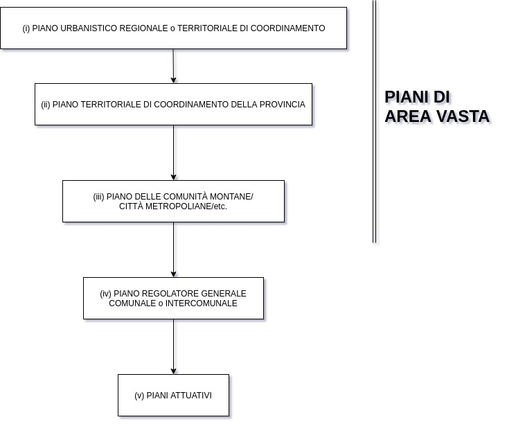

--- 
title: Appunti di Tecnica Urbanistica  
Docenti: *Geneletti* - *Zanon* - *Cassatella* - *Parona*
Autore: *Matteo Franzoi - 2019-03-20*  
Università degli Studi di Trento  
---
---

- [INTRODUZIONE ALLA TECNICA URBANISTICA (Bruno Zanon)](#introduzione-alla-tecnica-urbanistica-bruno-zanon)
  - [TERMINI DELLE DISCIPLINE TERRITORIALI](#termini-delle-discipline-territoriali)
  - [SOGGETTI DELLE DISCIPLINE TERRITORIALI](#soggetti-delle-discipline-territoriali)
  - [TERRITORIO, LUOGO](#territorio-luogo)
    - [LUOGO](#luogo)
    - [NON - LUOGO](#non---luogo)
  - [INSEDIAMENTI, CITTÀ e RETI URBANE](#insediamenti-citt%C3%A0-e-reti-urbane)
    - [CITTÀ](#citt%C3%A0)
    - [CITTÀ INDUSTRIALE](#citt%C3%A0-industriale)
      - [VILLAGGI OPERAI](#villaggi-operai)
      - [URBANISTICA TECNICA](#urbanistica-tecnica)
  - [LA CITTÀ DEL MOVIMENTO MODERNO (Le Corbusier)](#la-citt%C3%A0-del-movimento-moderno-le-corbusier)
    - [DALLA CITTÀ INDUSTRIALE ALLA CITTÀ CONTEMPORANEA](#dalla-citt%C3%A0-industriale-alla-citt%C3%A0-contemporanea)
    - [LA CRISI DELLA CITTÀ MODERNA](#la-crisi-della-citt%C3%A0-moderna)
    - [CITTÀ CONTEMPORANEA](#citt%C3%A0-contemporanea)
    - [NUOVE FORME DI TERRITORIO URBANIZZATO](#nuove-forme-di-territorio-urbanizzato)
    - [CRISI DELLA CITTÀ CONTEMPORANEA](#crisi-della-citt%C3%A0-contemporanea)
  - [TERRITORIO e CITTÀ IN EUROPA e ITALIA (dall'età industriale a oggi)](#territorio-e-citt%C3%A0-in-europa-e-italia-dallet%C3%A0-industriale-a-oggi)
    - [RIVOLUZIONE INDUSTRIALE, CAPITALISMO, CITTÀ INDUSTRIALE](#rivoluzione-industriale-capitalismo-citt%C3%A0-industriale)
      - [INNOVAZIONE TECNICA](#innovazione-tecnica)
      - [NUOVO SISTEMA ECONOMICO](#nuovo-sistema-economico)
      - [COLLOCAZIONE DELLE ATTIVITÀ SUL TERRITORIO](#collocazione-delle-attivit%C3%A0-sul-territorio)
      - [FERROVIE](#ferrovie)
      - [TRASFORMAZIONI URBANE IN EUROPA](#trasformazioni-urbane-in-europa)
      - [L'ITALIA NEL SECOLO $XIX$](#litalia-nel-secolo-xix)
        - [INFRASTRUTTURE STRADALI](#infrastrutture-stradali)
        - [COME SCEGLIERE LE LINEE FERROVIARIE?](#come-scegliere-le-linee-ferroviarie)
        - [BONIFICHE](#bonifiche)
    - [PIANIFICAZIONE URBANISTICA](#pianificazione-urbanistica)
      - [MILANO](#milano)
      - [BOLOGNA](#bologna)
      - [NAPOLI](#napoli)
    - [IL SECONDO DOPOGUERRA](#il-secondo-dopoguerra)
      - [COME RICOSTRUIRE?](#come-ricostruire)
      - [RICOSTRUZIONE](#ricostruzione)
      - [AVVIO DELLA PIANIFICAZIONE URBANISTICA](#avvio-della-pianificazione-urbanistica)
      - [IL BOOM ECONOMICO DEL 1963](#il-boom-economico-del-1963)
      - [NUOVE INFRASTRUTTURE](#nuove-infrastrutture)
      - [BOOM EDILIZIO](#boom-edilizio)
      - [EVOLUZIONE DELLA NORMATIVA URBANISTICA NEL DOPOGUERRA](#evoluzione-della-normativa-urbanistica-nel-dopoguerra)
      - [VINCOLI DEI PIANI e INDENNITÀ DI ESPROPRIO](#vincoli-dei-piani-e-indennit%C3%A0-di-esproprio)
      - [L'AMBIENTE NEL DOPOGUERRA](#lambiente-nel-dopoguerra)
  - [EVOLUZIONE DEL PIANO URBANISTICO](#evoluzione-del-piano-urbanistico)
    - [CITTÀ INDUSTRIALE](#citt%C3%A0-industriale-1)
      - [NEW YORK](#new-york)
    - [PIANO OTTOCENTESCO](#piano-ottocentesco)
    - [I PIANI DEL '900 IN ITALIA](#i-piani-del-900-in-italia)
    - [ATTUAZIONE DEL PIANO](#attuazione-del-piano)
      - [PEREQUAZIONE](#perequazione)
    - [ZONING](#zoning)
    - [AMSTERDAM - PIANO RAZIONALISTA (1934)](#amsterdam---piano-razionalista-1934)
    - [ITALIA](#italia)
      - [TRENTO](#trento)
  - [IL PIANO REGOLATORE GENERALE](#il-piano-regolatore-generale)
    - [FINALITÀ DEL PIANO](#finalit%C3%A0-del-piano)
    - [COSTRUZIONE DEL PIANO URBANISTICO](#costruzione-del-piano-urbanistico)
      - [RUOLO E FORMA DEL PIANO](#ruolo-e-forma-del-piano)
      - [DIMENSIONAMENTO](#dimensionamento)
        - [TRENTO](#trento-1)
    - [DOCUMENTI DEL PIANO](#documenti-del-piano)
    - [RAPPORTI CON TEMI E STRUMENTI DI SETTORE](#rapporti-con-temi-e-strumenti-di-settore)
    - [ZONING](#zoning-1)
    - [STANDARD URBANISTICI](#standard-urbanistici)
      - [ZONE TERRITORIALI OMOGENEE](#zone-territoriali-omogenee)
      - [INDICI URBANISTICO - EDILIZI](#indici-urbanistico---edilizi)
    - [DEFINIZIONE DEGLI INTERVENTI EDILIZI](#definizione-degli-interventi-edilizi)
    - [L'ITER DI APPROVAZIONE DEL PIANO](#liter-di-approvazione-del-piano)
      - [INTERVENTO DIRETTO](#intervento-diretto)
      - [PIANI ATTUATIVI](#piani-attuativi)
        - [PROGRAMMA INTEGRATO DI INTERVENTO](#programma-integrato-di-intervento)
      - [PROCEDURE AMMINISTRATIVE](#procedure-amministrative)
        - [REGOLAMENTO EDILIZIO](#regolamento-edilizio)
        - [COMMISSIONE EDILIZIA](#commissione-edilizia)
  - [LE ANALISI URBANE E TERRITORIALI](#le-analisi-urbane-e-territoriali)
    - [ANALISI e PIANO](#analisi-e-piano)
    - [SAPERE ESPERTO, SAPERE CONTESTUALE](#sapere-esperto-sapere-contestuale)
    - [SISTEMI INFORMATIVI TERRITORIALI (SIT) e GEOGRAPHICAL INFORMATION SYSTEM (GIS)](#sistemi-informativi-territoriali-sit-e-geographical-information-system-gis)
      - [SIT](#sit)
    - [CARTOGRAFIA](#cartografia)
      - [PRODUZIONE CARTOGRAFICA](#produzione-cartografica)
      - [DATI PER ANALISI URBANE e TERRITORIALI](#dati-per-analisi-urbane-e-territoriali)
        - [DOVE SI TROVANO I DATI?](#dove-si-trovano-i-dati)
    - [ANALISI AMBIENTALI](#analisi-ambientali)
    - [MOBILITA'](#mobilita)
  - [I DATI](#i-dati)
    - [TIPI DI DATI](#tipi-di-dati)
    - [VALIDITA' e AFFIDABILITA'](#validita-e-affidabilita)
  - [ANALISI DEMOGRAFICHE PER LA PIANIFICAZIONE](#analisi-demografiche-per-la-pianificazione)
    - [STUDIO DEI CARATTERI DI UNA POPOLAZIONE](#studio-dei-caratteri-di-una-popolazione)
    - [BILANCIO DEMOGRAFICO](#bilancio-demografico)
    - [STRUTTURA DELLA POPOLAZIONE](#struttura-della-popolazione)
    - [PIRAMIDE DELLE ETA'](#piramide-delle-eta)
    - [ANALISI DEI TASSI](#analisi-dei-tassi)
    - [PREVISIONE DELLA POPOLAZIONE](#previsione-della-popolazione)
      - [METODO DI SOPRAVVIVENZA DELLE CORORTI (CLASSI DI ETA')](#metodo-di-sopravvivenza-delle-cororti-classi-di-eta)
  - [ANALISI TIPOLOGICA e MORFOLOGICA URBANA](#analisi-tipologica-e-morfologica-urbana)
    - [LA TIPOLOGIA](#la-tipologia)
    - [SENSO DELLA TIPOLOGIA](#senso-della-tipologia)
    - [TIPOLOGIA e MORFOLOGIA URBANA](#tipologia-e-morfologia-urbana)
    - [TIPOLOGIE DI EDIFICI](#tipologie-di-edifici)
  - [TERRITORIO, INSEDIAMENTO, ATTIVITA'](#territorio-insediamento-attivita)
    - [RELAZIONI VERTICALI e ORIZZONTALI](#relazioni-verticali-e-orizzontali)
    - [LOCALIZZAZIONE DELLE ATTIVITA' SUL TERRITORIO](#localizzazione-delle-attivita-sul-territorio)
      - [PRINCIPI DI ORGANIZZAZIONE TERRITORIALE (CAMAGNI)](#principi-di-organizzazione-territoriale-camagni)
        - [AGGLOMERAZIONE](#agglomerazione)
        - [ACCESSIBILITA'](#accessibilita)
        - [INTERAZIONE SPAZIALE](#interazione-spaziale)
        - [GERARCHIA](#gerarchia)
        - [COMPETITIVITA'](#competitivita)
  - [I SERVIZI PUBBLICI](#i-servizi-pubblici)
    - [SERVIZI](#servizi)
    - [NUOVE CONCEZIONI DI PUBBLICA AMMINISTRAZIONE](#nuove-concezioni-di-pubblica-amministrazione)
    - [QUADRO UE](#quadro-ue)
    - [ATTREZZATURA SOCIALE](#attrezzatura-sociale)
    - [I SOGGETTI](#i-soggetti)
    - [PIANIFICAZIONE DEI SERVIZI](#pianificazione-dei-servizi)
    - [ATTREZZATURE DI SERVIZIO](#attrezzature-di-servizio)
      - [RUOLO URBANISTICO DELLE ATTRAZZATURE](#ruolo-urbanistico-delle-attrazzature)
    - [ANALISI DEL FABBISOGNO](#analisi-del-fabbisogno)
    - [GERARCHIA DEI SERVIZI](#gerarchia-dei-servizi)
    - [BACINO DI UTENZA](#bacino-di-utenza)
    - [DIMENSIONAMENTO e LOCALIZZAZIONE](#dimensionamento-e-localizzazione)
  - [ANALISI DELLA RESIDENZA](#analisi-della-residenza)
    - [LA CASA](#la-casa)
    - [CONTESTO TERRITORIALE - URBANO](#contesto-territoriale---urbano)
      - [GOVERNO DEL MERCATO EDILIZIO](#governo-del-mercato-edilizio)
        - [STRUMENTI DI CONCENTRAZIONE](#strumenti-di-concentrazione)
      - [POLITICA DEI SUOLI](#politica-dei-suoli)
      - [LA RENDITA](#la-rendita)
      - [RUOLO DELL'ENTE PUBBLICO](#ruolo-dellente-pubblico)
      - [ABITAZIONI PRIMARIE e SECONDARIE](#abitazioni-primarie-e-secondarie)
    - [EDIFICIO (ISTAT 2011)](#edificio-istat-2011)
      - [ANALISI DEI DATI](#analisi-dei-dati)
      - [PRATICHE DI INTERVENTO](#pratiche-di-intervento)
- [IL PROCESSO DI PIANO e GLI STRUMENTI DELLA PIANIFICAZIONE IN ITALIA - LA VALUTAZIONE DEI PIANI (Davide Geneletti)](#il-processo-di-piano-e-gli-strumenti-della-pianificazione-in-italia---la-valutazione-dei-piani-davide-geneletti)
  - [CONTENUTI DEI PRINCIPALI STRUMENTI DI PIANIFICAZIONE TERRITORIALE IN ITALIA](#contenuti-dei-principali-strumenti-di-pianificazione-territoriale-in-italia)
  - [LA PIANIFICAZIONE DI AREA VASTA](#la-pianificazione-di-area-vasta)
    - [SCALA REGIONALE (o livello sovracomunale)](#scala-regionale-o-livello-sovracomunale)
      - [STRUTTURA GENERALE](#struttura-generale)
    - [PIANO TERRITORIALE REGIONALE - PTR](#piano-territoriale-regionale---ptr)
      - [TEMI PRINICIPALI DEL PTR](#temi-prinicipali-del-ptr)
    - [PIANO PAESAGGISTICO REGIONALE - PPR](#piano-paesaggistico-regionale---ppr)
      - [PAESAGGIO](#paesaggio)
      - [LINEE GUIDA](#linee-guida)
    - [PIANO TERRITORIALE DI COORDINAMENTO PROVINCIALE - PTCP](#piano-territoriale-di-coordinamento-provinciale---ptcp)
      - [TEMI PRINCIPALI DEL PTCP](#temi-principali-del-ptcp)
    - [PIANO DI BACINO e PIANO PER IL PARCO](#piano-di-bacino-e-piano-per-il-parco)
      - [PIANO DI BACINO](#piano-di-bacino)
        - [TEMI D'INTERESSE DEL PIANO DI BACINO](#temi-dinteresse-del-piano-di-bacino)
      - [PIANO PER IL PARCO](#piano-per-il-parco)
  - [PIANO URBANISTICO COMUNALE](#piano-urbanistico-comunale)
    - [STRUTTURA GENERALE](#struttura-generale-1)
      - [INQUADRAMENTO](#inquadramento)
      - [QUADRO CONOSCITIVO](#quadro-conoscitivo)
      - [PROPOSTE](#proposte)
      - [ATTUAZIONE](#attuazione)
    - [CONTENUTI](#contenuti)
      - [PROVINCIA DI TRENTO](#provincia-di-trento)
      - [EMILIA-ROMAGNA](#emilia-romagna)
      - [LOMBARDIA](#lombardia)
    - [SVILUPPO URBANO](#sviluppo-urbano)
      - [DOVE METTO GLI ABITANTI?](#dove-metto-gli-abitanti)
      - [SERVIZI](#servizi-1)
    - [PROCESSO DI PIANO](#processo-di-piano)
      - [OBIETTIVI](#obiettivi)
      - [RACCOLTA e ANALISI DEI DATI](#raccolta-e-analisi-dei-dati)
      - [STUDI DI DETTAGLIO](#studi-di-dettaglio)
      - [IPOTESI DI PIANO](#ipotesi-di-piano)
- [LA PIANIFICAZIONE URBANISTICA: PROFILI GIURIDICI (Antonio Cassatella)](#la-pianificazione-urbanistica-profili-giuridici-antonio-cassatella)
  - [LE FONTI DEL DIRITTO URBANISTICO e DEL DIRITTO DELL'ATTIVITA` EDILIZIA](#le-fonti-del-diritto-urbanistico-e-del-diritto-dellattivita-edilizia)
    - [NORME DI RIFERIMENTO](#norme-di-riferimento)
      - [LEGISLAZIONE STATALE](#legislazione-statale)
  - [LA PIANIFICAZIONE URBANISTICA: PRINCIPI GENERALI](#la-pianificazione-urbanistica-principi-generali)
    - [LEGGE URBANISTICA 1150/1942](#legge-urbanistica-11501942)
    - [LEGGE 865/1967 "PONTE"](#legge-8651967-%22ponte%22)
  - [IL CONCETTO GIURIDICO DI PIANO](#il-concetto-giuridico-di-piano)
  - [LE FUNZIONI DEI PIANI URBANISTICI](#le-funzioni-dei-piani-urbanistici)
  - [CARATTERISTICHE DELLA PIANIFICAZIONE URBANISTICA](#caratteristiche-della-pianificazione-urbanistica)
  - [LIVELLI DI PIANIFICAZIONE TERRITORIALE](#livelli-di-pianificazione-territoriale)
  - [IL PRG: CONTENUTI e STRUTTURA](#il-prg-contenuti-e-struttura)
    - [STRUTTURA FISICA DEL PIANO](#struttura-fisica-del-piano)
    - [ZONIZZAZIONE: LE SINGOLE ZONE OMOGENEE](#zonizzazione-le-singole-zone-omogenee)
      - [LIMITI e SUPERAMENTO DEL MODELLO STATALE](#limiti-e-superamento-del-modello-statale)
        - [LIMITI](#limiti)
- [LA DISCIPLINA DELLA PIANIFICAZIONE ATTUATIVA (Dott. Leonardo Parona)](#la-disciplina-della-pianificazione-attuativa-dott-leonardo-parona)
  - [EVOLUZIONE DEI MODELLI DI PIANIFICAZIONE: CAUSE e SVILUPPI](#evoluzione-dei-modelli-di-pianificazione-cause-e-sviluppi)
  - [SCHEMA DI SINTESI DEI PIANI](#schema-di-sintesi-dei-piani)
  - [PIANIFICAZIONE ATTUATIVA](#pianificazione-attuativa)
    - [PROGRAMMI PLURIENNALI DI ATTUAZIONE](#programmi-pluriennali-di-attuazione)
    - [PIANO PARTICOLAREGGIATO DI ESECUZIONE](#piano-particolareggiato-di-esecuzione)
      - [PROCEDIMENTO DI FORMAZIONE ORDINARIO](#procedimento-di-formazione-ordinario)
      - [PROCEDIMENTO DI FORMAZIONE SEMPLIFICATO](#procedimento-di-formazione-semplificato)
    - [PIANO DI LOTTIZZAZIONE](#piano-di-lottizzazione)
      - [PROCEDIMENTO DI FORMAZIONE](#procedimento-di-formazione)
      - [PROBLEMATICHE](#problematiche)
    - [PIANI ATTUATIVI SPECIALI e SPERIMENTAZIONI](#piani-attuativi-speciali-e-sperimentazioni)
  - [IN SINTESI ](#in-sintesi)
  - [ESEMPI DI PIANIFICAZIONE URBANISTICA](#esempi-di-pianificazione-urbanistica)
    - [VENETO](#veneto)
      - [PTCR](#ptcr)
        - [CONTENUTO](#contenuto)
        - [PROCEDIMENTO DI FORMAZIONE](#procedimento-di-formazione-1)
      - [PTCP](#ptcp)
        - [CONTENUTO](#contenuto-1)
        - [PROCEDIMENTO DI FORMAZIONE](#procedimento-di-formazione-2)
      - [PIANO REGOLATORE COMUNALE](#piano-regolatore-comunale)
        - [PAT](#pat)
          - [CONTENUTO](#contenuto-2)
          - [PROCEDIMENTO DI FORMAZIONE](#procedimento-di-formazione-3)
        - [PI](#pi)
          - [CONTENUTO](#contenuto-3)
          - [PROCEDIMENTO DI FORMAZIONE](#procedimento-di-formazione-4)
      - [PIANI URBANISTICI ATTUATIVI](#piani-urbanistici-attuativi)
        - [CONTENUTO](#contenuto-4)
        - [PROCEDIMENTO DI FORMAZIONE](#procedimento-di-formazione-5)
    - [PROVINCIA DI TRENTO](#provincia-di-trento-1)
      - [FINALITÀ](#finalit%C3%A0)
      - [ATTRIBUZIONI DELLA PROVINCIA](#attribuzioni-della-provincia)
      - [ATTRIBUZIONI DELLE COMUNITÀ](#attribuzioni-delle-comunit%C3%A0)
      - [ATTRIBUZIONI DEI COMUNI](#attribuzioni-dei-comuni)
      - [SISTEMA DI PIANIFICAZIONE TERRITORIALE](#sistema-di-pianificazione-territoriale)
      - [PUP](#pup)
        - [CONTENUTO](#contenuto-5)
        - [PROCEDIMENTO DI FORMAZIONE](#procedimento-di-formazione-6)
      - [PTC](#ptc)
        - [CONTENUTO](#contenuto-6)
        - [PROCEDIMENTO DI FORMAZIONE](#procedimento-di-formazione-7)
      - [PRG](#prg)
        - [CONTENUTO](#contenuto-7)
        - [PROCEDIMENTO DI FORMAZIONE](#procedimento-di-formazione-8)
      - [PIANI ATTUATIVI](#piani-attuativi-1)
        - [TIPI DI PIANO ATTUATIVO](#tipi-di-piano-attuativo)
        - [PROCEDIMENTO DI FORMAZIONE](#procedimento-di-formazione-9)
    - [PROVINCIA DI BOLZANO](#provincia-di-bolzano)
      - [LIVELLI DI PIANIFICAZIONE](#livelli-di-pianificazione)
      - [PIANIFICAZIONE DI LIVELLO PROVINCIALE](#pianificazione-di-livello-provinciale)
        - [PSP](#psp)
          - [PROCEDIMENTO DI FORMAZIONE](#procedimento-di-formazione-10)
        - [PdS](#pds)
          - [PROCEDIMENTO DI FORMAZIONE](#procedimento-di-formazione-11)
      - [PIANIFICAZIONE DI LIVELLO COMUNALE](#pianificazione-di-livello-comunale)
        - [PSCTP](#psctp)
          - [CONTENUTI MINIMI](#contenuti-minimi)
        - [PCTP](#pctp)
          - [CONTENUTI MINIMI](#contenuti-minimi-1)
          - [PROCEDIMENTO DI FORMAZIONE](#procedimento-di-formazione-12)
        - [PIANIFICAZIONE ATTUATIVA](#pianificazione-attuativa-1)
          - [OBIETTIVI](#obiettivi-1)
          - [TIPOLOGIE DI PIANI](#tipologie-di-piani)
          - [PROCEDIMENTO DI FORMAZIONE](#procedimento-di-formazione-13)
    - [LOMBARDIA](#lombardia-1)
      - [STRUTTURA](#struttura)
        - [PTR](#ptr)
          - [CONTENUTI](#contenuti-1)
        - [PTCP](#ptcp-1)
          - [CONTENUTI](#contenuti-2)
        - [PIANO COMUNALE](#piano-comunale)
          - [DOCUMENTO DI PIANO](#documento-di-piano)
          - [PIANO DEI SERVIZI](#piano-dei-servizi)
          - [PIANO DELLE REGOLE](#piano-delle-regole)
          - [PROCEDIMENTO DI FORMAZIONE](#procedimento-di-formazione-14)
  - [CONSIDERAZIONI CONCLUSIVE](#considerazioni-conclusive)
# APPUNTI DI TECNICA URBANISTICA  <!-- omit in toc -->
## INTRODUZIONE AL CORSO
Il corso pone le basi per l'**introduzione all'urbanistica** e si articola in 4 moduli:  
1) introduzione alla tecnica urbanistica (*Zanon*);  
2) strumenti e processi di pianificazione urbana e terrioriale (*Geneletti*);  
3) elementi e progettazione urbana;  
4) tecnica e principi di legislazione urbanistica (*Cassatella*).

L'esame si composto da:  
- parte scritta (moduli **1**, **2**, **4**): 5 domande articolate come segue:
  - 2 domande sul modulo 1 (Zanon);
  - 2 domande su modulo 2 (Geneletti);
  - 1 domanda sul modulo 4 di legislazione.
- elaborato progettuale con discussione orale.

# INTRODUZIONE ALLA TECNICA URBANISTICA (Bruno Zanon)

## TERMINI DELLE DISCIPLINE TERRITORIALI
* **urbanistica**: impiegato dall'ingegnere spagnolo *Alfonso Cerdà* (1885) nel 1867 per designare una disciplina autonoma avente per scopo l'organizzazione del territorio.
* **pianificazione**: processo decisionale orientato a risolvere problemi. E` impiegato in campi diversi (ambiente, economia, etc.) ed è un concetto **diverso dal progetto**!  
Richiede di precisare il problema e fare delle previsioni (processo molto rischioso).
* **piano regolatore**: regola l'uso di zone del territorio attraverso regole e indicazioni. Presenta dei contenuti di *disegno urbano* come il **progetto alla scala urbana** (infrastrutture, scuole, etc.).
* **governo del territorio**: è stato introdotto nel 2001 nella *Costituzione* italiana. Amplia il concetto di *urbanistica* a tutte le azioni di **trasformazione del territorio**.
* **territorio**: *spazio organizzato dall'uomo*. Ha dimensione ampia e fa riferimento anche all'ambito di governo: `il comune interviene su un certo territorio, la provincia su un altro e lo Stato su un altro ancora`. Si riferisce a **funzioni** e alle loro **relazioni** da organizzare spazialmente.
* **ambiente**: termine molto ampio, di diversi significati in base ai contenuti. In urbanistica ci si riferisce all'ambiente come allo spazio vitale (**habitat**), non solo dell'uomo ma di tutta la natura (materia vivente), cioè dell'**ecosistema**.  
Dove prima c'era un ambiente omogeneo (di una sola specie) a causa delle prevalenza di alcune specie, dopo la modifica da parte dell'uomo si ha un sistema di *biodiversità* caratterizzato da una mescolazione di specie presenti nell'ambiente.  
Il riconoscimento giuridico dell'ambiente è avvenuto di recente (1967) e riguarda il danneggiamento dello stesso (inquinamento dell'aria o dell'acqua, etc.).  
Anche l'Unione Europea con il progetto **Natura 2000** ha iniziato a salvaguardare l'ambiente ed ostacolare impatti negativi sull'habitat.
* **città**: concetto complesso che si riferisce a realtà morfologiche, funzionali e organizzative diverse. È uno spazio diverso da quello agricolo, infatti, consente attività commerciali, artistiche (ma non agricole) e allo stesso tempo offre servizi, protezione, etc.
È comunque un luogo denso e con forma particolare (strade strette, case attaccate, etc.) e impone delle regole specifiche per costruire.
* **paesaggio**: è quello che si percepisce dello spazio che ci circonda. Rappresenta l'aspetto percettivo (visivo) dell'organizzazione del territorio.  Il concetto vede la sua nascita con la pittura del '700 per poi essere usato in geografia come categoria descrittiva di aspetti fisico - morfologici del territorio legati ad aspetti climatici.
* **metodo**: natura composita della disciplina utilizzando strumenti propri dell'urbanistica, ma anche di tipo storico, analitico, geografico, etc.  Necessita di saper dialogare con altre conoscenze.
* **piani**: strumenti urbanistici che hanno scale territoriali differenti in base al territorio da studiare (comunale, provinciale, regionale, statale).
* **norme**: leggi che regolano comportamenti (scala edilizia).
* **programmi**: riguardano aspetti economici di organizzazione temporale.
* **procedure** definizione di scelte e decisioni come *autorizzazioni*, *valutazioni di impatto ambientale*, etc.  
A volte prevedono la conformità di certe norme, altre vole sono valutative (impatto ambientale, sicurezza, etc.).
* **politiche**: intervento di amministrazioni pubbliche.

## SOGGETTI DELLE DISCIPLINE TERRITORIALI
* **amministrazioni pubbliche**: Stato, regioni, province, comuni hanno competenze diverse ma devono perseguire l'interesse pubblico.
* **cittadini**: utenti di città e servizi, membri della comunità che opera le scelte attraverso i meccanismi di partecipazione.
* **operatori economici**: figure diverse relative ai vari settori dell'economia (commercio, industria, etc.).
* **soggetti collettivi**: partiti, sindacati, etc. Entrano nelle scelte territoriali.
* **progettisti/tecnici**: ingegneri, architetti, etc. che si occupano di settori specifici.

## TERRITORIO, LUOGO
Già i romani organizzarono il territorio in modo ordinato usandolo per scopi specifici come può essere quello agricolo.  
Certe forme impresse al territorio, che servono nel lungo periodo, sono tutt'ora presenti. Si deve, allora, valutare se l'opera sarà duratura e utilizzata nel tempo o se verrà dismessa in fretta (come, ad esempio, per le strade).  
Il territorio **non** è un dato ma il risultato di diversi processi, spontanei o umani.  
Gli abitanti di un territorio scrivono, cancellano e riscrivono il "palinsesto" del territorio.  
Il territorio funziona perché consente relazioni con il sito e/o altri parti dello stesso (relazione tra area agricola e mercato o area industriale e porto, etc.)

Il territorio è costruito mediante fasi, dette *atti territorializzanti*:  
1. **denominazione**: un luogo ha un significato per chi lo frequenta. Serve per identificare una superficie o un luogo.  
2. **perimtrizzazione**: confini che consentono la definizione dei luoghi.  
3. **trasformazione materiale**  
4. **comunicazione**: uscire dai limiti fisici con la creazione di reti, nodi, maglie che consentono la relazione tra parti diverse del territorio.  
5. **strutturazione**
<!-- end of list -->
Il primo livello di organizzazione del territorio è quello agricolo che distingue lo spazio utile (*ager*) dalle zone marginali (*saltus*). 

Il concetto di **proprietà** nasce infatti dall'appropriazione del territorio da parte dell'uomo mediante l'agricoltura. La proprietà ha ancora più significato con l'introduzione delle successioni ereditarie  e dell'edificazione.

* **abitare**: dal latino *continuare ad avere* da un senso di sostenibilità nel lungo periodo.

* il paesaggio agrario riflette:
    - capacità tecniche;
    - economie sociali. 

Ad esempio, in Val Badia, vi sono piccoli insediamenti isolati (di origine latina) dovuti dal fatto che i "padroni" consentivano la libertà agli uomini, abitando e coltivando delle zone altrimenti isolate e inabitabili. 

* Bisogna tener conto della *resilienza* del territorio. Riuscire a mantenere il territorio in sicurezza da agenti atmosferici.  
* **deterritorializzazione**: è un processo  di perdita di senso del territorio o di porzioni di esso.  
* **riterritorializzazione**: processo di riconferimento di senso al territorio.  
<!-- end of list --> 
### LUOGO
È uno spazio con un senso e un'immagine.  
Deve rispettare certe qualità e certe funzioni e deve fungere da *rifugio*.  
Le condizioni del luogo coinvolgono anche il comportamento delle persone (ad esempio ghetti).

È molto importante saper comprendere le potenzialità dei luoghi, in modo da pianificare adeguatamente.

### NON - LUOGO
Il non - luogo è uno spazio che non si può definire:
* identitario;
* relazionale;
* storico.

<!-- end of list --> 

Sono un esempio gli *aeroporti*, i *centri commerciali*, etc.  
Spesso i non - luoghi hanno un valore economico, di mercato, ma non storico. Funzionano in maniera differente dai luoghi (piazze, duomo, etc.).

## INSEDIAMENTI, CITTÀ e RETI URBANE
### CITTÀ
La città è una forma insediativa caratterizzata dall'essere un:
* punto di incontro;  
* luogo di attività non agricole;  
* luogo difeso (da mura) e di difesa;  
* sede di potere, giustizia, etc.

La città può avere luogo dove c'è un surplus agricolo in grado di sostenere uomini che si dedicano ad attività non agricole.

È un agglomerato di popolazione, edifici, attività diverse. È un luogo di incontro culturale di gruppi sociali diversi.  
Ha il compito di dare sicurezza mediante regole ed istituzioni.

In genere, le città sono una diversa dall'altra. Il concetto di città non è legato alle dimensioni, ma alla **funzione**, al **peso**, alla **forma che ricopre**.  
La città deve offrire protezione e servizi al territorio circostante. Deve essere collocata in un luogo appropriato: lungo un percorso, in un incrocio di reti, etc.

### CITTÀ INDUSTRIALE
Tra il '700 e '800, in Inghilterra e Europa centrale, si formano nuove attivita produttive: le **fabbriche**.  
Tra le nuove tecnologie portate dalla rivoluzione industriale c'è la *macchina a vapore* (fine '700).  

L'invenzione di nuovi attrezzi agricoli che sostituiscono l'uomo porta una "migrazione" delle persone dalle campagne alla città, che trovano lavoro nelle industrie presenti nei centri urbani.  

I proprietari si appropriano di terre comuni, recintandole e definendo la loro proprietà. Molti contadini rimangono senza terra e sono costretti a spostarsi in città, dove sono situate le fabbriche.

Inizialmente non c'erano regole che limitavano e normavano la costruzione di nuovi edifici; inizia così un momento di *abusivismo edilizio* dove gli imprenditori costruivano edifici con una densità di abitanti molto elevata che causa un calo drastico delle condizioni igienico - ambientali.

Con l'arrivo delle malattie e delle pestilenze, nascono le prime regole con il fine di limitare i rischi sanitari (in particolare per i ricchi borghesi). Le città non reggono questo cambiamento.

Si diffonde l'interesse di difesa collettiva che porta alla prima comparsa dei __fondamenti dell'urbanistica__:
* larghezza minima delle strade;  
* presenza di scuole e parchi.  

#### VILLAGGI OPERAI
Causa condizioni ambientali sempre peggiori date dall'inquinamento atmosferico, inizia un processo di delocalizzazione delle fabbriche che vengono spostate fuori dalle città. Nascono dei piccoli villaggi attorno alle fabbriche che contenevano gli operai.

#### URBANISTICA TECNICA
La comparsa delle prime norme, quali:
* igienico - sanitarie;  
* edilizie;  
* sulle infrastrutture urbane;  
* sulle attrezzature collettive;  
* sui piani;
  
e del loro rispetto, porta ad una edificazione basata sulla ripetizione di moduli creando una urbanizzazione monotona e ripetitiva.

## LA CITTÀ DEL MOVIMENTO MODERNO (Le Corbusier)
Preso atto del cambiamento industriale che colpisce le città, si fa largo l'idea di una *macchina urbana* che includa l'industria.

### DALLA CITTÀ INDUSTRIALE ALLA CITTÀ CONTEMPORANEA
La città moderna, nata sulla base di quella industriale, è una città "**fordista**" connessa:
* al processo di industrializzazione;  
* alla concentrazione di capitali, attività e persone;  
* alla manifattura e alle tecnologie pesanti;  
* al ruolo primario dell'iniziativa privata e a quello complementare di quella pubblica.

Lo Stato ha il compito importante di *pianificazione* e *programmazione* nonché di dare diritti e doveri ai singoli soggetti.

### LA CRISI DELLA CITTÀ MODERNA
I cambiamenti:  
* economici (da economia industriale a terziario);  
* di organizzazione produttiva (just in time);  
* sociali (migrazione, globalizzazione, etc.);  
* di mobilità;

fanno si che le attività si spostino all'esterno delle città.  
I modelli del movimento moderno, in particolare di *Le Corbusier*, hanno prodotto edifici, organismi urbani, etc. inadatti a ospitare la società. Erano infatti piani utopistici, basati sulle "ipotetiche" esigenze della popolazione, con l'idea di fabbricare alloggi capaci di contenere migliaia o addirittura milioni di persone al loro interno (una città in un unico edificio), che andava però contro alle effettive esigenze delle persone.

### CITTÀ CONTEMPORANEA
Pone le basi sullo spazio espanso della società post - industriale, con le industrie delocalizzate. Questo porta a un ruolo di minor importanza delle industrie, formano la *classe borghese*.

Il ruolo dello Stato diventa sempre più importante dovendo gestire compiti e servizi sempre maggiori (strade, canali, etc.) e non solo la sicurezza come era abituato a fare in precedenza.

Diventa importante la figura dell'*ingegnere civile* che sa come applicare nuove tecnologie e nuove capacità di intervento tramite modelli di città.

La struttura urbana cambia profondamente:
* funzioni ospitative (meno industrie e più servizi);
* relazioni con il territorio;
* nuove gerarchie urbane: città servite da reti ferroviarie e industriali vengono premiate rispetto alle vecchie città di "potere" posizionate in alto e non in valle;
* tempi delle città.

<!-- --> 

Dal punto di vista sociale ed etnico si creano:
* minoranze di migranti;
* problemi di identità locale: gli abitanti non hanno nessun sentimento di appartenenza alla società (si creano ghetti).

<!-- end of list --> 

Alcune città come Milano perdono abitanti e attività industriali, rimanendo però un luogo centrale grazie al passaggio della ferrovia.

### NUOVE FORME DI TERRITORIO URBANIZZATO
La dislocazione delle fabbriche porta la formazione di nuovi luoghi di lavoro (nel campo terziario). Si ritrovano funzioni, prima presenti in città, anche in spazi estesi fuori città.

Si riscontra una difficoltà maggiore a rigenerare gli spazi dismessi piuttosto che espandere la città costruendo su aree nuove.

Nascono nuovi luoghi pubblici (centri commerciali, contenitori di attività ludiche e sportive, etc.) ma anche zone dismesse (vuoti urbani, non-luoghi, etc.) che imitano la città storica (ad esempio con la presenza di portici, etc.).

### CRISI DELLA CITTÀ CONTEMPORANEA
La crisi si crea anche nella città contemporanea a causa di:
* problemi ambientali;
* problemi di sicurezza;
* aree di crisi acuta come periferie e aree dismesse.

<!-- --> 

## TERRITORIO e CITTÀ IN EUROPA e ITALIA (dall'età industriale a oggi)
### RIVOLUZIONE INDUSTRIALE, CAPITALISMO, CITTÀ INDUSTRIALE
La rivoluzione industriale in atto in tutta Europa porta:
* profondi cambiamenti economici;
* nuove esigenze e bisogni;
* nuova organizzazione del territorio;
* nuovo ruolo dello Stato che tramite le *tasse* costruisce edifici per la parte debole della popolazione.

<!-- --> 

Per le *organizzazioni territoriali* si nota:
* trasformazione del territorio agricolo;
* nuove reti di infrastrutture per il commercio (non più per il controllo) e per il collegamento di zone commerciali, agricole e mercenarie.

Dove inizialmente erano i *privati* a finanziare le nuove infrastrutture come *ferrovie* e *autostrade*, che rientravano dell'investimento facendo pagare un pedaggio, successivamente lo Stato inizia a nazionalizzare le ferrovie. 

Si creano nuovi nodi centrali derivanti dagli incroci di reti ferroviarie e strade che in precedenza non erano importanti, mentre le città tagliate fuori dal passaggio delle infrastrutture stradali e ferroviarie perdono il ruolo di città.

#### INNOVAZIONE TECNICA
L'innovazione tecnica partita con la rivoluzione industriale migliora le condizioni industriali: esempio lampante è la **macchina a vapore**.

#### NUOVO SISTEMA ECONOMICO
Nasce il **sistema capitalistico**:
* nuovi prodotti in grandi  quantità e in scambio con altri contintenti;
* rimozione di dazi in modo da agevolare gli scambi internazionali;
* libertà di iniziativa senza particolari autorizzazioni.
  
<!-- end of list --> 

Lo Stato reagisce al nuovo sistema imponendo la dogana, le leggi, il fisco. Prende il ruolo di gestore di servizi e infrastrutture e, come sempre, della difesa.  
Gestisce regolamentando le trasformazioni territoriali con la finalità di **mediare interessi diversi**.

#### COLLOCAZIONE DELLE ATTIVITÀ SUL TERRITORIO
Con l'avvento del vapore le **attività si concentrano** e non rimangono solo vicino a fiumi e corsi d'acqua (necessari per dare "energia").

Il trasporto di merci avveniva su:
* canali: natualmente presenti;
* strade;
* ferrovie.

<!-- end of list --> 
  
In particolare, per le ultime due, sorge il problema di chi e come le costruisce, dati gli scarsi fondi dello Stato.  
I privati, con nuove innovazioni tecniche, costruiscono le infrastrutture al posto dello Stato.

#### FERROVIE
La necessità di collegare le attività industriali ai porti creò una rete nazionale e internazionale di ferrovie.  
Le reti urbane vengono riorganizzate e il territorio viene modificato dove arriva la ferrovia.  
Città servite dal sistema ferroviario (o di intersezione di esso) guadagnano un'importanza notevole di mercato, mentre, le città tagliate fuori dal passaggio della ferrovia perdono sempre più valore.

#### TRASFORMAZIONI URBANE IN EUROPA
Le grandi capitali diventano un modello di riferimento.  
La Parigi di Napoleone e Haussmann sente la necessità di:
* innovare il sistema urbano;
* rendere sicura la città;
* connettere le stazioni ferroviarie tra loro;
* creare viali di connessione tra poli o parti urbane;
* definire le modalità attuative del piano (o delle idee).  

Per connettere parti urbane, in particolare, vengono creati dei viali molto larghi (quello che passa sotto all Tour Eiffel). Per fare questo fu necessario abbattere edifici, mentre, quelli che davano sui viale salirono vertiginosamente di prezzo.

#### L'ITALIA NEL SECOLO $XIX$
Dopo l'unificazione politica del 1861, si scelse un modello napoleonico di amministrazione pubblica basato su province, comuni, ministeri, moneta unica, catasto, etc.  

Nasce la prima legge sulle **espropriazioni per causa di utilità pubblica**: *legge n. 2359 del 25 giugno 1865*.  
Nonostante questo, non esistevano leggi che descrivevano come ampliare l'abitato. Per farlo era necessario adottare i piani regolatori (prima statali e poi passati in mano alle regioni).  

Durante il secolo $XIX$ prevavelano le attività agricole, principalmente poste lungo i corsi d'acqua. 

La scoperta dell'**idroelettrico** all'inizio del '900 porta a un veloce sviluppo delle zone più avantaggiate (dove passavano corsi d'acqua). In seguito la nazionalizzazione del sistema idroelettrico consente un ampliamento della rete anche a zone rurali.

Fotografando l'Italia del secolo $XIX$, si può vedere che:
* l'Italia settentrionale era caratterizzata da piccole città concentrate;
* in Italia centrale c'erano città più grandi contornate da campagne;
* in Italia meridionale prevalevano i latifondi con vaste campagne, paesi molto grandi e densi in cui abitavano i contadini.

##### INFRASTRUTTURE STRADALI
Nel 1861 le infrastrutture stradali erano deboli: le strade carrabili erano poche e difficili da percorrere.  
Si sente il bisogno di creare nuove strade, ottenendo negli anni '20 una rete che converge nei centri urbani.

Con l'avvento della motorizzazione ci si accorge che far convergere le strade nei centri non è l'ideale (per inquinamento e traffico): nascono le *circonvallazioni* e il primo **codice della strada**.  
La rete stradale si articola su un sistema urbano e extraurbano. Negli anni '20 - '30, l'avvio del progetto autostradale (attorno a Milano) amplia ancora la rete di infrastrutture.  
Lo Stato decide e gestisce le tratte autostradali (oltre alle ferrovie) assegnando a privati l'onere di costruire e gestire l'opera per 25 anni (iniziali).

##### COME SCEGLIERE LE LINEE FERROVIARIE?
Scegliendo linee più dirette (stile alta velocità) si corre il rischio di tagliare fuori alcune città, prediligendo città più importanti.  
Si creano così delle linee secondarie per collegare le città tagliate fuori alle linee principali, formando una **rete ferroviaria**.

Nel 1905, a causa della crisi delle aziende gestori delle ferrovie, lo Stato decide di nazionalizzara la rete ferroviaria.

Dopo il 1936, con l'avvento dell'idroelettrico e la carenza di carbone, si avvia un processo di elettrificazione delle linee principali, eliminando qualche linea secondaria.

Nel 2009 le principali reti ferroviarie erano collegate con le linee europee.

##### BONIFICHE
I cambiamenti territoriali possono avvenire anche attraverso **bonifiche** e arginazioni (come ad esempio per il Po). Gli interventi possono essere finanziati sia dal pubblico (in particolare per i corsi d'acqua) che da privati.  
Le dimensioni degli interventi dell'epoca erano molto grandi. Un esempio possono essere il _delta del Po_, la _pianura veronese e ferrerase_.  
I privati che finanziavano le bonifiche erano principalmente grandi imprese capitalistiche che avevano il fine di lavorare il terreno. Importanti lavori sono stati fatti anche costruendo collegamenti e servizi, che formarono poi un **capoluogo**. Un esempio di questo processo è _Latina_.  
Nel primo dopoguerra il compito di bonificare le aree di Latina era stato dato ai reduci della prima guerra mondiale (invece che alle grandi imprese).

Dal 1932, 60'000 contadini veneti, friulani e ferraresi si trasferirono nelle aree bonificate.

Le nuove città vengono progettate con l'idea di _città italiana_ e quindi con una __centralità__ e una __griglia__ abbastanza regolare.

### PIANIFICAZIONE URBANISTICA
#### MILANO
Le città si espandono molto velocemente e in modo diverso dalla città storica per via delle diverse attrezzature e dei diversi servizi.  
Si ha la necessità di individuare luoghi per la residenza adatti alle diverse gerarchie di popolazione. Non basta però individuare e inventare lo spazio, ma serve creare dei _modelli di pianificazione_.  

La città diventa sempre più estesa e necessità di un trasporto pubblico massiccio. Essendo le strade non adatte al transito di un elevato flusso di veicoli, si creano delle sezioni stradali più larghe affiancate a marciapiedi molto ampi protetti da alberi (viali alberati).

#### BOLOGNA
Le mura vengono abbattute e la città si espande in cerchie centrate nella città vecchia collegate ad essa mediante strade radiali. Questo processo ha un costo per la comunità ma allo stesso tempo porta dei vantaggi in termini di valori degli edifici nelle nuove zone.

#### NAPOLI
Dopo l'epidemia di colera (1885) il centro viene sventrato e viene fatto un viale centrale.  
Passa la legge per l'esproprio e il risanamento in modo da bonificare la città messa in ginocchio dalla malattia.  
L'approccio della demolizione viene mantenuto anche durante l'epoca fascista, non svecchiando né aggiornando la città.

### IL SECONDO DOPOGUERRA
A differenza della prima guerra mondiale svoltasi lontano dalle città, la seconda si è svolta su tutto il territorio portando devastazione nelle città e sulle infrastrutture.  
Viene nuovamente istituita la democrazia, svanita con il fascismo e viene attivata una grande mobilità da parte delle persone per ricostruire centri storici e infrastrutture.  
Le condizioni abitative erano molto problematiche: le persone erano attirate verso la città, ma gli alloggi scarseggiavano ovunque. 

#### COME RICOSTRUIRE?
Nasce il dibattito fra il _ricostruire le parti storiche come e dove erano_ e l'_utilizzo di nuove tecnologie_ in modo da costruire "come oggi".

A cavallo degli anni '50 la situazione economica era grave e la maggior parte della popolazione si occupava di agricoltura.  
Ha il via una fase di __emigrazione__ temporanea verso i Paesi europei, e permanente verso il nord - america.

#### RICOSTRUZIONE
La ricostruzione fu favorita dal __"piano Marshall"__ (USA) che integrava economicamente anche gli altri Paesi colpiti. Il sostegno per consentire di far ripartire l'economia era comune tra tutti gli Stati.
I mercati si aprono con i Paesi esteri. 

Lo Stato italiano ha un ruolo importante: fonda l'istituto di ricostruzione (IRI) che, assieme ad ENI, approvvigionano con prodotti siderurgici ed energetici il popolo che necessita di materie prime.

#### AVVIO DELLA PIANIFICAZIONE URBANISTICA
La __legge urbanistica__ (1942) che regolamenta, attraverso il PRG, e definisce i _piani_ come _strumenti di governo e territorio, __non viene utilizzata!__  
Con un decreto viene istituito un _piano di ricostruzione_. Si identificano i danni eseguiti e si creano dei piani (non unici) per la ricostruzione, con delle sezioni molto semplici e un numero di piani elevato in modo da contenere più alloggi che in precedenza.  
Parte il processo di edificazione: come si interviene?  

A __Trento__ si interviene senza un piano, appoggiandosi solamente al _regolamento edilizio_ e a qualche lottizzazione locale. 

In altri casi è intervenuto l'ente pubblico con l'edilizia popolare costruita distante dalla città.  

Nasce un processo di urbanizzazione (servizi di trasporto pubblico, altre costruzioni edilizie, etc.) nelle zone attorno alla città.

Nel 1963, in seguito al processo di ricostruzione, l'economia italiana ha un __booom__.

#### IL BOOM ECONOMICO DEL 1963
Durante il boom economico del 1963 molte imprese si rafforzano con la progettazione di auto e moto e nascono le prime industrie di elettrodomestici.  
L'Italia, caratterizzata da prezzi medio - bassi, vive grazie all'esportazione. 

Si ha un'evoluzione del settore tessile grazie a nuove modalità: si prendono materie prime povere e si creano prodotti finiti di alta qualità.

Le città medio - piccole si specializzano in un settore grazie alla congregazione di piccole imprese.  
Le grandi imprese, invece, sviluppano il __triangolo industriale__: Torino - Milano - Genova.

Dal punto di vista territoriale, tra gli anni '50 - '70, si ha uno spostamento della popolazione dal sud Italia verso il nord.

Nonostante tutto, le condizioni abitative erano modeste: solo il 7.4% delle abitazioni italiane avevano acqua, servizi ed elettricità assieme.

Lo Stato crea __INA CASA__, istituto pubblico finanziato dallo Stato, dai datori di lavoro e dalle trattenute dagli stipendi dei dipendenti, con il compito di costruire case e quartieri popolari.

#### NUOVE INFRASTRUTTURE
Con l'avvio della motorizzazione di massa si necessita di una rete stradale più adeguata.  
Dagli anni '50 si inizia a costruire con entusiasmo l'_autostrada_ con modelli avanzati: 2 corsie per senso di marcia, svincoli su due livelli, autogrill, pedaggi. Le autostrade spesso venivano finanziate e costruite da privati che avevano un ritorno attraverso i pedaggi a carico degli utilizzatori.

#### BOOM EDILIZIO
Accanto al boom economico ha inizio il boom edilizio. L'assenza di piani urbanistici e regole adeguate, però, necessita di seguire il regolamento edilizio che non sempre da tutte le indicazioni.  
L'alta domanda di alloggi e i bassi costi di costruzione fomentano la _speculazione edilizia_.

#### EVOLUZIONE DELLA NORMATIVA URBANISTICA NEL DOPOGUERRA
Le leggi e le normative urbanistiche del secondo dopoguerra erano:
* legge 1150 del 1942: viene criticata perché prevedeva uno sviluppo prevalentemente da parte del pubblico;
* legge 167/1967: __legge sull'esproprio__ per attuare piani di _edilizia economica popolare_;
* legge 765/1967: impone dei limiti all'edificazione dove non sono presenti piani regolatori. Inoltre, i PRG devono proporre _indici di edificazione_ contenuti (altezza, volume su mq, etc.). I PRG non possono prevedere solo aree edificabili ma devono prevedere anche aree di servizio pubblico ($18\,m^2$ per abitante per i comuni con più di 10'000 abitanti);
* legge 865/1971: __esproprio per piani di insediamento produttivi__ (industrie);
* legge 10/1997: concessioni edilizie;
* legge 457/1978: recupero dei centri storici per evitare l'abbandono.

#### VINCOLI DEI PIANI e INDENNITÀ DI ESPROPRIO 
Dopo una sentenza della Corte Costituzionale, i vincoli dei piani per l'esproprio sono diventati a __tempo determinato__. In precedenza, infatti, i piani potevano prevedere degli espropri per servizi pubblici senza l'obbligo di doverli costruire entro una data precisa.  
Inoltre, dal 2007 l'indennità di esproprio avviene al prezzo di mercato, il che lo rende molto dispendioso economicamente per la pubblica amministrazione.

#### L'AMBIENTE NEL DOPOGUERRA
Durante il secondo dopoguerra sono state approvate delle leggi per la tutela dell'ambiente. In particolare:
* 1939: legge sulla tutela delle bellezze;
* 1985 - legge Galasso: sottopone a vincolo zone, aree e luoghi di grande importanza e bellezza (laghi, coste, etc.). Impone dei controlli paesaggistici per costruire;
* 2004: codice beni culturali e paesaggio.

## EVOLUZIONE DEL PIANO URBANISTICO
### CITTÀ INDUSTRIALE
La città industriale è caratterizzata da nuove componenti: le fabbriche.  
Diventa importante collegare tra loro le componenti della città e definire modelli urbani di abitabilità di determinate classi sociali.

#### NEW YORK
A New York, i commissari definiscono una _griglia regolare_ e semplice che risulta un elemento solido pesantemente impiegato.  
Di notevole importanza per una città così ampia sono gli spazi verdi: viene creato _Central Park_, parco molto vasto posizionato in mezzo alla città.  
Alle strade principali viene dato il nome di "i - esima" __Aveneu__. Alle strade secondarie "j - esima" __Street__. Entrambe non risultavano eccessivamente larghe (come i viali francesi).  
Il modello di edificio impiegato si estende in altezza, in modo da occupare meno area possibile del territorio.

### PIANO OTTOCENTESCO
Adegua la città storica e la collega alla nuova città mediante modelli tipicamente a griglia caratterizzati da edifici con facciata che dà sulla strada e cortili interni.

Non sempre il modello a griglia è accettato: nascono dei movimenti che prediligono il "pittoresco" caratteristico della città vecchia.  
Questi si basano sul disegno irregolare con la proposta, all'inizio del '900, di città giardino a bassa densità, dove prevale il verde. In molti casi vengono creati _quartieri giardino_: schiere circondate da giardini e posizionate su griglie deformate.

### I PIANI DEL '900 IN ITALIA
All'inizio del '900 c'è una contrapposizione tra il disegno urbanistico regolare, a griglia, e il disegno pittoresco.

### ATTUAZIONE DEL PIANO
L'attuazione del piano necessita di riorganizzare le aree.  
In Germania nascono i primi __piani di lottizzazione__: si riorganizzano le superfici per definire lotti edificabili, strade, marciapiedi che vengono detratti dalle superfici edificabili.

#### PEREQUAZIONE
Se l'esproprio è molto caro, il privato cede una parte di terreno per costruire strade, servizi pubblici (area per standard) tenendosene una parte utilizzabile (area privata).

### ZONING
Lo zoning è un meccanismo di pianificazione secondo zone del territorio comunale, che viene smaterializzato.  
Il territorio viene diviso in zone a cui vengono definite le destinazioni d'uso (zona residenziale, zona industriale, etc.) e gli indici edificabili (distanza dai confini, altezza massima, etc.).

### AMSTERDAM - PIANO RAZIONALISTA (1934)
Si attiva un percorso di analisi preliminari e di previsione negli anni futuri in funzione del numero di abitanti futuro (scuole necessarie, servizi, etc.).

Vengono costituiti dei quartieri residenzili serviti da scuole e servizi pubbici vari.  
Il territorio viene suddiviso in zone che definiscono il piano attuativo.

### ITALIA
In Italia, viene approvata la legge urbanistica 1150/1942: piano post razionalista, dove vengono attuate delle previsioni (in genere poco accurate) e delle indagini.  

Le periferie crescono in maniera disordinata, obbligando il pubblico a creare servizi (fognature, strade, etc.) per poche case sparse sul territorio.

Viene impiegato lo zoning dalla pubblica amministrazione, che risulta però poco impegnata ed efficacie. Inizia un intervento da parte dei privati.

__N.B. Il piano non è un progetto! Dà più libertà di interpretazione e delle indicazioni su cosa fare e cosa non fare__.

Sulla base della legge urbanistica del 1942, sono stati avviati i __piani__ (anche se in ritardo, intorno agli anni '70). Questi prevedevano lo __zoning__ distinguendo le attività che potevano essere svolte e le funzioni ammesse in determinate zone.

#### TRENTO
A Trento, il PRG del 1989 contiene lo zoning che è composto da microzone. Questo lo rende facilmenta attuabile.

In zone già urbanizzate, o in lottizzazioni, si può intervenire applicando un _piano attuativo_.

## IL PIANO REGOLATORE GENERALE
Il PRG si occupa sia di questioni al lungo periodo sia a breve periodo.

### FINALITÀ DEL PIANO
Il piano deve rispondere alle esigenze della comunità. Questo rende il piano di competenza del comune, ente pià vicino al cittadino.  
Il piano deve comunque bilanciare attese collettive (parcheggi, sicurezza, etc.) ma anche interloquire con diversi interessi dei cittadini, a volte conflittuali.

### COSTRUZIONE DEL PIANO URBANISTICO
In Trentino, si ha:
* piano territoriale: deve essere soddisfatto dal PRG;
* piano paesaggistico (non regolamenta le infrastrutture, etc.).
  
#### RUOLO E FORMA DEL PIANO
Il piano è composto da:
* norme e indicazioni;
* progetto o processo;
* rapporti tra scale o fasi e soggetti attuatori.

Vi sono diverse declinazioni del piano:
* piano strategico: decisioni e strategie da assumere per il cambiamento;
* piano strutturale: riguarda la struttura del territorio. Include le invarianti (monte Bondone, Duomo, autostrada, etc.) che non possono essere spostate;
* piano operativo: piano di intervento e di trasformazione (presente ad esempio in Veneto);
* piano di uso del suolo: regolamenta gli usi e la trasformabilità del suolo;
* piano comprensivo: somma un po' tutti i piani precedenti. Un esempio è il PRG di Trento.

#### DIMENSIONAMENTO
In alcuni casi è necessario modificare il piano perché servono alloggi, parcheggi, servizi, etc. Si possono distinguere due visioni di dimensionamento del piano:
* __visione funzionalista__: consiste nel prevedere i fabbisogni delle persone e le dimensioni di servizi e infrastrutture;
* __visione incrementalista__: consiste nell'identificare le esigenze e creare delle soluzioni.

Nel dimensionamento si deve riuscire a soddisfare, oltra alla quantità di richieste, anche la _qualità_, definendo una tipologia edilizia e degli __standard__: una persona ha bisogno di $100\,m^3$ (o $25\,m^2$).  
Si deve anche decidere il ruolo dei soggetti per le responsabilità.

##### TRENTO
Trento è un territorio molto eterogeneo. L'80% del territorio del comune di Trento è _extraurbano_ e il restante 20% _urbano_. Di quest'ultimo, il 50% degli alloggi è di proprietà pubblica. Il PRG deve essere in grado di normare tutto il territorio e di fornire un quadro urbano coerente, combinando in maniera appropriata tutte le componenti.

### DOCUMENTI DEL PIANO
Il piano è composto da tre elementi principali:
* __relazione__: giustifica, descrive e argomenta le scelte fatte per l'interesse pubblico. Dà indicazioni su come fare certi interventi;
* __cartografia__: zonizza il territorio in funzione agli utilizzi. Rimanda alle norme per i vincoli progettuali;
* __norme di attuazione__

### RAPPORTI CON TEMI E STRUMENTI DI SETTORE
Il PRG deve soddisfare piani e tematiche di settore quali:
* sicurezza idrogeologica: in genere contenuta nel __piano di bacino__ che attraverso la __carta geologica__ indica le zone geologicamente pericolose o problematiche e mette a tutela zone di sorgenti e pozzi;
* valori naturalistici (aree protette);
* valori paesaggistici (aree sottoposte a vincoli paesaggistici come boschi, corsi d'acqua, etc.);
* valori storico - culturali (immobili sottoposti a vincolo come il Duomo, etc.);
* piani di settore: un esempio sono il piano di mobilità (si può limitare alla circolazione ma deve comunque accordarsi al piano regolatore), il piano per lo smaltimento dei rifiuti, etc.;

### ZONING
Lo zoning consiste nell'individuazione cartografica delle diverse zone. Bisogna comunque tener conto delle fasce di rispetto da autostrade, ferrovie, depuratori, etc. Questo rende lo zoning un processo complicato.

### STANDARD URBANISTICI
Gli standard urbanistci sono stati definiti da un decreto ministeriale del 1968 e dalla legge "__Ponte__" del 1967 e fissano operativamente parametri quali:
* limite inderogabile di densità edilizia;
* altezza massima;
* distanza tra i fabbricati;
* etc.

Il piano regolatore deve già soddisfare i limiti e gli standarde definiti, prevedendo spazi pubblici e parcheggi.

Il decreto interviene _fissando limiti ai parametri edificatori e prescrivendo aree e attrezzature pubbliche_.

Gli __standard urbanistici__ sono quantità minime prescritte per le quantità di spazi pubblici, di verde pubblico, di parcheggi, da osservare nella redazione di un piano urbanistico.

#### ZONE TERRITORIALI OMOGENEE
La norma sugli standard individua le zone territoriali omogenee:
* __A__: centri storici;
* __B__: parti ediciate consolidate;
* __C__: aree di nuovo sviluppo residenziale;
* __D__: aree per insediamenti industriali;
* __E__: aree agricole;
* __F__: aree per attrezzature e impianti di interesse generale.

Il decreto sugli standard impone che _per ogni abitante insediato o da insediare deve essere prevista una superficie minima di spazi pubblici pari a_:
* $18\,m^2$ per insediamenti residenziali con un numero di abitanti superiore a 10'000;
* $12\,m^2$ per insediamenti residenziali con un numero di abitanti inferiore a 10'000;

Questa superficie viene ripartita come segue:
* $4.50\,m^2$ __istruzione__: asili nido, scuole materne, scuole dell'obbligo;
* $2.00\,m^2$ __aree attrezzate__: sanitarie, religiose, culturali;
* $9.00\,m^2$ __spazi pubblici attrezzati a parco__ e per il gioco e per lo sport;
* $2.50\,m^2$ __parcheggi__.

Il __dimensionamento__ avviene tramite  indici di densità, territoriale o fondiaria ($\simeq 2\,m^3/m^2$), e parametri che misurano le esigenze di spazio pro capite (circa $25\,m^2$ di superfricie abitabile).

Indici di densità territoriale alti portano a superfici effettivamente edificabili minori e quindi indici di densità fondiaria bassi.

Le _aree a standard_ sono _aree pubbliche_ cedute dai privati al pubblico (in caso di lottizzazioni, etc.).

Oltre ai parcheggi pubblici che rientrano, però, nelle aree a standard, bisogna tener conto del numero di _parcheggi privati_ delle zone edificate che sono differenti da quelli pubblici.

#### INDICI URBANISTICO - EDILIZI
__Come si attua un piano regolatore?__

Il piano regolatore si attua per _piani attuativi_ (in caso di lottizzazioni) o, in alcuni casi, per _intervento diretto_ (servizi già presenti).

Si devono comunque rispettare le regole imposte dagli indici edificatori tipo:
* rapporto di copertura  

* superficie minima dei lotti: conferisce omogeneità all'edificazione. È presente in alcuni piani regolatori;
* distanza minime tra edifici: $10\,m$ (decreto ministeriale) oppure la proiezione dell'edificio più elevato se la confrontanza è maggiore o uguale a $12\,m$.  
   
È possibile derogare in caso di pareti non finestrate, di vani scala, etc.;
* altezza degli edifici: il piano descrive anche la modalità di misura (gronda, metà falda, colmo, etc.);
* densità fondiaria: espressa in $m^3 / m^2$ o in $m^2_{calpestabili} / m^2$. Nel secondo caso vani come ingresso, vano scala, muratura, etc. non vengono contati (adottato dal PRG di Trento). Per indici di densità fondiaria più grandi di $3\,m^3/m^2$ è necessario un piano attuativo. Per limitare l'edificabilità (ad esempio in zone agricole) si abbassa l'indice edificatorio. Per le residenze in territorio aperto il rapporto è di $0.01\,m^3/m^2$;
* densità terrioriale: rapporto tra volume edificabile e superficie dove alcune aree sono destinate secondo gli standard;
* distanza dai confini ($5\,m$);
* distanza dalle strade: definita dal decreto sugli standard vale all'esterno dei centri abitati;
* superfici a parcheggio: sono presenti 2 indicazioni:
  - riferita all'edificio: $1\,m^2$ di parcheggio ogni $10\,m^3$ di edificio per assicurare la funzionalità dell'edificio;
  - riferita alla città: $2.5\,m^2/abitante$ di parcheggi pubblici;
* superfici a verde: in aree produttive il decreto sugli standard impone una quota minima di aree verdi;
* altri indici: permeabilità del suolo, etc.

### DEFINIZIONE DEGLI INTERVENTI EDILIZI
Gli interventi edilizi sono normati non solo da zonizzazione, destinazioni d'uso e da indici ma anche da indicazioni riferite all'intervento specifico ai singoli edifici.

Alcune parti, come nel centro urbano, non sono regolamentate da indici ma dall'_individuazione di singole unità edilizie_ e dalla refolazione degli interventi da effettuare. Ad esempio, per edifici storici, non sono importanti i limiti di volume e le distanze, ma viene regolamentata con riferimento alle operazioni di restauro e conservazione dello stesso.  
Ogni singola unità edilizia avrà le sue regole da rispettare.

Secondo la _legge n. 457 art. 31 del 5 agosto 1978_ gli interventi possibili sono:
* manutenzione ordinaria: riparazione, rinnovamento, mantenimento dell'efficienza dell'edificio (impianti, etc.);
* manutenzione straordinaria: modificare o sostituire parti strutturali, realizzare servizi igienico - sanitari o tecnologici (senza che aumentino il volume dell'edificio e la superficie delle unità o modifichino le destinazioni d'uso);
* restauro e risanamento conservatorio: conservare l'organismo edilizio e assicurarne le funzionalità. Esempi sono il consolidamento, ripristino e rinnovo degli elementi dell'edificio. Reastauro e risanamento sono due interventi diversi: il restauro è molto rigoroso mentre il risanamento è più libero ma non consente di modificare drasticamente l'aspetto dell'edificio;
* ristrutturazione edilizia: trasformare gli organismi edilizi mediante un insieme di opere in modo da ottenere un organismo in parte o del tutto diverso dal precedente. Include anche la demolizione e successiva __fedele__ ricostruzione di un fabbricato identico;
* nuova costruzione: trasformazione edilizia o urbanistica del territorio;
* ristrutturazione urbanistica: sostituire il tessuto urbanistico - edilizio.

### L'ITER DI APPROVAZIONE DEL PIANO 
I piani urbanistici sono _atti tecnico - amministrativi_ che devono seguire un iter preciso di approvazione per garantire la correttezza delle norme.  
Solitamente la Giunta comunale (organo esecutivo) decide e avvia il processo di modifica del piano regolatore.  
Una volta predisposto, il Consiglio comunale presenta e __adotta__ il piano. Il piano viene adottato e non approvato!  
Viene così reso pubblico e può essere visionato per 30 giorni durante cui possono essere presentate delle __osservazioni__ di atti non giustificati o di problemi in esso.  

Dopo la seconda adozione segue l'__esame tecnico__ da parte di uno specifico organo. In seguito viene __approvato__ da organi superiori (regione o provincia autonoma).  

L'adozione fa scattare la _salvaguardia del piano_, per evitare ad esempio che venga costruito in zone classificate nel piano come pubbliche durante l'adozione.

Il piano può essere attuato attraverso:
* l'__intervento diretto__;
* __piani attuativi__.

#### INTERVENTO DIRETTO
Normato dal _DPR 6-06-2001 n. 380 TITOLO II - TITOLI ABILITATIVI - CAPO I - DISPOSIZIONI GENERALI - Art. 6_ definisce:
* __attività edilizia libera__;
* __permesso per costruire__;
* __denuncia di inizio lavori__.

#### PIANI ATTUATIVI
I piani attuativi possono essere di:
* __iniziativa pubblica__: permette di investire denaro pubblico per:
  * piani particolareggiati;
  * esproprio di terreni;
  * etc.

* __iniziativa privata__:
  * lottizzazioni convenzionate;
  * piani di recupero (anche di iniziativa pubblica);
  * convenzione tra ente pubblico e privati.

##### PROGRAMMA INTEGRATO DI INTERVENTO
Pensato per il recupero edilizio e urbanistico di aree dismesse cedendo parte dell'area al pubblico.  
Può valere come variante al PRG.

#### PROCEDURE AMMINISTRATIVE
##### REGOLAMENTO EDILIZIO
Norma gli aspetti relativi all'edificazione. Non cambia con il PRG.
##### COMMISSIONE EDILIZIA
Organo tecnico consultivo dell'amministrazione comunale.

## LE ANALISI URBANE E TERRITORIALI
Il processo di indagine e analisi serve, oltre che per costruire il piano, per rispondere ai momenti decisionali e amministrativi.

### ANALISI e PIANO
Il quadro del piano deve essere monitorato lungo tutto il suo processo  e attraverso tutti i ruoli in fase di progettazione e attuazione dello stesso.

I dati e le informazioni possono essere raccolti in modo continuativo o con azioni ad hoc.

### SAPERE ESPERTO, SAPERE CONTESTUALE
Non è sempre sufficiente il sapere tecnico (dell'ingegnere) ma a volte bisogna anche contestualizzarlo con la cultura degli abitanti e del territorio.

Per prima cosa si analizza lo stato attuale della popolazione, del lavoro e del territorio. Poi, si passa alla fase di visione generale con ipotesi, previsioni e decisioni.

Le informazioni non sono generiche, ma localizzate.

### SISTEMI INFORMATIVI TERRITORIALI (SIT) e GEOGRAPHICAL INFORMATION SYSTEM (GIS)
#### SIT
Hanno a che fare con informazioni geometriche, spaziali e topologiche.  
I dati possono essere vettoriali o raster.  
Il sistema consente di archiviare i dati ed estrarli. I dati sono corredati da _metadati_, informazioni sui dati stessi (modalità di raccolta, data della raccolta, etc.).

### CARTOGRAFIA
La cartografia è necessaria per operare sul lato urbano.  
La scala cartografica è fondamentale per defiire il livello di dettaglio delle informazioni raccolte.
La cartografia è molto dispendiosa sia economicamente che in termini di tempo. A volte, infatti, possono non essere aggiornate.

#### PRODUZIONE CARTOGRAFICA
I produttori cartografici italiani sono:
* __Istituto Geografico Militare__: scala di rappresentazione di 1:100'000, 1:50'000;
* __regioni__ e __province autonome__: sclale di 1:10'000, 1:5000;
* __catasto__: documenta le proprietà immobiliari a fini fiscali. La cartografia che produce è di scala 1:1000, etc. e non rappresentano il territorio ma hanno una visuale piatta.

È quasi impossibile sovrapporre carte catastali e topografiche.

Le scale richieste per un piano urbanistico sono di 1:1000, 1:2000.

#### DATI PER ANALISI URBANE e TERRITORIALI
I dati di interesse sono:
* popolazione;
* attività della popolazione;
* abitazioni;
* dinamiche della popolazione (come e dove si spostano).

e vengono raccolte attraverso:
* fonti dirette: rilevate sul campo;
* fonti indirette: banche dati, etc.

##### DOVE SI TROVANO I DATI?
I dati necessari sono forniti da:
* __Istituto Nazionale di Statistica (ISTAT)__: raccoglie dati generali, in particolare censimenti di:
  * popolazione;
  * industria;
  * agricoltura.
  
  Dal 1 ottobre 2018 è in atto il censimento permanente che avviene in modo dinamico e continuativo. In precedenza il censimento avveniva ogni 10 anni.  
  Il censimento fornische dati relativi a:
  * popolazione per sesso, età, istruzione;
  * famiglie e relativi componenti;
  * attività svolte (agricoltura, industria, terziario);
  * abitazioni occupate e non occupate, tipologia di abitazione, numero di stanza, servizi, etc.

  I dati devono essere studiati tenendo conto del territorio e delle sue dinamiche.

* __anagrafe comunale__: registra i residenti e i cambi di residenza. Fornisce informazioni su:
  * nati;
  * morti;
  * immigrati;
  * emigrati.

  L'ISTAT raccoglie e analizza questi dati generalmente disponibili annualmente.

  Interessanti sono i cambi di residenza che descrivono le esigenze delle famiglie e la loro necessità di cambiare casa.

 * __camera di commercio__: dati relativi a imprese e attività economiche;
 * __uffici pubblici, aziende di servizio__, etc.

Gli aspetti da indagare sono:
* ambiente, risorse, paesaggio, salvaguardia dell'ambiente e delle risorse, senso di appartenenza;
* popolazione e sue attività;
* attività economiche di un determinato territorio;
* dinamiche insediative: variazione di popolazione e di attività econoniche;
* uso del suolo: cosa c'è e dove (qui ci sono boschi, qui prati, etc.);
* struttura urbana: reticolo, suburbanizzazione, corte, etc.;
* patrimonio edilizio e produzione edilizia;
* mobilità: modi per spostare persone e merci sul territorio. Esistono piani per la mobilità (e.g. piano per la mobilità sostenibile);
* servizi (pubblici): scuole, strade, etc. Quante sono? In che condizioni sono?
* quadro normativo, vincoli, sistema di piani: è sempre utile tracciare un quadro generale sui vincoli che gravano.

### ANALISI AMBIENTALI 
I piani ambientali hanno valenza anche nei piani paesaggistici, come ad esempio i piani provinciali e i piani di bacino.

I piani ambientali si riferiscono a:
* gestione delle risorse: acque, foreste, agricoltura, etc.;
* paesaggio: utile per conoscere le trasformazioni ambientali a scala medio - grande (ecologia del paesaggio);
* ciclo dell'acqua;
* sicurezza idrogeologica.

### MOBILITA'
Un esempio sulla mobilità è il piano urbano di moblità, che non va inteso solo come una questione sul traffico ma rigurda le relazioni con il territorio (collegamento tra poli).

## I DATI
I dati si distinguono in:
* __dati primari__: raccolti direttamente;
* __dati secondari__: disponibili o raccolti da altri enti.

I dati devono essere adeguati alle proprie esigenze conoscitive (livello territoriale o di aggiornamento). La qualità dei dati è legata alla finalità degli stessi.

I dati hanno senso se corredati da __indicatori__ che rappresentano i valori dei _dati grezzi_ in un contesto (valori percentuali, numeri indice, etc.).

`I numeri indice si calcolano ponendo a 100 il valore di riferimento (ad esempio un anno) e visualizzando la variazione dei valori (nel corso degli anni) rispetto al riferimento.`

### TIPI DI DATI
I dati possono essere:
* quantitativi: grandezze assunte da variabili (percentuali, numeri indice, etc.). In urbanistica sono i più interessanti;
* qualitativi: qualità dei dati (va bene o non va bene).

### VALIDITA' e AFFIDABILITA'
* validità: pertinenza delle variabili per definire il concetto da studiare;
* affidabilità: coerenza dei dati impiegati.

## ANALISI DEMOGRAFICHE PER LA PIANIFICAZIONE
Le analisi demografiche mettono in luce:
* dimensione della popolazione residente totale e la sua variazione;
* dinamiche familiari;
* struttura della popolazione;
* componente della varizione;
* mobilità territoriale.
### STUDIO DEI CARATTERI DI UNA POPOLAZIONE
Consiste nello studio della variazione di popolazione nel tempo in ambito territoriale.

### BILANCIO DEMOGRAFICO
Riguarda il territorio (comune, provincia, regione, Stato) e si compone di: 
* bilancio naturale (nati/morti);
* bilancio sociale o migratorio;
* altre variazioni.

### STRUTTURA DELLA POPOLAZIONE 
E' definita dalla composizione per sesso e classi di età. Dipende direttamente dagli andamenti di fertilità, mortalità e immigrazione.

### PIRAMIDE DELLE ETA'
Rappresenta la composizione di popolazione per classi di età, divisa per sesso.

### ANALISI DEI TASSI
Tassi e indici usati dai demografi per descrivere la popolazione media sono:
* tasso (rapporto);
* coorte.

Gli indici descrivono in modo sintetico condizioni dei caratteri della popolazione (problematiche sociali ed economiche, etc.).

### PREVISIONE DELLA POPOLAZIONE
tra le tante modalità di previsione ce n'è una molto interessante:
#### METODO DI SOPRAVVIVENZA DELLE CORORTI (CLASSI DI ETA')
E' un metodo probabilistico per proiettare il numero di nati. Unico neo è che non si conosce in numero di immigrati.

## ANALISI TIPOLOGICA e MORFOLOGICA URBANA
Camillo Sitte, architetto austriaco, studiò la forma delle città e del centro storico guardando le relazioni tra edifici storici ed edifici attorno.

### LA TIPOLOGIA
Sitte classificò le tipologie di edifici in:
* tipo edilizio: riferimento formale, funzionale e tecnologico con il quale, in una certa epoca, viene costruita l'"edilizia di base";
* varianti: dal tipo iniziale si sviluppano e si evolvono ulteriori tipi, sia contemporaneamente che in epoche successive.

### SENSO DELLA TIPOLOGIA
* concetto di casa in un certo luogo e in un certo tempo;
* modello: viene creato un modello di casa da replicare. "_Il tipo sostituisce il progetto_" (G. C. Argan);
* controllo delle trasformazioni e/o progettazione: fondazioni o espansioni urbane, lottizzazioni, regole (e.g. lotto gotico).

### TIPOLOGIA e MORFOLOGIA URBANA
Il tipo edilizio è legato alla morfologia urbana e alle sue relazioni. Si parla di __tessuto costruttivo__.

Bisogna tener conto delle trasforamazioni eseguite all'insediamento con certe modalità.

Dopo gli anni '60 - '70 tutte le città hanno iniziato a mappare le tipologie urbane e il loro rapporto con il sistema viario.  
Questi studi sono serviti per regolarizzare l'edificazione urbanistica.

### TIPOLOGIE DI EDIFICI
Gli edifici possono essere:
* __singola__: unità abitativa non aggregabile. Ha un giardino privato;   

* __a schiera__: unità abitativa aggregabile con:  
  * ingressi indipendenti;
  * spazi privati di pertinenza all'aperto;
  * due muri in comune e unità affiancate;
  * due soli fronti a contatto con l'esterno.    

* __in linea__: caratterizzate da aggregazioni lineari, non necessariamente rettilinee, di unità immobiliari accorpate a due a due (o più) attorno a un collegamento verticale;  

* __a ballatoio__  

* __a torre__: hanno forma diversa ma caratteristiche comuni:
  * isolati su tutti i fronti;
  * più unità abitative per ogni piano;
  * elemento/i di connessione verticale.

## TERRITORIO, INSEDIAMENTO, ATTIVITA'
### RELAZIONI VERTICALI e ORIZZONTALI
Lo spazio si può distinguere in:
* spazio geografico:
  * costruito dalla natura;
  * integrazioni tra le attività;
  * è una __relazione verticale__.
* spazio economico:
  * costruito dall'uomo;
  * relazioni di scambio tra siti diversi;
  * è una __relazione orizzontale__.

Il territorio è l'unione tra entrambe le relazioni, che sono in continuo cambiamento.

### LOCALIZZAZIONE DELLE ATTIVITA' SUL TERRITORIO
Come mai certe attività si localizzano su certi siti?

Si ricercano i __fattori di localizzazione__.
#### PRINCIPI DI ORGANIZZAZIONE TERRITORIALE (CAMAGNI)
I principi fondamentali definiti da Camagni sono:
* agglomerazione;
* accessibilità;
* integrazione spaziale;
* gerarchia;
* competitività.

##### AGGLOMERAZIONE
Esistono logiche ed economie di agglomerazione, divise in:
* economie di scala: i costi diminuiscono con l'aumento della dimensione industriale efficiente. Bisogna fate attenzione poiché la produzione centralizzata in un'unica industria causa la _diseconomia_ (o inceppo). La _diseconomia_ porta a delocalizzare la singola impresa e crea una grande mobilità territoriale. Dal punto di vista urbano l'economia di scala ha senso solo per un numero elevato di utilizzatori (ospedali, aeroporti, etc.);
* economie esterne: economie che si ricavano grazie agli investimenti di un investitore esterno. Si dividono in:
  * economie di localizzazione: sono, ad esempio, le economie che si creano per i lotti fuori da uno svincolo autostradale;
  * economie di urbanizzazione: vantaggi dati da servizi come università, poli, etc.  

  Superate certe soglie si creano diseconomie causate da congestione, costi elevati, etc.

##### ACCESSIBILITA'
Fattore di definizione dell'organizzazione del territorio, in particolate delle infrastrutture.  
L'accessibilità cambia rapidamente grazie a nuove modalità (Flixbus, BlaBlaCar, etc.)

##### INTERAZIONE SPAZIALE
Rapporti che l'attività crea con l'ambiente circostante. Queste relazioni possono essere viste come campi gravitazionali (più grande è la città più azienda grandi attrae).

##### GERARCHIA
Principio che cerca di comprendere la differenza dimensionale dei centri e la loro distanza o posizione reciproca.  
C'è una gerarchia dei centri, dovuta alla dimensione e alla frequenza di visita degli stessi.  
Esistono vari modelli di centri:
* località centrali;
* rango - dimensione.

##### COMPETITIVITA'
Principio che individua la crescita delle città di quel pezzo di economia di esportazione che non favorisce la crescita della città.

## I SERVIZI PUBBLICI
I servizi pubblici sono attività che costituiscono un elemento importante che caratterizza la città e ne definiscono il ruolo.  
La localizzazione dei servizi pubblici nello spazio urbano è importante per far funzionare al meglio il servizio.

### SERVIZI
I servizi possono riguardare:
* attività pubbliche: municipio, scuola, ospedale, etc.;
* attivià di interesse pubblico gestite da soggetti privati;
* attività private: mercato, etc.

I servizi devono rispondere alle esigenze localizzative delle attività di competenza pubblica o di interesse collettivo.  
La pianificazione urbanistica ha il compito di governare la localizzazione delle attività commerciali e di mercato.

### NUOVE CONCEZIONI DI PUBBLICA AMMINISTRAZIONE
Molte attività che una volta erano gestite dal pubblico, sono state _esternalizzate_. Ora, i servizi possono essere prodotti indifferentemente sia da parte del pubblico che da parte di privati.

### QUADRO UE
La **UE** interviene in ambito servizi, con particolare occhio ai mercati. Spinge per la liberizzazione delle modalità di fornitura.

La __carta dei servizi pubblici__ puntualizza i diritti fondamenteali e i principi; in particolare:
* continuità del servizio;
* sicurezza;
* parità di accesso;
* prezzo ragionevole.

I servizi non vengono erogati per fare mercato ma per __benessere sociale__. Il pubblico infatti, anche nella gestione da parte di privati, contribuisce  economicamente.  
In gran parte i servizi vengono pagati con la fiscalità (imposte) ma anche con una tariffa (servizi di trasporto pubblico) o con una tassa.  
Le finalià dei servizi pubblici sono:
* promozione personale e sociale: scuola;
* integrazione;
* sicurezza;
* salute.

Lo stato sociale (welfare state) può essere definito come l'estensione a tutti i cittadini del diritto di accedere a condizioni di vita regolata da standard minimi, che devono essere definiti e misurati in modo appropriato.

### ATTREZZATURA SOCIALE
Implica lo spazio adibito allo svolgimento di attività di servizio e viene finanziato e gestito dal pubblico.  
La pianificazione dei servizi deve tener conto e delle dinamiche di mercato e della popolazione e della disponibilità presente e futura.

### I SOGGETTI
I soggetti che intervengono hanno ruoli diversi e possono essere:
* Stato: interviene con leggi, finanziamenti e gestione diretta tramite alcuni ministeri;
* regioni: intervengono con leggi, programmi e piani di settore, gestione dei servizi (sanità, trasporto pubblico locale, etc.);
* province: intervengono con l'edilizia scolastica superiore, etc.;
* comuni: forniscono servizi di base;
* comunità montane: aggregazione di comuni montani che gestisce i servizi dei comuni aggregati;
* agenzie, società municipalizzate (controllate dal pubblico), società di capitali.

### PIANIFICAZIONE DEI SERVIZI
Il PRG deve prevedere spazi adeguati alle attrezzature di servizio e possono essere creati con l'esproprio (come nel caso di verde pubblico, scuole, etc.), ricordando che i vincoli di esproprio decadono dopo alcuni anni.

Alcune regioni, oltre al PRG, creano un piano dei servizi.

Il problema della pianificazione dei servizi è che essi hanno una loro logica che tende a cambiare nel tempo. Bisogna cogliere una logica di servizio e una logica tecnico - funzionale (soglie di funzionalità: dimensioni minime e massime, costi di costruzione e gestione).  
Importante è anche capire il bacino di persone e quindi il territorio serviti da un determinato servizio.  
La pianificazione dei servizi deve tener conto e delle dinamiche di mercato e della popolazione e della disponibilità presente e futura e deve rispondere alle normative.

### ATTREZZATURE DI SERVIZIO
Possono essere:
* di interesse pubblico: municipio, etc.;
  
relative a:
* formazione: scuola, etc.;
* salute: ospedali, poliambulatori, etc.;
* cultura: teatri, biblioteche, etc.;

ma anche relative a:
* mobilità: stazioni, parcheggi, etc.;
* verde;
* attrezzature sportive.

Alcune sono obbligatorie (municipio) altre no (teatro). Sono orientate verso i consumatori e soddisfano la loro domanda.

Esistono altri servizi urbano che svolgono funzioni di servizio pubblico come _piazze_ e _parchi_.

#### RUOLO URBANISTICO DELLE ATTRAZZATURE
In base alla normativa _L. 874/1964 art. 4 modificato dall'art. 44 L.865/1971_ si distingue fra:
* __opere di urbanizzazione primaria__: strade, parcheggi, fognature, rete idrica, gas, verde, etc.
* __opere di urbanizzazione secondaria__: asili nido, scuole materne, etc.

Altra normativa sugli standard urbanistici è il _D.I. 1444/1968_.

### ANALISI DEL FABBISOGNO
Quando si parla di pianificazione bisogna tener conto dell'analisi del fabbisogno tramite un confronto tra situazione teorica e stato di fatto. Bisogna definire degli __standard__ come strumento di misura.

La previsione della domanda futura deve essere fatta proiettando l'evoluzione demografica e quindi l'evoluzione della domanda.

### GERARCHIA DEI SERVIZI
Esiste una gerarchia dei servizi, alcuni più diffusi sul territorio, altri rari e concentrati nei centri maggiori. Nonostante questo tutti i servizi devono essere __accessibili__.

### BACINO DI UTENZA
Bisogna individuare un'area di gravitazione o bacino di utenza per un determinato servizio. Il fattore principale è il _tempo di percorrenza_ (non la distanza). Riducendo il tempo di percorrenza si aumenta il bacino di utenza.   
E' fondamentale dare la possibilità di scelta agli utenti: non è mai buona cosa imporre un servizio.

### DIMENSIONAMENTO e LOCALIZZAZIONE
I servizi vanno dimensionati e localizzati definendone le caratteristiche prestazionali (limiti di soglia, etc.). All'interno del PRG si trovano previsioni di aree per servizi.  
Il tutto è regolamentato dal _DM 11 aprile 2013: Norme tecniche - quadro_.

## ANALISI DELLA RESIDENZA 
Le famiglie hanno bisogni ed esigenze specifiche. Non è facile far incontrare la domanda con l'offerta.
### LA CASA
La casa è un oggetto che soddisfa le esigenze fondamentali dell'uomo. E' un oggetto complesso, legato alle ai progetti di vita ed emotivamente all'uomo.  
Le dotazioni delle case sono molto diverse tra loro, in particolare nel tempo.  
Bisogna tener conto che le esigenze cambiano nel corso della vita.

In Italia c'è una forte stabilità nell'alloggio.

La casa è un prodotto di comparto economico che opera secondo le logiche di mercato.  
Gli aspetti tipologici dell'alloggio sono in relazione:
* al modello di famiglia: allargata, nucleare, etc.;
* alle attività svolte: economiche, etc.;
* alla disponibilità finanziaria;
* alla cultura;
* alle conoscenze tecniche.

### CONTESTO TERRITORIALE - URBANO
Il fabbisogno di alloggi dipende dalle aree urbane. Esistono:
* aree stabili;
* aree in declino;
* aree in crescita;
* fenomeni di suburbanizzazione;
* diffusione di insediamenti;
* sviluppo locale;
* fenomeni di recupero del patrimonio esistente;
* trasformazioni dei modelli abitativi.

E' necessario definire uno standard di riferimento per far incontrare la domanda con l'offerta (quello che non è stato fatto alle Albere).  
Il fabbisogno riguarda:
* il fabbisogno regresso;
* il fabbisogno futuro.

Per soddisfare il fabbisogno ci sono modalità diverse:
* attraverso il mercato (acquisto o affitto di alloggi): __domanda solvibile__;
* accesso ad abitazioni messe a disposizione dall'ente pubblico: __strati sociali deboli__;
* uso e valorizzazione di proprietà famigliari: __autopromozione__ sostenuta dal pubblico attraverso mutui agevolati, etc.

#### GOVERNO DEL MERCATO EDILIZIO
I soggetti istituzionali per orientare la produzione impiegano:
* intervento diretto: edilizia pubblica;
* agevolazioni fiscali: detrazioni dalle tasse, iva agevolata, etc.;
* incentivi: finanziamenti a fondo perduto o in conto d'interessi.

##### STRUMENTI DI CONCENTRAZIONE
Sono imprese private che costruiscono, finanziate con soldi pubblici e in accordo con il pubblico, e mettono a disposizione degli alloggi a "_canone moderato_".

#### POLITICA DEI SUOLI
Non è detto che l'ampliamento di aree edificabili porti a nuove costruzioni. Questo perché per ogni area edificabile è necessario avere delle aree pubbliche in più.

#### LA RENDITA
Controllo di proprietà del suolo (monopolio).

Processo di valorizzazione delle aree e degli immobili grazie all'intervento collettivo attraverso un piano.

Ampliando l'offerta di terreni i prezzi non calano (utile per l'esproprio che avviene a prezzi di mercato).

#### RUOLO DELL'ENTE PUBBLICO
L'ente pubblico opera:
* sostenendo le famiglie: agevolazioni, sgravi fiscali, mutui, etc.;
* intevenendo con modifiche agli strumenti di piano;
* tollerando o sanando l'abusivismo.

#### ABITAZIONI PRIMARIE e SECONDARIE
Le abitazioni possono essere:
* di prima residenza delle famiglie;
* seconde case per vacanze;
* alloggi per permanenze prolungate: studio, lavoro, etc.

### EDIFICIO (ISTAT 2011)
L'edificio costituisce l'unità di rilevazione per il censimento delle abitazioni, escluse quelle non occupate.

#### ANALISI DEI DATI
Il senso del censimento delle abitazioni è capire quali di queste sono occupate e quali no, la dinamica (i flussi) delle persone, le stanze, le condizioni degli alloggi, i cambi di destinazione d'uso, etc.

I dati possono essere:
* di __stock__: misurano una certa situazione in una determinata data;
* di __flusso__: misurano le variazioni tra due date.

#### PRATICHE DI INTERVENTO
Le pratiche di intervento su un edificio possono essere:
* riuso e/o nuovi alloggi;
* nuova edificazione (quali tipologie edilizie? Chi interviene?);
* residenze primarie e secondarie;
* scelte urbanistiche.

---

# IL PROCESSO DI PIANO e GLI STRUMENTI DELLA PIANIFICAZIONE IN ITALIA - LA VALUTAZIONE DEI PIANI (Davide Geneletti)

## CONTENUTI DEI PRINCIPALI STRUMENTI DI PIANIFICAZIONE TERRITORIALE IN ITALIA
Ogni regione adotta piani urbanistici con nomi diversi.  
Ogni piano deve contenere 2 elementi fondamentali:
* descrizione;
* cartografia.

I piani possono essere __riferiti alle amministrazioni__ (comunali, provinciali, regionali) o __trasversali__ (piano di bacino, piano per il parco). Questi ultimi in particolare intersecano trasversalmente la gerarchia degli altri piani e oltrepassano i confini amministrativi, e si riferiscono a confini territoriali e morfologici.  
Esiste una gerarchia amministrativa definita dalla _legge 142/1990 e TU enti locali 267/200_ e dalla _legge urbanistica 1150/1942 e smi_. 
<figure>
  
  <figcaption>Gerarchia dei piani - <i>Fonte prof. D. Geneletti</i></figcaption>
</figure>

In alcune regioni esistno piani intermedi (sovracomunali) come:
* piano territoriale della città metropolitana;
* piano territoriale intercomunale;
* etc.

## LA PIANIFICAZIONE DI AREA VASTA
### SCALA REGIONALE (o livello sovracomunale)
I piani di aria vasta sono __strumenti di indirizzo__ e coordinamento per l'attività pianificatoria comunale e/o regionale.  
Il piano definisce cosa si può e cosa non si può fare (restrittivo) ma anche cosa si dovrebbe e non si dovrebbe fare (suggerimento).

#### STRUTTURA GENERALE
<figure>
  
  <figcaption>Struttura dei piani - _Fonte Prof D. Geneletti_</figcaption>
</figure>

La struttura generale dei piani è così composta:
* __vision e obiettivi generali__;
* __quadro conoscitivo__ (studio di flussi, aree verdi, idrografia, aree sismiche, caratteristiche urbanistiche ed economiche del territorio):
  * analisi;
  * sintesi;

* __progetto di piano/scelte__:
  * obiettivi specifici (idee di dove si vuole arrivare in funzione alle zone - e.g. valli);
  * azioni;

* __strumenti per l'attuazione__:
  * norme: come posso fare per avere il budget per gli obiettivi? Quali sono i divieti (costruire il nuovo, etc.)?
  * indirizzi (o strategie);
  * monitoraggio: mi sto avvicinando agli obiettivi? Come sta cambiando il territorio?

### PIANO TERRITORIALE REGIONALE - PTR
A livello regionale dovrebbe:
* recepire le direttive nazionali ed europee e tradurle sul territorio;
* rendere coerente la visione strategica della programmazione regionale con il contesto fisico, ambientale, etc., della regione;
* costituire il quadro di riferimento per il governo del territorio.

Fattore molto importante rimane la _coerenza_:
* __interna__ alle scelte/vision contenute nel PTR: i contenuti del PTR non devono essere in conflitto;
* __esterna__ tra i vari piani: non deve essere in conflitto con i piani provinciali, comunali ma in particolare i piani trasversali quali _piano di bacino_ e _piano dei parchi_.

#### TEMI PRINICIPALI DEL PTR
I temi principali contenuti all'interno del PTR sono:
* ambiente: parchi, aree protette, rete ecologica (modo per collegare aree importanti dal punto di vista ecologico - e.g. boschi o parchi isolati collegati attraverso delle corridoi verdi o altri boschi);
* infrastrutture: principali corridoi (non solo riguardo i trasporti);
* assetto insediativo: classificazione delle aree urbane e le relative dinamiche;
* sviluppo socio - economico: attività da promuovere.

### PIANO PAESAGGISTICO REGIONALE - PPR
Introdotto dalla _L. 431/1985 "legge Galasso"_.  
Le regioni sono preposte anche a tutelare e valorizzare il paesaggio in modo adeguato. I cittadini devono fruire in maniera il più semplice possibile il paesaggio.  

Oltre a tutelare e valorizzare il paesaggio il piano paesaggistico definisce le trasformazioni compatibili con i valori paesaggistici con azioni di recupero e valorizzazione.

#### PAESAGGIO
Definito dal _D.L. 42/2004 art. 131_:  
`Per paesaggio si intende una parte omogenea del territorio i cui caratteri derivano dalla natura, dalla storia umana o dalle reciproche
interrelazioni.`

All'interno dei piani paesaggistici sono presenti censimenti di beni culturali e di beni paesaggistici (località dotate di qualità estetiche meritevoli), normati attraverso dei vincoli.

I beni paesaggistici non sono solo _puntuali_ (lago, cascata, etc.) ma anche _ambiti_ (fasce lungo il mare, montagne, aree di vigneti, etc.).

Come detto sopra, il PPR:
* __tutela__ il paesaggio attraverso vincoli;
* __valorizza__ la fruizione del paesaggio e l'educazione della collettività;
* __recupera e riqualifica__ attraverso interventi sui paesaggi degradati.

La scala di rappresentazione del PPR si aggira attorno a 1:25'000 - 1:50'000.

I piani paesaggistici dovrebbero coinvolgere anche i cittadini in modo da descrivere il paesaggio da chi lo abita.

#### LINEE GUIDA
Spesso questi piani contengono linee guida per gli interventi (materiali da utilizzare, caratteristiche, etc.), utili per l'ingegnere civile, riferite a questioni estetiche e paesaggistiche.

### PIANO TERRITORIALE DI COORDINAMENTO PROVINCIALE - PTCP
Non si differenzia molto in termini di contenuti dal PTR. La principale differenza consiste nella scala di rappresentazione, e quindi nella ricchezza informativa, che è di 1:10'000. A questa scala si vedono le infrastrutture, i confini tra verde e zona urbana, etc.

Il PTCP deve essere coerente con i piani che gli stanno sopra (beni culturali, tutela paesaggistica, etc.). Nel PTCP sono presenti reinterpretazioni e indicazioni precise descritte nel piano regionale. Deve, inoltre, coordinare i piani comunali e le loro pianificazioni.

#### TEMI PRINCIPALI DEL PTCP
I temi principali trattati nel PTCP sono:
* agricoltura;
* foreste a rischio idrologico;
* infrastrutture;
* sviluppo socio - economico;
* assetto insediativo.

Il PTCP ha alcune competenze specifiche per interessi sovracomunali (centri commeriali, campi sportivi, etc.). 

Essenzialmente si struttura come il piano regionale, in particolare si compone di:
* relazione;
* norme di attuazione;
* cartografia.

### PIANO DI BACINO e PIANO PER IL PARCO
Entrambi fanno parte del piano di area vasta (piani sovracomunali).

#### PIANO DI BACINO
Introdotto dalla _L. 183/1989_ che istituisce le autorità di bacino e tutela le acqua e il rischio idrogeologico.  
E` un piano territoriale di settore relativo alla difesa del suolo e delle acque superficiali e sotterranee.  

Le prescrizioni del piano di bacino sono __vincolanti__ e per i piani che stanno sotto (comunali) e per le amministrazioni pubbliche e i cittidini.

Il territorio dei piani di bacino scinde i confini geografici e considera confini idrologici e/o morfologici.  

Dal punto di vista normativo si appoggiano a 2 normative europee:
* __direttiva alluvioni__ (2007/60/CE) per la _difesa idrogeologica_;
* __direttiva quadro sulle acque__ (2000/60/CE) per la _tutela della qualità e della quantità delle risorse idriche_.

##### TEMI D'INTERESSE DEL PIANO DI BACINO
I temi principali trattati sono:
* sistemazione, conservazione e recupero del suolo e dei bacini idrografici;
* difesa e sistemazione dei corsi d'acqua;
* vincoli e aree sottoposte a vincoli;
* protezione delle coste;
* etc.

La struttura è simile al PRG. Il piano ricopre __tutto__ il territorio nazionale.

#### PIANO PER IL PARCO
Vale solo per le aree protette nazionali o regionali. Viene istituito dalla _L. 394/1991_ per:
* parchi nazionali;
* parchi regionali.

Il compito è quello di fare in modo che le finalità del parco vengano garantite, oltre che tutelare i valori naturali e ambientali del parco e delle azioni (e.g. pascoli ad alta quota). 

La struttura è la stessa dei precedenti piani.

Una delle carte più importanti del piano per il parco è quella che descrive la _zonizzazione_ del parco:  
  A: __riserve integrali__: prevale la tutela della natura;  
  B: __riserve guidate__: è consentita l'attività antropica se mantiene e tutela l'ambiente;  
  C: __riserve controllate__: attività volte alla fruizione del parco (area pic-nic, sentiero guidato, etc.).

Il piano sostituisce, all'interno dell'area protetta, i piani paesaggistico, territoriale e urbanistico.

I contenuti del piano si interfacciano anche con i confini del parco (trasporto locale, parcheggi, strade, etc.).

## PIANO URBANISTICO COMUNALE
Le indicazioni, la zonizzazione, etc., hanno carattere _quantitativo_ (quanta crescita ci si aspetta).

Devono essere coerenti con i piani sovraordinati e con i piani trasversali. Disciplina le trasformazioni territoriali e urbanistiche.

In dettaglio tratta:
* obiettivi di sviluppo sulla base di dinamiche demografiche e capacità insediative del territorio;
* individua le aree di nuova espansione, la zonizzazione e le modalità di realizzazione;
* valuta lo stato dei servizi (aree verdi, poliambulatori, infrastrutture, etc.);
* definisce l'intervento di edilizia pubblica, per l'attività produttiva e di commercio;
* definisce le aree di esercizio per l'attività agricola e forestale, tenendo conto dei vincoli sovraordinati.

### STRUTTURA GENERALE
<figure>
  
  <figcaption>Struttura del piano urbanistico comunale - Fonte Prof. D. Geneletti</figcaption>
</figure>
La struttura è la medesima dei piani precedenti:
* introduzione/inquadramento;
* quadro conoscitivo;
* progetto di piano;
* strumenti per l'attuazione.

#### INQUADRAMENTO
Il processo di pianificazione comunale è un processo __partecipativo__ guidato dall'amministrazione comunale e che coinvolge:
* enti di vigilanza;
* enti consultivi;
* cittadini.

#### QUADRO CONOSCITIVO
Analisi dei servizi esistenti e dei servizi previsti dai precedenti piani in fase di attuazione o realizzazione.

La conoscenza contiene temi come: 
* carta idrologica;
* carta geomorfologica;
* carta del rischio idraulico;
* carta dei servizi;
* etc.

Il quadro conoscitivo può contenere una sintesi di _opportunità_ e _criticità_ del territorio comunale sotto forma di tabella o cartografia.

#### PROPOSTE
Srutturate in _obiettivi_ (astratte) e _azioni_ (concrete) molto specifiche.

#### ATTUAZIONE
E` sempre presente una tavola di zonizzazione che divide __tutto__ il territorio comunale in aree omogenee per tipologia e destinazione d'uso. Ad ogni zona è associata una normativa specifica che definisce funzioni, indici di edificabilità, tipologie di insediamento, interventi ammessi (demolizioni, ricostruzioni, etc.).  
Il _D.M. 1444/68_ definisce 6 zone omogenee principali:
* zona A centro storico;
* zona B di completamento (già urbanizzata, edificazione da completare);
* zona C di espansione (prati, pascoli, aree boschive);
* zona D insediamenti produttivi;
* zona E uso del soprasuolo per fini agricoli;
* zona F.

Ogni zona comprende svariate sottozone (e.g. C1, C2, etc.).

### CONTENUTI
Il PRG può avere contenuti diversi in base all'area a cui fa riferimento; ad esempio:
#### PROVINCIA DI TRENTO
In provincia di Trento il piano urbanistico è un _piano unico_ chiamato **PRG** e contiene:
* relazione;
* carta/zonizzazione;
* norme tecniche di attuazione;
* altri elaborati di dettaglio.

#### EMILIA-ROMAGNA
In Emilia-Romagna esistono più piani _gerarchici_ (come in Veneto) quali:
* PSC (Piano Strutturale Comunale): comprende le scelte strategiche di assetto e di sviluppo del territorio comunale;
* RUE (Regolamento Urbanistico Edilizio): definisce i parametri urbanistico-edilizi;
* POC (Piano Operativo Comunale).

#### LOMBARDIA
La Lombardia ha 3 _piani divisi per tematiche_. Esistono un piano dei servizi (PDS), un piano delle regole e un documento generale (DDP - documento di piano).

La zonizzazione, **obbligatoria in ogni piano**, comprende tutto il territorio comunale! Le zone sono uniformate in tutto il Paese (A, B, C, etc. hanno la stessa destinazione) mentre le categorie vengono definite dalla **legenda standard** di ogni regione.

### SVILUPPO URBANO
Nello sviluppo urbano rientra tutto quello che il piano intende fare per lo sviluppo delle aree urbane. Si articola in:
1. crescita attesa della popolazione durante il periodo di validità del piano;
2. verifica della disponibilità residua del piano precedente;
3. dimensionamento del nuovo piano.

#### DOVE METTO GLI ABITANTI?
Ci sono 3 diversi modi per distribuire la popolazione:
1. espansione/nuova urbanizzazione: è il metodo **più critico** poiché aumenta il consumo di suolo; viene anche chiamato _green-fill_ e viene particolarmente impiegato per le zone **C**;
2. completamento: utilizzo di un lotto libero residuo di un'area già urbanizzata. Viene impiegato per le aree di completamento **B** ed è anche chiamato _in-fill_;
3. riqualificazione/rigenerazione: è il metodo più **virtuoso** dal punto di vista ambientale, non occupando nuovo suolo. Consiste nel riutilizzare il suolo già occupato attraverso la riqualificazione o la demolizione e successiva ricostruzione dell'esistente o ancora la bonifica di aree dismesse e abbandonate. E` anche detto _brown-fill_.

Dal punto di vista __ambientale__ l'obiettivo dei piani comunali moderni è quello di _ridurre il consumo di suolo_.

- **Suolo:** strato superficiale che contiene sia sostanza organiche che non organiche (minerali, etc.) essenziale per la vita delle piante. E` una risorsa _non rinnovabile_ (si rigenera molto lentamente: 2.5 cm in 500 anni).

Per tamponare la crescita dell'occupazione di nuovo suolo si agisce attraverso i piani urbanistici, ad esempio con i meccanismi di sviluppo urbano presenti all'interno del piano stesso.

#### SERVIZI
I servizi, nel piano urbanistico, sono contenuti all'interno della zona **F** e devono essere dimensionati in funzione delle esigenze e del numero di abitanti (insediati e insediabili), soddisfacendo allo stesso momento gli standard minimi definiti dalla legge.

### PROCESSO DI PIANO
Da un punto di vista logico, il processo di piano si articola come segue:
1. **obiettivi:** quello che voglio che il piano raggiunga;
2. **raccolta e analisi dati**;
3. **studi dettagliati** dei dati raccolti (e.g. land suitability analysis);
4. **ipotesi di piano**;
5. **stesura del piano** (normative, cartografie, relazione, etc.).

#### OBIETTIVI
Possono essere direttamente identificati dalla Giunta o ereditati dai piani sovrastanti (e.g. provinciale/regionale) o proposti dai cittadini. Questo percorso si conclude con la _formalizzazione degli obiettivi_ in un documento. Si possono anche creare dei focus groups su particolari obiettivi, assemblee, questionari, etc. che comprendano anche i cittadini, in modo da cercare di soddisfare i loro bisogni. Durante la stesura delle opportunità e delle criticità vengono sempre coinvolti i cittadini.

#### RACCOLTA e ANALISI DEI DATI
I dati possono riguardare analisi climatiche (irraggiamento in una specifica area, etc.), rischio idrogeologico, rischio sismico, presenza e localizzazione di pozzi e aree di rispetto, caratterizzazione dei suoli, ecologia (distribuzione degli habitat), aree protette, etc.  
Il tutto può essere descritto da un _layer-cake model_.

Per quanto riguarda l'ambito __socio-culturale__ i dati più rilevanti sono:
* uso del suolo;
* popolazione;
* crescita urbana;
* analisi demografica: confronto con le comunità vicine o comunità che comprendono l'area in esame, per valutare gli spostamenti della popolazione.

Alla fine del processo di analisi si crea una banca dati GIS, utile per la creazioni di modelli, e si stileranno delle relazioni (geologica, sismica, etc.).

#### STUDI DI DETTAGLIO
Negli studi di dettaglio si mettono in relazione i dati raccolti con gli obiettivi, cercando di dare una risposta al problema. Vengono studiate:
* morfologia del territorio;
* suolo (meno pregiato);
* aree di tutela;
* altro.

#### IPOTESI DI PIANO
Comprendono le prime bozze del piano (più di una) basate sugli studi di dettaglio nonché sui dati raccolti e sugli obiettivi fissati. Durante il processo di ipotesi si amplia la _questione decisionale ai cittadini_.  
La bozza, che contiene relazione e norme, deve essere aperta ai commenti del pubblico e di amministrazioni sovrastanti (provincia, regione) o trasversali (gestori di bacini, parchi, etc.). Dopo aver risolto le criticità e integrato consigli e commenti, il piano viene **adottato** per un periodo di prova per poi essere approvato.

---

# LA PIANIFICAZIONE URBANISTICA: PROFILI GIURIDICI (Antonio Cassatella)

Ogni attività umana è regolata da norme giuridiche, nonché ogni attività di trasformazione del territorio e ogni attività umana sul territorio.  

_Non c'è attività umana sul territorio che non sia regolata da una legge_

Esempi come TAV, ferrovia del Brennero, pedemontana, etc. - dal punto di vista giuridico - sono grandi opere pubbliche già progettate e prese in carico da un'impresa. Da un punto di vista legislativo esistono delle leggi e degli atti amministrativi che __impongono__ la realizzazione di queste grandi opere. Da un punto di vista strettamente politico, queste opere vogliono essere bloccate, violando così delle leggi e dei contratti di appalto. Infine, il giurista può discutere attraverso mezzi giuridici e legislativi per interrompere queste opere.

Il diritto tratta svariate attività da un punto di vista particolare, usando loiche autonome e dinamiche proprie che si basano su norme giuridiche.

Vi è una differenza sostanziale tra norme scientifiche e norme giuridiche:
## NORMA SCIENTIFICA<!-- omit in toc -->
E` una norma ___descrittiva___, che descrive - appunto - una piccola porzione della realtà usando un linguaggio simbolico - numerico che si traduce spesso in equazioni che descrivono, a loro volta, un fenomeno e hanno un certo _grado di verità_. La norma è detta _descrittiva_ perché collega due fenomeni, ad esempio
  $$ \sigma = E\,\varepsilon$$
Questi fenomeni sono legati da __causalità naturale__. Una nuova scoperta scientifica, come ad esempio 
$$ \sigma = E\,\varepsilon + k$$
è detta _falsificazione_ e fa si che la proposizione precedente non sia più vera e quindi non descriva più la realtà; trasgredisce, cioè, la regola.

Le regole che condionano il diritto hanno una struttura completamente diversa:
## NORME GIURIDICHE<!-- omit in toc -->
Sono regole ___prescrittive___ (indicano alle persone quali comportamenti tenere nei confronti di altre persone o cose). Non descrivono la realtà: non danno indicazioni descrittive su un fatto (e.g. furto) ma dicono cosa succede se si accerta il fatto (reato di furto). Orientano, perciò, la condotta umana.  
Talvolta possono incorporare regole scientifiche: prescrizioni di elementi/materiali derivanti da studi scientifici per la prevenzioni incendi.  
Una regola giuridica in quanto tale non dice nulla di vero o di falso perché il suo obiettivo non è quello di descrivere la realtà ma di __prescrivere__. La caratteristica delle regole prescrittive è la ___cogenza___. Il furto non è vietato, ma chi ruba è soggetto a una sanzione (in teoria, se si accerta il furto). Lo schema è
$$ cogenza \Longrightarrow furto \Longrightarrow imputazione\,\,giuridica$$
L'imputazione giuridica implica che i fatti non siano legati alla causalità. Se non vuoi essere imputato non commettere certi comportamenti.  
_Le regole giuridiche possono essere violate_, questo non rende _non vere_ le norme.

## LE FONTI DEL DIRITTO URBANISTICO e DEL DIRITTO DELL'ATTIVITA` EDILIZIA
### NORME DI RIFERIMENTO
#### LEGISLAZIONE STATALE
Comprende leggi dello Stato italiano, elaborate dal parlamento/governo e valide sul territorio italiano, quali:
* legge n. 1150/1942 __legge urbanistica__: prima legge sull'urbanistica che ha previsto l'obbligo ai comuni di dotarsi di piani regolatori generali. E` la legge statale di riferimento per l'urbanistica;
* legge n. 382/2001 sull'__espropriazione di pubblica utilità__: è uniforme su tutto il territorio ed è strettamente connessa alla pianificazione del territorio. L'esproprio è un procedimento che attua il processo di pianificazione, acquisendo la proprietà del terreno;
* d.P.R. 380/2001 dell'__edilizia__: atto preparato dal governo (testo unico cioè raccolta e riordino di norme esistenti, alcune della quali hanno valore di legge) che è stato emanato dal Presidente della Repubblica. Si riferisce ai procedimenti di rilascio del _permesso di costruire_ e quindi allo svolgimento dell'attuazione dei piani.

Queste tre leggi assieme permettono a un tecnico di conoscere bene la materia.

Nel 2001 ci fu una riforma della costituzione (conseguentemente a un referendum) attribuire alle regioni più potere legislativo e amministrativo, tra cui un _potere di governo del territorio_; questo ha implicato un proliferarsi di leggi urbanistiche regionali (o provinciali, per Trento e Bolzano) che integrassero la legge n1150/1942 e il d.P.R. 380/2001, fatta eccezione la legge sugli espropri che continua a valere per tutto il territorio italiano.

## LA PIANIFICAZIONE URBANISTICA: PRINCIPI GENERALI
Durante l'800, in Italia, non si è avuta una normativa di riferimento per quanto riguardava l'urbanizzazione delle aree di campagna attorno ai centri storici. L'attività costruttiva era guidata dalle norme contenute nel codice civile (o norme private), salvo questioni di sanità pubblica e infrastrutture viarie, fluviali e ferroviarie.  
I centri storici hanno iniziato ad espandersi progressivamente, basandosi sulle 3 norme sopra elencate (codice civile, sanità pubblica e infrastrutture). Non vi erano grandi limiti alla costruzione nel codice civile, che regola in particolare le distanza dai confini, l'apertura di luci (finestre) affacciate ad altre proprietà, costruzioni in aderenza, etc.  
Fino oltre meta del '800 non c'è alcun riferimento all'urbanistica e al diritto urbanistico. La costruzione dell'epoca era _disordinata_ e _casuale_, proprio a causa della mancanza di regole. Le opere caratterizzate da un ordine (piazze, chiese, etc.) derivano dal fatto che qualcuno ha voluto costruire un'opera pubblica in maniera ordinata e non è affatto collegato ad una normativa.  

Dopo l'800, con l'unità di Italia, prende piede il _nation building_ (costruire una nazione) atto a costruire e mantenere tutti gli elementi che identificano la nazione. 

I piani ottocenteschi introducono la prima _pianificazione urbanistica_, presente nei grandi centri in modo da superare il disordine presente all'epoca; i piani più importanti sono quelli di Firenze, Roma, Palermo, Milano, Napoli. All'interno dei centri storici sono stati realizzati assi stradali primari, edifici pubblici (scuole, etc.) caratterizzati da tratti comuni. Tutto questo è stato possibile grazie all'applicazione di piani predisposti specificatamente per ogni città, sulla base di leggi speciali.  
Questa logica si è mantenuta anche durante l'epoca fascista, poiché fino al 1942 non c'era l'obbligo di munirsi di un PRG.  

* __Nel 1929, con i _patti lateranensi_, nasce via della Conciliazione, che collega Roma a San Pietro in Vaticano.__

### LEGGE URBANISTICA 1150/1942
Si decide di imporre ad ogni comune, a prescindere dalle dimensioni, di munirsi di piani atti a regolare e limitare l'attività costruttiva. I piani devono essere approvati dal Ministero dei lavori pubblici.   
Il legislatore era interessato a regolare e limitare la costruzione nei centri urbani e quindi la legge del 1942 non era applicabile alle campagne. Questo ha portato alla nascita del fenomeno di _speculazione edilizia_ nelle aree di campagna, che oggi sono le periferie urbane.

### LEGGE 865/1967 "PONTE"
A fronte della speculazione edilizia degli anni '50-'60, la legge _Ponte_ amplia l'obbligo di pianificazione a tutto il territorio comunale, campagne comprese. Si crea, così, il concetto di _zonizzazione_.  

Il PRG cerca di coordinare sia le attività edilizie pubbliche sia quelle private, per garantire il benessere collettivo.  
La legge applica il _principio di salvaguardia_ che obbliga ogni attività di costruzione ad essere soggetta ad una pianificazione e quindi a sottostare al PRG.

## IL CONCETTO GIURIDICO DI PIANO
Nel __linguaggio comune__, un piano è uno strumento che consente di programmare una determinata attività nel tempo a venire, per il conseguimento di determinati risultati.  
In __termini giuridici__ `il piano è un atto amministrativo volto alla definizione di future attività pubbliche e private volte alla realizzazione di opere.`  
Un __atto amministrativo__ è un _atto giuridico_ (documento) normalmente adottato da determinati soggetti (pubblica amministrazione quali comune, provincia, regione, etc.) che sulla base della legge hanno poteri che tutelano atti pubblici.

Il piano è un documento redatto da tecnici (aiutati da giuristi nella stesura delle norme) che opera negli interessi della pubblica amministrazione e quindi del pubblico in generale.

___`Il piano è un atto amministrativo generale!`___ Un atto amministrativo generale non si riferisce a un destinatario specifico o a un specifico momento ma è riferita tutti in generale (e.g. ZTL).  
Le caratteristiche del piano in quanto _atto amministrativo generale_ sono:
* ___caratteristiche dei destinatari___: un piano urbanistico ha come destinatari non solo i residenti del comune, ma anche i proprietari di immobili che giaciono nel comune. Proprietari e residenti sono solo un sottoinsieme dei destinatari, cui fanno parte anche i pendolari che hanno un forte collegamento con il comune (lavoro, studio, altri servizi). Il numero di destinatari è _indeterminato_ e _indeterminabile_ e proprio per questo il piano è dett __generale__.
* ___caratteristica di efficacia temporale___ (scadenza): in genere i provvedimenti amministrativi hanno una loro efficacia e quindi un termine; i piani _non hanno termini di efficacia_, non scadono mai. Possono, però, essere modificati attraverso _varianti di piano_ oppure sostituiti integralmente da un nuovo piano. L'esigenza di tutela del territorio fa si che il piano abbia sempre valore a meno che non venga sostituito.
* ___caratteristica dell'efficacia conformativa___: il piano ha la capacità di conformare il godimento della proprietà privata. Soltanto i piani urbanistici inseriti in atti amministrativi generali hanno questa caratteristica di efficacia conformativa. Il piano contiene una rappresentazione della realtà futura cogente. Il piano non è una soluzione tecnica ma obbliga i soggetti proprietari, onerandoli a costruire nel rispetto delle norme del piano. Il piano limita lo _ius edificandi_ (diritto di costruire) e quindi le attività costruttive (in certe zone). A volte, il piano ingloba lo standard progettuale, vietando l'applicazione di altri standard. Il piano ha efficacia tale da obbligare di applicarlo (pena sanzione).

## LE FUNZIONI DEI PIANI URBANISTICI
`A cosa serve dal punto di vista giuridico il piano urbanistico comunale?`
 
Da un punto di vista giuridico il piano comunale è necessario perché permette di raggiungere 5 obiettivi:
1. ___conformazione dell'attività edilizia___: si può costruire (in Italia ma non solo) sulla base di quanto permette il piano di riferimento. C'è un collegamento tra _norme tecniche_ e _norme giuridiche_. Per costruire dove il piano non lo permette è necessaria una _variante al piano_ o una _concessione in deroga_; quest'ultima è concessa per opere pubbliche e opere di interesse pubblico.
2. ___garantire il coordinamento degli usi possibili del territorio___ (residenziale, industriale, commerciale, agricolo, etc.): il piano urbanistico è uno strumento di governo essenziale per lo sviluppo del territorio. Il decisore politico (comune, provincia/regione) usa il piano per sviluppare il territorio locale secondo le sue scelte. La zonizzazione è un effetto di questo punto. In base alle scelte del decisore politico il piano cambia e cambia così lo sviluppo del territorio (cambia la città). Spesso gli usi vanno _dosati_ e collegati tra loro in modo che "comunichino". Queste scelte avvengono attraverso la pianificazione urbanistica.
3. ___localizzazione di opere pubbliche e previsione di vincoli espropriativi___ (ospedali, scuole, parchi, parcheggi, etc.): tutti i servizi pubblici vanno dimensionati e integrati nel piano. E` necessaria un attento studio per localizzare al meglio i servizi pubblici per evitare che quartieri non siano provvisti di scuole, ospedali, etc. e che diventino quindi un ghetto. Talvolta, il posizionamento di servizi pubblici necessita di avviare una procedura di esproprio al privato.
4. ___contributo alla tutela dei centri storici, del paesaggio, dei beni culturali e dell'ambiente___: il piano può proteggere il paesaggio attraverso la pianificazione di riutilizzo e mantenimento dei centri storici e dei beni culturali. Per tutelare l'ambiente è sufficiente tutelare le aree agricole (e.g. vigne, etc.) e boschive in modo da evitare costruzioni non necessarie e mantenere la salubrità dell'aria.
5. ___la generale funzione di garanzia rispetto all'esercizio e al godimento di diritti di libertà e dell'iniziativa economica___: il piano urbanistico è uno strumento che garantisce il soddisfacimento dei diritti e dei bisogni delle persone. Quando non avviene si riscontrano fenomeni come i ghetti (e.g. Scampia).

## CARATTERISTICHE DELLA PIANIFICAZIONE URBANISTICA
Esiste una:
- ___dimensione tecnica del piano urbanistico___: i piani sono perlopiù composti da valutazioni tecniche deliberate da tecnici di fiducia del comune o dell'amministrazione. La pianificazione viene fatta sulla base di dati, raccolti e studiati da tecnici ed esperti, che applicano scienze e tecniche (demografia, sociologia, economia, storia, geologia, etc.),
- ___dimensione discrezionale del piano urbanistico___: la parte tecnica è la base _conoscitiva_ del piano. La fase successiva è una fase decisionale che si basa sui dati tecnici raccolti; questo procedimento spetto alla pubblica amministrazione (Consiglio comunale, Consiglio provinciale/regionale). Come per le fasi di attuazione del piano, i cittadini possono partecipare attivamente alle scelte. La parte tecnica cede i dati alla parte _politica_, la quale __fa le scelte__ (con la partecipazione dei cittadini). Riassumendo: la parte tecnica raccoglie i dati scientifici e li elabora (dimensione tecnica); la parte politica, sulla base di questi dati, compie delle scelte (assieme ai cittadini); queste scelte generano i contenuti da inserire nel piano e quindi le linee guida da dare ad esso. 

I cittadini possono partecipare attivamente al processo; in particolare, possono impugnare il piano se delle scelte non sono motivate. Il diritto impone la motivazione delle scelte urbanistiche, che si trovano in due atti:
* ___relazione illustrativa___: comprende le condizioni in cui si trova il piano e i motivi delle scelte (in linea di massima). Comprende le ragioni pratiche e tecniche che hanno portato a quelle scelte.
* ___verbale di attuazione del piano___: contiene al suo interno i dettagli su come è avvenuta la votazione per l'adozione del piano. La discussione, al contrario della relazione illustrativa, sarà prettamente politica.

Il piano, in quanto atto amministrativo, può essere impugnato davanti a un giudice amministrativo (TAR) se viola piani sovraordinati o norme di settore.

## LIVELLI DI PIANIFICAZIONE TERRITORIALE
Esistono 3 livelli di pianificazione territoriale:
1. ___livello di pianificazione regionale/provinciale di coordinamento___;
2. ___livello comunale___ (PRG);
3. ___piani attuativi___: attuano, in certe aree del territorio, parti del piano comunale (_e.g. piani di lotizzazione_).

I tre livelli appena menzionati sono diversi l'uno dall'altro; in particolare:
* hanno diversa efficacia giuridica (e pratica);
* hanno diverso ambito spaziale di riferimento;
* hanno diverse procedure di attuazione dei piani.

## IL PRG: CONTENUTI e STRUTTURA
In base alla legge urbanistica n. 1150/1942:
* __art. 7 - caratteristiche necessarie del PRG:__
  * rete delle principali vie di comunicazione (stradali, ferroviarie, navali, etc.);
  * divisione del territorio in zone (_zonizzazione_) e caratteristiche delle zone (vincoli informativi);
  * aree e spazi di uso pubblico (esistenti e potenziali) e quindi vincoli di esproprio;
  * edifici pubblici o ad uso pubblico;
  * vincoli di carattere storico e paesaggistico;
  * _norme di attuazione_: serie di articoli che prescrivono ciò che si può e non si può fare in una zona o sottozona del piano (e.g. che tipo di interventi si possono fare nei centri storici). Traduce l'opzione tecnica in obbligo giuridico. È scritta da tecnici (ingegneri, architetti, etc.) i quali devono avere un linguaggio giuridico chiaro e appropriato.

### STRUTTURA FISICA DEL PIANO
Il piano contiene:
- relazione illustrativa: obiettivi, stato di fatto del territorio, etc.;
- cartografia;
- norme di attuazione: traduzione in regola della parte cartografica del piano. Norme e cartografia devono essere coerenti e con la relazione illustrativa e con le norme esterne (i.e. legge urbanistica); se così non fosse, il piano potrevve essere annullato per illegittimità.

### ZONIZZAZIONE: LE SINGOLE ZONE OMOGENEE
Normato dall'art. 2 del D.M. 1444/1968, il concetto di __zona omogenea__ è un concetto astratto perché non rispecchia ne le caratteristiche dello stato urbano attuale, ne lo sviluppo dello stesso. Basti pensare ad una grande città: ogni quartiere di una grande città è provvisto di servizi, attività artigianali e commerciali, supermercati, scuole, etc., e ovviamente residenze; tutto questo è una prova del fallimento della zonizzazione. Per lo stesso principio di zone omogenee si vengono a creare ___ghetti___, cioè aree residenziali completamente distaccate dal resto della città, non provviste di servizi pubblici e attività commerciali.  
Unico esempio di _zona omogenea_ possono essere i piccoli centri extraurbani che comprendono la ___campagna___.

#### LIMITI e SUPERAMENTO DEL MODELLO STATALE
Il modello della legge urbanistica del 1942 non è più seguito ne dalle regioni ne dalle province; è ancora un punto di riferimento, ma è oramai stato superato.  
In particolare, il modello statale si basa su:
* distinzione rigida dei vari piani (regionale, provinciale, comunale);
* pesante zonizzazione.

##### LIMITI
I principali limiti del modello della legge urbanistica:
* il fallimento dei piani territoriali di coordinamento, piani che descrivono l'espansione dei centri urbani ed extraurbani regionali (implementato in modo efficace solo in provincia di Trento). È fallito il governo regionale del territorio, che ha funzionato solo in Trentino attraverso il PUC e che impone ai comuni cosa possono e non possono inserire nei vari piani comunali;
* inefficacia della zonizzazione;
* eccessiva rididità dei PRG: il fatto che i piani non abbiano una scadenza (ma possano subire varianti), aumenta il rischio che il piano non riesca a tenere il ritmo dei cambiamenti socio-culturali durante la vita dello stesso piano. Si dovrebbe obbligare i comuni a rivedere il piano, magari, ogni cinque (o dieci) anni, in modo da verificare ciò che è stato attuato e applicato e quindi valutare la bontà dello stesso;
* limiti endemici della descrezionalità politica: essendo il piano adottato da organi politici, descrive necessariamente le idee della politica che amministra il pubblico in quel momento.

---
# LA DISCIPLINA DELLA PIANIFICAZIONE ATTUATIVA (Dott. Leonardo Parona)
La disciplina della pianificazione attuativa si inserisce nell'urbanistica che a sua volta rientra nel governo del territorio.  
Si ricorda la gerarchia delle fonti, qui descritta:  
<figure>

<figcaption> Gerarchia delle fonti </figcaption>
</figure>

In generale, la legge urbanistica n. 1150/1942 è stata parzialmente superata: le regioni hanno potere legislativo in materia di governo del territorio. A questo punto si devono differenziare le regioni a statuto ordinario da quelle a statuto speciale:
* ___regioni a statuto ordinario___: il legislatore regionale può emanare leggi in materia urbanistica con alcuni limiti giuridici, dovendo sottostare a:
  * leggi costituzionali;
  * trattati internazionali;
  * altre leggi;  

  come descritto dalla gerarchia delle fonti. Il governo del territorio è una __competenza concorrente__: le leggi regionali sono concorrenti a quelle nazionali. Rimangono prevalenti le leggi nazionali per, ad esempio, il diritto di proprietà (codice civile) e per l'esproprio.

* ___regioni a statuto speciale___: hanno competenza esclusiva in materia urbanistica (C. Cost. 46/2014 e art. 4 e 8, n. 5 Statuto speciale TAA).

---
`N.B. La legge urbanistica è del 1942, mentre la costituzione è del 1948!`

---

La legge n. 1150/1942 ha un sistema a cascata (o cannocchiale) che è:
* pluralistico: moltitudini di piani (piani di area vasta, piani comunali, piani urbanistici, etc.);
* gerarchico;
* gradualistico.

La pianificazione attuativa si pone all'ultimo livello della cascata.

<figure>
 
 <figcaption>Modello a cascata della legge urbanistica n. 1150/1942</figcaption>
</figure>

## EVOLUZIONE DEI MODELLI DI PIANIFICAZIONE: CAUSE e SVILUPPI
La riforma costituzionale del 2001 ha fatto si che il modello della legge urbanistica del 1942 cambiasse: vi è un riparto di competenze legislative dovute a:
* esigenze di flessibilità degli strumeni urbanistici (varianti, etc.);
* maggiore attenzione a interessi specifici e settoriali;
* urbanistica contrattata: rappresentata dalla convenzione di lottizzazione;
* perequazione urbanistica: per spiegarla si fa un esempio: si supponga che su un terreno gravi un vincolo di esproprio. Il proprietario riceverà si un indennizzo ma, grazie al concetto di perequazione, potrà godere di un vantaggio (non necessariamente automatico) di titoli edificatori da sfruttare (e.g. cubatura edificabile). In questo modo il vincolo viene "ammortizzato" dalla comunità invece che dal singolo.

Si comprende che la pianificazione urbanistica si inserisce in un sistema già di per se complesso.  
In più, si ritiene che i poteri discrezionali in materia di pianificazione siano sempre meno; questo vale soprattutto per la pianificazione generale.

E nella pianificazione attuativa? 

Anche qua esiste una certa discrezionalità; non è quindi una pianificazione meramente esecutiva delle norme del piano generale!

## SCHEMA DI SINTESI DEI PIANI
In figura qua sotto è possibile distinguere la "gerarchia", o meglio lo schema, dei piani urbanistici in termini generali.

<figure>
  
  <figcaption>Schema di sintesi dei piani urbanistici</figcaption>
</figure>

## PIANIFICAZIONE ATTUATIVA
La pianificazione attuativa ha l'obiettivo di specificare, dettagliare e atuare previsioni degi strumenti urbanistici di base. I lati positivi sono la realizzazione degli obiettivi, mentre quelli negativi sono il rischio che siano realizzato interventi non consentiti (con rispettive sanzioni).

La pianificazione attuativa, generalmente ma non è sempre così, avviene attraverso due piani:
* piano particolareggiato;
* piano di lottizzazione.

In realtà ogni regione può usare piani differenti o può non usarne, essendo i piani di attuazione non obbligatori.

### PROGRAMMI PLURIENNALI DI ATTUAZIONE
È un programma di durata triennale (generalmente) le cui finalità sono: 
* pianificazione temporale di lavori posti in essere da privati;
* priorità;
* proporzioni.

Il programma pluriennale di attuazione è stato progressivamente abbandonato; ora è previsto solo per nuovi insediamenti o ristrutturazioni urbanistiche rilevanti.

---
`N.B. Il programma pluriennale di attuazione è diverso dalla programmazione pluriennale delle opere pubbliche che consiste in una programmazione triennale e che comprende uno studio di fattibilità e un elenco annuale (piano finanziario).`

---

### PIANO PARTICOLAREGGIATO DI ESECUZIONE
Il piano particolareggiato è uno degli esempi di piano attuativo. È disciplinato dagli artt. 13-17 della legge n. 1150/1942. Le finalità principali sono:
* specificare le indicazioni di zona del PRG;
* conformare le opere di rilievo minori, le varianti, etc.

Si può affermare che il piano particolareggiato da un indice sull'attività edilizia privata.

#### PROCEDIMENTO DI FORMAZIONE ORDINARIO
Il procedimento di formazione ordinario consiste in:
* progetto da parte del ___comune___ fatto da _tecnici del comune_ o da _privato scelto mediante appalto_;
* delibera del ___Consiglio comunale___ che _adotta_ il progetto;
* una volta adottato, il progetto viene _pubblicato_ nell'albo pretorio (e online). I cittadini possono presentare **osservazioni** mentre i proprietari lesi possono presentare delle **opposizioni**. Se il comune decide di accettare le osservazioni e le opposizioni modificherà il piano;
* il piano viene inviato alla ___regione___ assieme alle modifiche effettuate;
* il piano viene ri-adottato e ri-pubblicato con notifica ai proprietari lesi;
* **il piano ha efficacia temporale massima di dieci anni**.

#### PROCEDIMENTO DI FORMAZIONE SEMPLIFICATO
Il procedimento semplificato si differenzia dal precedente per:
* potere decisorio solo a livello comunale;
* le regioni possono solo depositare osservazioni;
* eventuale trasferimento di competenze alle province.

Viene usato principalmente per le varianti di piano.

### PIANO DI LOTTIZZAZIONE
Secondo esempio di piano attuativo previsto dalla legge urbanistica nazionale. È disciplinato dalla legge "Ponte" n. 765/1967 (in precedenza da convenzioni urbanistiche).  
È il principale istituto attraverso cui si realizza l'edificazione contrattata. Le sue finalità sono:
* coordinamento della disciplina di zone già urbanizzate e di nuovi insediamenti;
* accollare gli oneri di urbanizzazione ai privati; in particolare:
    * _urbanizzazione primaria_ a carico del privato;
    * _urbanizzazione secondaria_ parte (in base ai diversi casi) a carico del pubblico.

#### PROCEDIMENTO DI FORMAZIONE
La formazione avviene come segue:
* attuazione su istanza dei ___proprietari___ (maggioranza dei proprietari dell'area per superficie e non procapite) o di iniziativa pubblica. L'istanza deve contenere:
  * progetto;
  * schema di convenzione: ripartizione degli oneri e spese degli oneri di costruzione.
* delibera di approvazione;
* talvolta può essere necessario un _nulla osta_ dalla regione.
* una volta approvati progetto e schema di convenzione si stipula la convenzione: ipotesi di accordo integrativo del provvedimento (è un atto formalmente privato o comunqua tra privati);
* trascrizione della convenzione;
* autorizzazione allo svolgimento dell'attività edilizia.

#### PROBLEMATICHE
La lottizzazione è necessaria? Esistono altre modalità nel PRG?

No, non lo è!

È comunque possibile recedere dal contratto in caso di inadempimento. In questo caso le spese per gli oneri di urbanizzazione pagati possono essere riacquisite in altri modi.

La problematica primaria è la _lottizzazione abusiva_: questa può essere materiale (per finalità speculative) o formale.

### PIANI ATTUATIVI SPECIALI e SPERIMENTAZIONI
Riguardano specifici interessi e cercano di rispondere a specifiche esigenze. Un esempio sono:
* piani attuativi per l'edilizia residenziale pubblica (L. 167/1967);
* programmi di recupero urbano;
* programmi di riqualificazione urbana;
* programmi di riqualificazione e sviluppo sostenibile del territorio;
* programmi di riabilitazione urbana;
* piano strutturale (linee di sviluppo del territorio comunale i.e. zonizzazione) - piano operativo (individuazione delle opere e identificazione delle varie zone).

## IN SINTESI <!-- omit in toc-->
In sintesi, le caratteristiche generali della pianificazione attuativa sono:
* pluralismo;
* rimane un vincolo gerarchico (tendenziale) con il PRG;
* adottati esclusivamente (o quasi) a livello comunale;
* non hanno natura necessaria a patto che:
  * l'area sia sufficientemente urbanizzata;
  * il PRG non lo puntializzi;
  * per opere di manutenzione o restauro.

## ESEMPI DI PIANIFICAZIONE URBANISTICA
### VENETO
I piani urbanistici in Veneto si organizzano con un sistema a piramide.

<figure>
  
  <figcaption>Gerarchia dei piani urbanistici veneti</figcaption>
</figure>

Il sistema veneto si basa sui seguenti principi:
* principio di sussidiarietà: se un ente inferiore è capace di svolgere bene un compito, l'ente superiore non deve intervenire, ma può eventualmente sostenerne l'azione. La sussidiarietà può essere: 
  * verticale:  le funzioni amministrative devono essere attribuite agli enti più prossimi ai cittadini;
  * orizzontale: riconoscimento formale alla legittimità  del ruolo attivo dei cittadini, singoli o associati, nella promozione di iniziative di interesse generale;
* coerenza;
* gerarchia.

#### PTCR
##### CONTENUTO
Oltre al governo del territorio il PTCR contiene:
* programmazione regionale di sviluppo;
* assetto territoriale regionale;
* zone e beni oggetto di tutela;
* valorizzazione e riqualificazione del territorio;
* schema delle reti di infrastrutture, servizi, etc.;
* individuazione di aree per insediamenti industriali.

##### PROCEDIMENTO DI FORMAZIONE
La formazione avviene come segue:
* documento preliminare elaborato dalla ___Giunta regionale___ e trasmesso agli enti locali;
* concertazione e partecipazione dei cittadini;
* adozione da parte della ___Giunta regionale___;
* deposito entro 30 giorni;
* osservazioni e proposte entro 120 giorni;
* trasmissione del piano, ed eventuali osservazioni, al ___Consiglio regionale___, entro 120 giorni;
* approvazione (o meno) da parte del ___Consiglio regionale___;
* **efficacia dopo 15 giorni dalla pubblicazione sulla gazzetta ufficiale**.

#### PTCP
Le province mantengono competenze in materia urbanistica dal punto di vista e dell'organizzazione e della pianificazione e dell'edilizia, in particolare quella scolastica.

##### CONTENUTO
I contenuti del PTCP sono:
* relazione ricognitiva dello stato di fatto e delle finalità da perseguire;
* elaborati grafici;
* norme tecniche.

Il piano individua gli obiettivi di pianificazione dell'assetto del territorio provinciale come:
* tutela del suolo;
* tutela e valorizzazione del patrimonio agro-forestale.

##### PROCEDIMENTO DI FORMAZIONE
La formazione avviene attraverso:
* documento preliminare elaborato dalla ___Giunta provinciale___;
* concertazione e partecipazione;
* adozione del piano da parte del ___Consiglio provinciale___;
* deposito entro 120 giorni e per 30 giorni;
* osservazioni entro 30 giorni dalla scadenza del deposito;
* trasmissione alla regione entro 60 giorni dalla fine del processo di osservazioni;
* approvazione della ___Giunta regionale___ entro 180 giorni, se compatibile con il PTRC;
* **efficacia dopo 15 giorni dalla pubblicazione**.

#### PIANO REGOLATORE COMUNALE
Il piano regolatore comunale è composto da due strumenti:
1. piano di assetto del territorio (PAT);
2. piano degli interventi (PI).

##### PAT
Delinea le scelte di assetto e sviluppo del territorio comunale.
###### CONTENUTO
Si compone di relazione tecnica, elaborati grafici e norme tecniche.  
Ha bisogno di una _previsione decennale_ che deve contenere:
* obiettivi e condizioni di sostenibilità;
* zone e ambiti di tutela e valorizzazione;
* invarianti idrogeologiche, paesaggistiche, etc.;
* consumo di suolo;
* centri storci, fasce di rispeto, etc.;
* dotazioni minime di servizi e infrastrutture.

###### PROCEDIMENTO DI FORMAZIONE
Il processo di formazione segue i seguenti passi:
* documento preliminare redatto dalla ___Giunta comunale___;
* concertazione;
* trasmissione al ___Consiglio comunale___;
* adozione da parte del ___Consiglio comunale___;
* deposito entro 8 giorni e per 30 giorni;
* osservazioni entro 30 giorni dalla fine del deposito;
* trasmissione alla ___provincia___ entro 30 giorni;
* approvazione da parte della ___Giunta provinciale___ entro 240 giorni (o silenzio assenso), se compatibile con il PTCP e PTRC;
* **efficacia dopo 15 giorni dalla pubblicazione della delibera di approvazione**.

##### PI
Strumento urbanistico, coerente al PAT, che individua e tutela gli interventi di organizzazione e trasformazione del territorio. 

Nel sistema veneto, approvazioni e modifiche dei piani di livello superiore obbliga, a livello comunale, di adeguare i piani ***entro 1 anno***.

Il piano degli interventi si compone di relazione programmatica sui tempi, priorità e quadro economico, elaborati grafici e norme tecniche operative.  
È coordinato con il bilancio pluriennale comunale e con programma triennale delle opere pubbliche.  
Può essere attuato tramite interventi diretto o piani attuativi.

###### CONTENUTO
Il piano degli interventi: 
* precisa la zonizzazione;
* individua le zone che richiedono interventi diretti;
* destinazioni d'uso, indici edilizi, etc.;
* modalità di interventi di trasformazione e conservazione;
* localizzazione di opere e servizi;
* piano urbano per traffico, parcheggi, mobilità ciclistica, etc.

###### PROCEDIMENTO DI FORMAZIONE
Il procedimento di formazione del piano degli interventi è competenza esclusiva del ___Consiglio comunale___.
* consultazione, concertazione e partecipazione;
* adozione;
* deposito entro 8 giorni e per 30 giorni;
* osservazioni per 30 giorni;
* decisione e approvazione del piano entro 60 giorni;
* trasmissione alla provincia (uffici specializzati);
* **efficacia dopo 15 giorni dalla pubblicazione**.

#### PIANI URBANISTICI ATTUATIVI
Nella legislazione veneta sono presenti una pluralità di piani attuativi:
* piano particolareggiato;
* piano di lottizzazione;
* piano per l'edilizia popolare;
* piano di recupero;
* piano ambientale;
* etc.

##### CONTENUTO
I contenuti in comune tra i vari piani sono i seguenti:
* estratto del piano di assetto territoriale e del piano degli interventi;
* cartografia che la zona soggetta a intervento;
* planimetria delle infrastrutture a rete;
* vincoli;
* verifica di compatibilità;
* estratto catastale;
* progetto planovolumetrico;
* schema delle opere di urbanizzazione;
* relazione illustrativa;
* norme di attuazione.

##### PROCEDIMENTO DI FORMAZIONE
I piani attuativi sono di competenza della ___Giunta comunale___ (organo esecutivo).
* iniziativa privata (51% dei proprietari) o pubblica (individuata dalla Giunta comunale);
* adozione preliminare;
* deposito entro 5 giorni e per 10 giorni;
* osservazioni entro 20 giorni;
* approvazione entro 30 giorni da parte della ___Giunta comunale___ (o silenzio assenso);
* deposito e notifica ai poprietari dissenzienti (49% dei proprietari);
* efficacia entro 15 giorni dalla pubblicazione;
* **durata massima di 10 anni e proroga massima di 5 anni**.

### PROVINCIA DI TRENTO
Disciplinata dalla legge provinciale per il governo del territorio **L.P. Trento 15/2015**.  
La provincia ha competenza primaria in materia di urbanistica, piani regolatori e tutela del paesaggio.

#### FINALITÀ
Le finalità dei piani sono dettate dall'art. 2:
* riproducibilità e valorizzazione delle risorse naturali;
* migliorare la qualità della vita;
* sviluppo sostenibile;
* riqualificazione e recupero degli insediamenti esistenti;
* salvaguardia identitaria e cultura locale;
* competitività;
* sussidiarietà, partecipazione e valutazione (monitoraggio continuo del piano e delle leggi).

In particolare, la gerarchia trentina si sviluppa come segue:

<figure>
  
  <figcaption>Gerarchia della Provincia di Trento</figcaption>
</figure>

#### ATTRIBUZIONI DELLA PROVINCIA
Le competenze della Provincia sono: 
* pianificazione provinciale;
* approvazione dei piani delle comunità e dei PRG regionali;
* autorizzazioni paesaggistiche;
* vigilanza, autotutela, poteri sanzionatori.

Esiste poi la _commissione provinciale per l'urbanistica e il paesaggio_ che ha funzione consultiva ma può rilasciare autorizzazioni.

#### ATTRIBUZIONI DELLE COMUNITÀ
Per quanto riguarda le comunità:
* pianificazione di livello sovracomunale;
* parere sulla coerenza del PRG;
* accertamento della conformità e approvazione di opere pubbliche;

#### ATTRIBUZIONI DEI COMUNI
Le attribuzioni dei comuni sono regolate dall'art. 8 e comprendono:
* pianificazione generica e attuativa;
* regolamento edilizio comunale;
* il comune può istituire una commissione edilizia; 
* rilascio di titoli abilitativi edilizi, SCIA e DIA (non sostituiscono i titoli abilitativi);
* accertamento conformità e approvazione di opere pubbliche;
* vigilanza e potere sanzionatorio.

#### SISTEMA DI PIANIFICAZIONE TERRITORIALE
Il sistema di pianificazione territoriale della Provincia di Trento si articola come segue:
<figure>
  
  <figcaption>Gerarchia dei piani urbanistici della Provincia di Trento</figcaption>
</figure>

#### PUP
Il piano urbanistico provinciale è adottato con legge.  
Si compone di una relazione illustrativa, elaboratici tecnici, cartografia e norme tecniche di attuazione. E` lo **strumento unitario** di governo e pianificazione territoriale provinciale.  
Ha il compito di rapportarsi con la programmazione socio-economica.

##### CONTENUTO
I contenuti principali del PUP sono:
* invarianti;
* carta del paesaggio;
* individuazione delle aree di tutela ambientale;
* carta di sintesi della pericolosità;
* sistema insediativo e reti infrastrutturali.

Si compone sia di _norme prescrittive vincolanti_ che di _norme di direttiva_.

##### PROCEDIMENTO DI FORMAZIONE
La formazione avviene come segue:
* documento preliminare predisposto dalla ___Giunta provinciale___ e trasmesso agli enti locali e al _Consiglio provinciale_;
* osservazioni e proposte da parte degli enti locali entro 90 giorni;
* indirizzi da parte del Consiglio provinciale entro 120 giorni;
* adozione da parte della ___Giunta provinciale___;
* deposito per 90 giorni per la consultazione e la trasmissione a:
  * regioni limitrofe e provinca di Bolzano (con osservazioni entro 60 giorni);
  * ministero competente (osservazioni entro 90 giorni);
  * altro;
* se la Giunta provinciale apporta modifiche, il piano va depositato nuovamente per 45 giorni. Durante il deposito è possibile presentare osservazioni esclusivamente con riferimento alle modifiche apportate. Se necessita una nuova modifica, il piano non è soggetto a pubblicazioni e deposito;
* approvazione da parte della ___Giunta___ di un disegno di legge di approvazione del PUP e trasmissione al Consiglio provinciale;
* il PUP viene approvato dal ___Consiglio provinciale___ con una legge provinciale;
* le varianti vengono approvate con il  medesimo procedimento.

#### PTC
Il piano territoriale delle comunità è composto da relazione illustrativa, rapporto ambientale, cartografia e norme di attuazione.  
Definisce sotto il profilo urbanistico e paesaggistico le strategie per lo sviluppo della comunità. Comunità che è atta a elaborare atti programmatori ed è formata da un Presidente, un Consiglio e un comitato esecutivo.

##### CONTENUTO
* approfondimento del PUP;
* delimitazione delle aree di tutela;
* carta del paesaggio;
* aree sovracomunali.

##### PROCEDIMENTO DI FORMAZIONE
* proposta di piano da parte della ___comunità___ con _procedimento partecipativo_;
* deposito per 90 giorni: consultazione, osservazione e trasmissione a:
  * comuni della comunità (parere entro 60 giorni);
  * provincia (parere della commissione urbanistica entro 90 giorni);
  * enti parco (parere entro 60 giorni);
  * comunità limitrofe (osservazioni entro 60 giorni);
* adozione del piano da parte della comunità;
* trasmissione alla ___Giunta provinciale___;
* approvazione del piano da parte della ___Giunta provinciale___ entro 60 giorni con delibera;
* **efficacia il giorno successivo alla pubblicazione della delibera di approvazione**
* varianti approvate con lo stesso procedimento e termini dimezzati.

#### PRG
Il piano comunale della Provincia di Trento mantiene il nome definito dalla legge urbanistica n. 1150/1942. Contiene una relazione illustrativa, allegati tecnici, cartografia e norme di attuazione.  
Disciplina le funzioni comunali sul territorio.

##### CONTENUTO
Determina le destinazioni delle divese aree e ne disciplina l'uso, oltre a:
* perimetrare le aree di tutela;
* individuare gli insediamenti storici e le modalità di conservazione;
* descrivere la mobilità stradale;
* individuare i servizi;
* individuare le aree che necessitano di piani attuativi.

##### PROCEDIMENTO DI FORMAZIONE
* pubblicazione di un avviso da parte del ___comune___ per 30 giorni per la raccolta di proposte da parte dei cittadini;
* elaborazione del progetto del piano;
* adozione preliminare dal ___Consiglio comunale___;
* deposito per 60 giorni e trasmissione alla _Provincia_;
* osservazioni durante il deposito;
* pubblicazione delle disposizioni oggetto di osservazioni (ultimi 20 giorni del deposito);
* conferenza di pianificazione: indetta dalla struttura provinciale entro 90 giorni. Non ha scopo decisionale ma ha solo funzione __consultiva__. Si può concludere con un parere;
* adozione definitiva da parte del ___Comune___ entro 120 giorni dal parere della conferenza e trasmissione alla ___Giunta provinciale___;
* approvazione entro 60 giorni;
* **efficacia dal giorno successivo alla pubblicazione e notifica**.

#### PIANI ATTUATIVI
I piani attuativi specificano e sviluppano le previsioni del PRG. Possono modificare i perimetri delle zone definititi dal piano comunale per rispettare i confini catastali.  
I piani attuativi sono composti da:
* rilievo planoaltimetrico quotato;
* planimetria con suddivisione in lotti;
* planovolumetria;
* indicazioni di massima degli elementi edilizi;
* eventuale schema di convenzione.

##### TIPI DI PIANO ATTUATIVO
Definiti dall'art. 50 della legge provinciale 15/2015, gli strumenti attuativi dei PRG sono:
<ol type="a">
  <li>piani di riqualificazione urbana;</li>
  <li>piani attuativi per specifiche finalità:
  <ul>
    <li>edilizia abitativa</li>
    <li>insediamenti produttivi</li>
  </ul>
  <li>piani di lottizzazione.
</ol>

Se per i primi due tipi di piani attuativi l'iniziativa può essere pubblica, privata o mista, per il piani di lottizzazione l'iniziativa è principalmente privata (eccezionalemte pubblica).

##### PROCEDIMENTO DI FORMAZIONE
I profili comuni per il procedimento di formazione dei piani attuativi è normato dall'Art. 51 della legge provinciale n. 15/2015:
* iniziativa pubblica o privata (con accordo di almeno il 60%) con progetto preliminare;
* adozione da parte del ___Consiglio comunale___ previo parere della _commissione edilizia_;
* deposito per 30 giorni e notifica;
* osservazioni durante il deposito;
* eventuali modifiche;
* approvazione da parte del ___Consiglio comunale___;
* **efficacia a partire dal giorno successivo alla pubblicazione**;
* **durata massima di 10 anni**.

### PROVINCIA DI BOLZANO
I piani urbanistici della Provincia di Bolzano sono regolamentati dalla legge provinciale 9/2018 che prevede una pluralità di finalità, definite nell'Art. 2:
* elevata qualità di vita e lavoro;
* pianificazione funzionale allo sviluppo economico e sostenibile;
* garantire la competitività;
* valorizzazione del paesaggio;
* tutela delle tradizioni;
* protezione e prevenzione di pericoli naturali;
* pianificazione funzionale all'agricoltura e silvicoltura;
* realizzazione di infrastrutture per servizi e abitazioni economicamente accessibili;
* contenimento del consumo di suolo ed energia.

#### LIVELLI DI PIANIFICAZIONE
Il sistema della Provincia di Bolzano si basa su due livelli principali di pianificazione, composti a loro volta da svariati piani. In particolare:
* pianificazione provinciale:
  - piano strategico provinciale (PSP);
  - linee guida per il paesaggio (LGP);
  - piano paesaggistico (PP); 
  - piani di settore (PdS);
* pianificazione comunale:
  - piano delle zone di pericolo (PZP);
  - programma di sviluppo comunale per il territorio e il paesaggio (PSCTP);
  - piano comunale per il territorio e il paesaggio (PCTP);
  - piani di attuazione (PdA).

#### PIANIFICAZIONE DI LIVELLO PROVINCIALE
##### PSP
Il PSP fa parte della pianificazione provinciale e coordina le competenze per lo sviluppo del territorio. Esso contiene una relazione illustrativa dello stato di fatto, la definizione dei principi fondamentali per il coordinato sviluppo socio-economico e culturale della popolazione nel territorio provinciale e la definizione degli obiettivi e degli strumenti per l'attuazione del piano.

###### PROCEDIMENTO DI FORMAZIONE
* progetto adottato dalla ___Giunta provinciale___;
* pubblicazione per 30 giorni:
  * osservazioni entro 90 giorni;
  * parare dei comuni entro 120 giorni;
  * osservazioni del Ministero delle infrastrutture e dei trasporti entro 120 giorni;
* approvazione da parte della ___Giunta provinciale___ con un disegno di legge;
* approvazione del piano con _legge provinciale_ da parte del ___Consiglio provinciale___;
* **entro 10 anni il piano deve essere confermato o adeguato**.
##### PdS
I piani di settore si differenziano dal piano strategico provinciale principalmente per il fatto che hanno funzione generale. Possono comunque riguardare anche porzioni limitate di area.

###### PROCEDIMENTO DI FORMAZIONE
* proposta della ___Giunta provinciale___ e pubblicazione (della proposta) per almeno 30 giorni;
* in questo lasso di tempo è possibile presentare osservazioni;
* parere dei comuni entro 60 giorni;

#### PIANIFICAZIONE DI LIVELLO COMUNALE
##### PSCTP
Il programma di sviluppo comunale per il territorio e il paesaggio ha carattere __programmatico__.  
La legge prevede che sia applicato a più comuni e che abbia una durata preferibilmente lunga con efficacia minima di 10 anni.

###### CONTENUTI MINIMI
* obiettivi di sviluppo per il soddisfacimento del fabbisogno abitativo;
* accessibilità e fruibilità dei servizi;
* censimento di edifici e aree;
* individuazione di aree insediabili compatibili con gli altri piani (e.g. piano delle zone di pericolo);
* mobilità;
* sviluppo del turismo.

##### PCTP
Il piano comunale per il territorio e il paesaggio è fondamentalmente il piano regolatore comunale. Esso è normato dall'Art. 52 della legge provinciale 9/2018 e si compone di una relazione illustrativa, di un piano di zonizzazione, di una descrizione delle convenzioni, di un piano delle infrastrutture tecniche, di mappe catastali delle aree soggette a vincoli, norme tecniche di attuazione, cronoprogramma e allegati tecnici.  
Il PCTP definisce l'utilizzo del territorio comunale con __efficacia a tempo indeterminato__.

###### CONTENUTI MINIMI
* aree e reti per opere di urbanizzazione;
* zonizzazione.

###### PROCEDIMENTO DI FORMAZIONE
* proposta da parte del ___Consiglio comunale___ il quale pubblica la proposta per 30 giorni;
* osservazioni nel termine della pubblicazione;
* trasmissione alla Provincia e parere entro 30 giorni;
* adozione da parte del ___Consiglio comunale___ entro 30 giorni;
* approvazione da parte della ___Giunta provinciale___ entro 30 giorni.

##### PIANIFICAZIONE ATTUATIVA
Come ben si sa, la pianificazione attuativa non è necessaria, a meno che non sia espressamente scritto nella legge di riferimento. Per quanto riguarda la legge provinciale 9/2018, la pianificazione attuativa è obbligatoria nei seguenti casi:
* nuove zone miste;
* aree per le quali vigono leggi speciali o gli strumenti pianificatori lo prevedano.

###### OBIETTIVI
Gli obiettivi della pianificazione attuativa sono la _perequazione_ e la _compensazione_ degli oneri di urbanizzazione.

###### TIPOLOGIE DI PIANI
* piano di attuazione (generale);
* piano di recupero;
* piano di riqualificazione.

Come si può notare, non è presente il piano partiolareggiato.

###### PROCEDIMENTO DI FORMAZIONE
* proposta della ___Giunta comunale___ o iniziativa privata;
* pubblicazione per 30 giorni osservazioni nello stesso termine;
* approvazione da parte del ___Consiglio comunale___ (o da parte della ___Giunta comunale___ se la popolazione è __maggiore__ di 10000 abitanti) e motivazioni sulle osservazioni e sulle eventuali modifiche;
* pubblicazione ed entrata in vigore il giorno sucessivo.

### LOMBARDIA
Il governo del territorio della regione Lombardia è regolato dalla legge regionale n. 12/2005 che definisce un _testo unico_ (urbanistica, edilizia, paesaggio, ambiente, etc.) e una pluralità di piani coordinati.

#### STRUTTURA
I piani urbanistici lombardi sono strutturati come segue.
<figure>
  
  <figcaption>Gerarchia dei piani della Regione Lombardia</figcaption>
</figure>

##### PTR 
Il piano territoriale regionale ha funzione di indirizzo e orientamento, nonché di coordinamento con il programma regionale di sviluppo.

###### CONTENUTI
I contenuti essenziali del piano territoriale regionale sono:
* obiettivi di sviluppo;
* quadro delle iniziative;
* criteri operativi di salvaguardia ambientale;
* quadro ricognitivo.

Il piano può essere affiancato da _piani territoriali regionali d'area_ che descrivono una pianificazione più dettagliata di un'area circoscritta.

##### PTCP 
Il piano territoriale di coordinamento provinciale mantiene la finalità di direttiva e coordinamento e funge, anche, da piano paesaggistico e ambientale.

###### CONTENUTI
* quadro conoscitivo più (dettagliato di quello regionale);
* obiettivi di sviluppo economico-sociale;
* elementi qualitativi di pianificazione comunale.

##### PIANO COMUNALE
Il piano comunale è composto da:
1. piano di governo del territorio (PGT) e piani associati:
   1. documento di piano;
   2. piano dei servizi;
   3. piano delle regole;
2. piani attuativi e programmazione negoziata con valenza territoriale.

###### DOCUMENTO DI PIANO
Il documento di piano comprende:
* quadro ricognitivo e preogrammatorio;
* quadro conoscitivo del territorio comunale;
* obiettivi di sviluppo, miglioramento e conservazione;
* patrimonio edilizio dismesso e da riutilizzare;
* qualifica del consumo di suolo;
* politiche di residenza;

Il documento ha una durata di 5 anni, ma è modificabile.

###### PIANO DEI SERVIZI
Colloca e assicura una dotazione adeguata di attrezzature pubbliche e di interesse pubblico (e verde pubblico) in base al numero di utenti, calcolati da:
* popolazione stabilmente residente;
* popolazione da insediare;
* popolazione gravitante.

###### PIANO DELLE REGOLE
* definisce gli ambiti del tessuto urbano consolidato;
* individua gli immobili assoggettati a tutela;
* individua le aree a rischio;
* individua le aree agricole e di valore paesaggistico-ambientale;
* definisce la carta del consumo di suolo;
* disciplina interventi di nuova edificazione.

###### PROCEDIMENTO DI FORMAZIONE
Le differenze principali nei procedimenti di formazione dei piani comunali sono qui descritte:
* il piano di governo del territorio è adottato dal ___Consiglio comunale___;
* i piani attuativi sono adottati dalla ___Giunta comunale___ o di iniziativa privata.

## CONSIDERAZIONI CONCLUSIVE
* il quadro normativo è frastagliato (dopo la modifica della Costituzione del 2001) e da centralità di legislazione alle regioni (o province autonome);
* la pianiicazione si compone di una _pluralità di strumenti edificatori_. Vale (abbastanza) il rapporto gerarchico, anche se i piani comunali possono derogare (eccedere) al piano provinciale (o regionale). In particolare prevalgono _piani più specifici e recenti_;
* esiste una pluralità di interessi nella pianificazione che devono trovare un punto di incontro, a volte attraverso _piani di settore_ (moltitudine di piani);
* In generale, i vincoli dei piani sono molto ampi. Esiste ancora una discrezionalità;
* rimane fondamentale (e sempre presente) la partecipazione dei cittadini (principio di sussidiarietà);
* l'urbanistica contrattata ha preso piede, in particolar modo nella fase attuativa, attraverso piani di lottizzazione la cui finalità è:
  * fornire una disciplina razionale a zone non urbanizzate;
  * allocare ai privati le spese per le opere di urbanizzazione:
    * primaria: sempre a carico dei privati;
    * secondaria: parte a carico del pubblico;
* nota sulla pianificazione attuativa: 
  * attuata dalla ___Giunta comunale___;
  * non sempre necessaria.